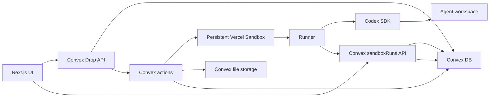
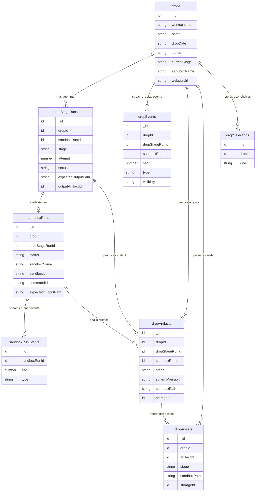
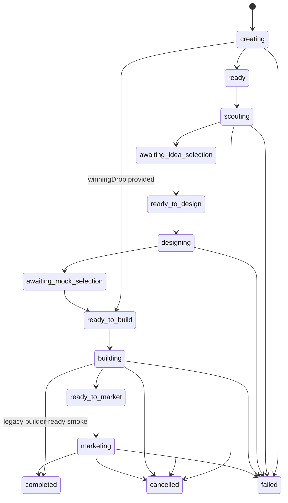
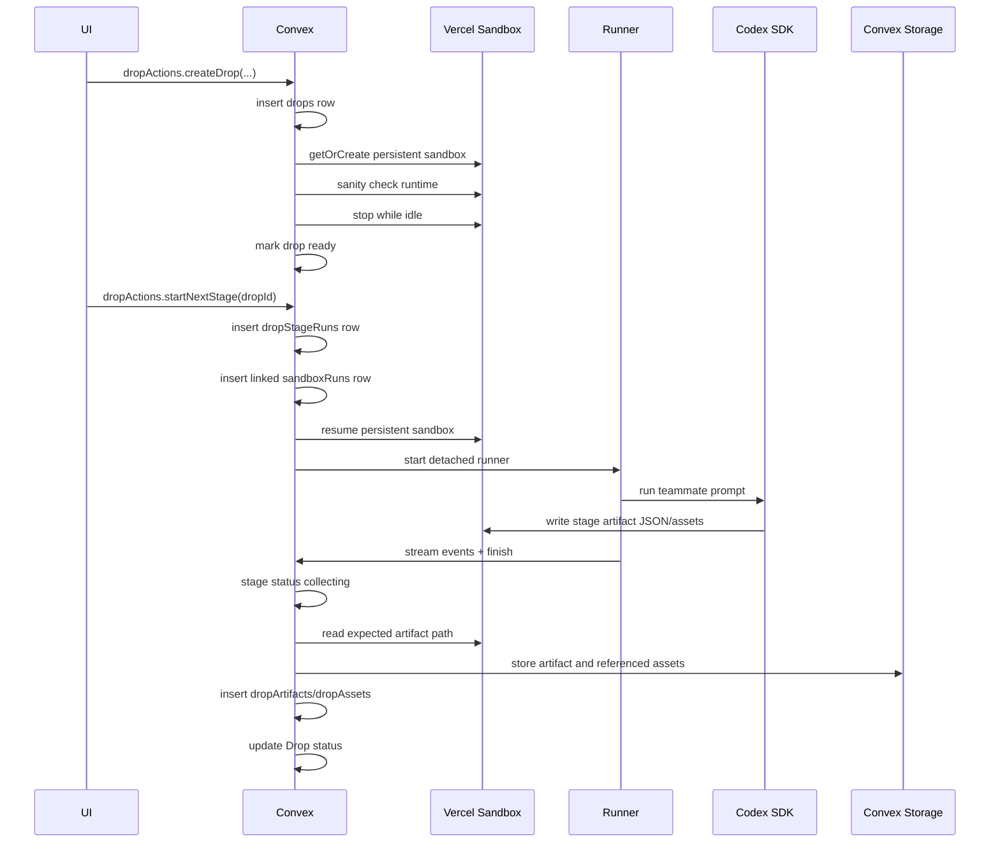

# Backend

Last updated: 2026-06-08

This document is the durable backend map for Drip's Drop workflow. It covers
the Convex data model, public and internal APIs, Vercel Sandbox execution path,
artifact persistence, replay model, and verification status.

Drip's backend is Convex. The long-running teammate work happens inside Vercel
Sandboxes that are started by Convex actions and reported back to Convex.

## Environment Model

Drip has two environments:

```text
Local = localhost Next.js + selected Convex dev deployment
Prod  = Vercel Production + Convex Production
```

Production deploys happen from `master`. Do not manually deploy Convex
production functions unless explicitly asked.

Local runtime config lives in ignored `.env`. Do not split active runtime
selection across `.env.local`, `.env.*`, `.vercel/`, or `.convex/`.

## Backend System Map



The sandbox runtime is separate from the Drip app repo. Only the prepared
`sandbox/` runtime payload is copied into the Vercel Sandbox base image. App
source stays in `src/`.

## Data Model Diagram



## Core Tables

### `drops`

One user-facing Drop.

Important fields:

- `workspaceId`: UI/workspace partition.
- `name`: Drop name.
- `dropDate`: Date for the Drop.
- `startingMode`: How the Drop was initialized.
- `status`: Top-level workflow state.
- `currentStage`: `scout`, `designer`, `builder`, or `marketer`.
- `sandboxName`: Stable persistent Vercel Sandbox name for this Drop.
- `currentSandboxId`: Last active sandbox id/name.
- `currentSnapshotId`: Latest known snapshot after sandbox stop/snapshot.
- `topics`, `productCategories`, `tasteConstraints`: inputs for early stages.
- `winningDrop`: legacy builder-ready smoke input. Normal product flow uses
  `selectedMocks`.
- `websiteUrl`: final immutable Builder deployment URL when available.
- `error`: terminal failure payload.

Indexes:

- `by_workspace_date`
- `by_status_updated`
- `by_sandbox_name`

### `dropStageRuns`

One attempt at one teammate stage for a Drop.

Important fields:

- `dropId`
- `sandboxRunId`
- `stage`
- `attempt`
- `status`: `queued`, `starting`, `running`, `collecting`, `succeeded`,
  `failed`, or `cancelled`.
- `sandboxName`
- `sandboxId`, `commandId`
- `input`
- `expectedOutputPath`
- `outputArtifactId`
- `error`
- `startedAt`, `completedAt`

Indexes:

- `by_drop_stage_attempt`
- `by_drop_status`
- `by_sandbox_run`

### `dropEvents`

Replayable user/debug event stream for historical Drops.

Important fields:

- `dropId`
- `dropStageRunId`
- `sandboxRunId`
- `seq`
- `stage`
- `type`
- `message`
- `visibility`: `user` or `debug`
- `payload`

Index:

- `by_drop_seq`

### `dropArtifacts`

Persisted structured output from a stage.

Important fields:

- `dropId`
- `dropStageRunId`
- `sandboxRunId`
- `stage`
- `kind`
- `schemaVersion`
- `generatedAt`
- `sandboxPath`
- `storageId`
- `data`
- `summary`

Indexes:

- `by_drop_stage_created`
- `by_stage_run`

### `dropAssets`

Persisted image or file assets referenced by a stage artifact.

Important fields:

- `dropId`
- `dropStageRunId`
- `sandboxRunId`
- `artifactId`
- `stage`
- `sandboxPath`
- `storageId`
- `fileName`
- `contentType`
- `bytes`
- `sha256`

Indexes:

- `by_drop_stage_created`
- `by_artifact`

### `dropSelections`

User selections between stages.

Kinds:

- `approvedIdeas`: Scout to Designer handoff.
- `selectedMocks`: Designer to Builder handoff.
- `winningDrop`: legacy builder-ready smoke handoff.

Index:

- `by_drop_kind`

### `sandboxRuns`

Generic sandbox execution record. It remains skill-agnostic, but now can link
to a Drop stage.

Drop-related fields:

- `dropId`
- `dropStageRunId`
- `stage`
- `sandboxName`
- `expectedOutputPath`

Existing generic fields still own runner lifecycle:

- `task`
- `status`
- `sandboxId`
- `commandId`
- `codexThreadId`
- `ingestTokenHash`
- `lastHeartbeatAt`
- `result`
- `error`

Drop indexes:

- `by_drop_stage_created`
- `by_drop_stage_run`

## Public API Surface

### Drop queries

`drops.listDrops({ workspaceId, limit? })`

Returns Drops for a workspace, newest first.

`drops.getDrop({ dropId })`

Returns:

- `drop`
- sorted `stageRuns`
- sorted `artifacts`
- sorted `assets` with storage URLs
- `selections`

This is the main historical detail/replay query.

`drops.listDropEvents({ dropId, afterSeq?, limit? })`

Returns ordered Drop events for live progress and replay.

`drops.listDropArtifacts({ dropId, stage? })`

Returns persisted artifacts, optionally filtered by stage.

### Drop mutations

`drops.selectScoutIdeas({ dropId, approvedIdeas })`

Persists Scout selections and moves the Drop to `ready_to_design`.

`drops.selectDesignerMocks({ dropId, selectedMocks })`

Persists Designer selections and moves the Drop to `ready_to_build`.

`drops.approveWinningDrop({ dropId, winningDrop })`

Legacy helper for builder-ready smoke runs. Persists a builder input and moves
the Drop to `ready_to_build`.

### Drop actions

`dropActions.createDrop(args)`

Creates a Drop record and creates or resumes a named persistent Vercel Sandbox.
It sanity checks the sandbox runtime, stops the sandbox while idle, and marks
the Drop ready.

Important args:

- `workspaceId`
- `name`
- `dropDate`
- `startingMode`
- `topics?`
- `productCategories?`
- `tasteConstraints?`
- `winningDrop?`

If `winningDrop` is provided, the Drop is initialized as `ready_to_build`.
Otherwise it starts at `ready` with `currentStage = scout`.

`dropActions.startNextStage({ dropId })`

Prepares the next stage from the Drop status, inserts a `dropStageRuns` row,
inserts a linked `sandboxRuns` row, and starts the generic sandbox runner in the
same persistent Drop sandbox.

### Generic sandbox APIs

The existing `sandboxRuns` API remains the generic runner contract:

- `createSandboxRun`
- `getSandboxRun`
- `listSandboxRunEvents`
- `cancelSandboxRun`
- runner-only ingest, heartbeat, and finish mutations

Drop-linked runs reuse this runner path instead of creating a separate stage
runner.

## Drop Lifecycle



## Stage Sequence



## Handoff Model

Each stage writes a structured JSON artifact in the persistent sandbox. Convex
stores the structured artifact and selected assets so the UI does not need the
sandbox to remain live for historical display.

Stage inputs are built from the Drop and previous selections:

- Scout input uses Drop metadata: name, date, topics, product categories, taste
  constraints.
- Designer input uses `approvedIdeas`.
- Builder input uses `selectedMocks` in the normal flow.
- Performance Marketer input uses the Builder artifact, Builder website URL,
  and `selectedMocks`.
- `winningDrop` is still accepted for the legacy builder-ready E2E fixture.

The UI controls the handoff by writing selection rows. The backend then uses
Drop status to decide which stage can start.

## Artifact Paths

Stage artifacts are run-scoped to avoid stale file reads:

```text
/vercel/sandbox/agent-workspace/drops/<dropId>/runs/<stageRunId>/<stage>/
```

Output file names:

- Scout: `scout-output.json`
- Designer: `fashion-designer-output.json`
- Performance Marketer: `performance-marketer-output.json`
- Builder: `builder-output.json`

Builder also receives a run-scoped site directory:

```text
/vercel/sandbox/agent-workspace/drops/<dropId>/runs/<stageRunId>/builder/builder-site
```

## Persistent Sandbox Contract

Every Drop gets a stable sandbox name:

```text
drip-drop-<dropId>
```

Drop stages use `Sandbox.getOrCreate` with:

- `persistent: true`
- `source` from `BASE_SANDBOX_IMAGE`
- Drop snapshot retention env knobs
- existing Vercel Sandbox credentials from Convex runtime env

The current SDK runtime supports snapshot-backed `getOrCreate`, but the
installed TypeScript definitions model only git/tarball sources for that method.
The code isolates that type gap in a small wrapper.

The action stops the sandbox after initial creation/sanity while the Drop is
idle. Stage runs resume the persistent sandbox and run the generic runner.

## Runner Env Contract

Drop-linked stage runs pass these additional env vars into the runner:

```text
DRIP_DROP_ID
DRIP_DROP_STAGE_RUN_ID
DRIP_DROP_STAGE
DRIP_EXPECTED_OUTPUT_PATH
```

The generic runner still receives its existing env:

- `CONVEX_URL`
- `INGEST_TOKEN`
- `OPENAI_API_KEY`
- `SANDBOX_RUN_ID`
- `CODEX_MODEL`
- `CODEX_REASONING_EFFORT`
- `DRIP_CODEX_NETWORK_ACCESS_ENABLED`
- optional Scout, Builder, and Performance Marketer credentials
- `WORKING_DIRECTORY`

Do not print or commit real env values.

## Event Model

There are two event streams:

1. `sandboxRunEvents`
   - Low-level runner/Codex events.
   - Used for detailed execution and debugging.
2. `dropEvents`
   - Product-level Drop progress and replay stream.
   - Used by the UI for user-facing progress.

Typical Drop event flow for Builder:

```text
drop.creating
drop.ready
stage.queued
stage.starting
stage.running
stage.succeeded
artifact.collected
```

## Replay Model

Historical Drop replay should read from Convex, not from a live sandbox:

- `drops.getDrop` for the complete Drop snapshot.
- `drops.listDropEvents` for ordered stage progress.
- `dropArtifacts.data` for structured outputs.
- `dropAssets.storageId` for persisted image/file assets.
- `drops.websiteUrl` for the final Builder page when available.

The persistent sandbox is useful for continuing work across stages. It should
not be required to render historical Drops.

## Failure And Retry Behavior

Current behavior:

- A stage cannot start if another stage run is `queued`, `starting`, `running`,
  or `collecting`.
- Runner start failures mark the linked Drop stage and Drop as failed.
- Runner terminal failure or cancellation updates both `sandboxRuns` and the
  linked Drop stage.
- Successful runner completion moves the stage to `collecting`.
- Artifact collection success marks the stage `succeeded` and advances the Drop.
- Artifact collection failure marks the stage and Drop failed.
- Attempts increment per Drop and stage.

Future retry UI can start another attempt after a failed stage once the Drop is
reset to the appropriate ready state.

## Builder Completion

When Builder artifact collection succeeds in the normal product flow:

- `dropStageRuns.status = succeeded`
- `dropStageRuns.outputArtifactId` points to the Builder artifact
- `dropArtifacts.schemaVersion = builder.drop-site.v1`
- `drops.status = ready_to_market`
- `drops.currentStage = marketer`
- `drops.websiteUrl` is persisted if present in the Builder artifact

When Builder artifact collection succeeds in a legacy builder-ready smoke run
created with `winningDrop`:

- `drops.status = completed`
- `drops.currentStage = builder`
- `drops.websiteUrl` is persisted if present in the Builder artifact

The Builder-generated immutable deployment URL is treated as historical output.
Do not promote Builder preview deployments unless a later product requirement
explicitly asks for that.

## Performance Marketer Completion

When Performance Marketer artifact collection succeeds:

- `dropStageRuns.status = succeeded`
- `dropArtifacts.schemaVersion = performance-marketer.facebook-campaign.v1`
- `drops.status = completed`
- `drops.currentStage = marketer`

The Performance Marketer artifact should contain one paused Facebook ad using
the Builder URL and selected product images. It should not contain optimization
loops, activation, or insights readback.

## Environment Variables

New optional knobs:

```text
DRIP_DROP_SANDBOX_SNAPSHOT_TTL_MS
DRIP_DROP_SANDBOX_KEEP_SNAPSHOTS
DRIP_RUNNER_CONVEX_URL
DRIP_RUNNER_CALLBACK_PREFLIGHT_TIMEOUT_MS
DRIP_RUNNER_CONVEX_REQUEST_TIMEOUT_MS
```

They are documented in `.env.example`. The Drop sandbox values control
persistent Drop sandbox snapshot retention. The runner callback values allow
operators to override the Convex URL passed to external sandbox runners and
bound the preflight check before a sandbox is started.

Existing sandbox env still applies, including:

- `BASE_SANDBOX_IMAGE`
- `VERCEL_TOKEN`
- `VERCEL_TEAM_ID`
- `VERCEL_PROJECT_ID`
- `VERCEL_DEPLOY_TOKEN`
- `DRIP_DROP_SITES_VERCEL_PROJECT`
- `DRIP_DROP_SITES_VERCEL_SCOPE`
- `OPENAI_API_KEY` or `CODEX_API_KEY`
- `CONVEX_CLOUD_URL`

## Prior Verification Evidence

Prior verification before the final Builder-before-Marketer integration was
recorded on 2026-06-07/2026-06-08:

```bash
pnpm lint
pnpm typecheck
pnpm build
pnpm exec convex dev --once --typecheck disable
pnpm e2e:sandbox -- --scenario drop-workflow-builder --timeout-ms 900000 --start-attempts 1
```

Notes:

- `pnpm build` required running outside the restricted sandbox because
  Turbopack needed local port binding.
- `pnpm e2e:sandbox` required running outside the restricted sandbox because
  `tsx` uses an IPC pipe and the smoke uses Convex/Vercel network access.
- `.env` and `.env.local` are private ignored runtime files. Keep active local
  runtime selection in `.env`; do not copy either file's values into docs,
  commits, screenshots, or logs.

Prior successful Drop e2e evidence:

```text
/Users/neilsanghrajka/Code/drip/.sandbox-e2e/drop-workflow-builder/mq41dn8i
```

Redacted result:

- Scenario: `drop-workflow-builder`
- Sandbox run: `succeeded`
- Drop status: `completed`
- Current stage: `builder`
- Builder stage: `succeeded`
- Artifact schema: `builder.drop-site.v1`
- Event flow included `artifact.collected`
- Generated static site checks passed
- Browser review evidence was present
- Generated site HTTP checks returned 200

Prior production health check:

- Latest production deployment was `READY` on `master`.
- Production `/` returned HTTP 200.
- Production `/convex-smoke` returned HTTP 200.
- Those local Drop backend changes were not deployed to production because the
  production flow is push-to-`master` unless a manual deploy is explicitly
  requested.

Current verification for the final integration goal is pending until this exact
post-change command passes:

```bash
pnpm e2e:sandbox -- --scenario drop-workflow-builder --timeout-ms 900000 --start-attempts 1 --keep-sandbox
```

Latest post-change status:

- `pnpm lint`, `pnpm typecheck`, `pnpm build`, `pnpm exec convex codegen`,
  and `pnpm exec convex dev --once --typecheck disable --env-file .env`
  passed on 2026-06-08.
- The exact `drop-workflow-builder` E2E command is blocked before runner start
  by Vercel Sandbox HTTP 402 for the configured team/project.
- The latest evidence path is
  `.sandbox-e2e/drop-workflow-builder/mq48bemu/failure.json`.
- The failed Drop row records `status = failed` and
  `error.code = vercel_sandbox_scope_or_entitlement`.
- Read-only Vercel diagnostics for the same configured token/team/project
  succeeded for team lookup, project lookup, Sandbox list, Sandbox session list,
  and Sandbox snapshot list.
- The configured Vercel scope matches `.vercel/project.json`; the token has
  owner-level access on the linked scope; the linked scope is currently a Hobby
  plan.
- `.env` and `.env.local` overlap only on Convex selection keys, and those
  overlapping values matched during this verification pass.
- The remaining blocker is specific to Sandbox creation entitlement,
  billing/quota, or sandbox scope; it is not a basic token, linked-project, or
  read-access failure.

## Verification Thread

A same-workspace verification-only Codex thread was created:

```text
019ea314-d319-7842-b805-50cc61cc5422
```

It was instructed to avoid edits, avoid Performance Marketer and sandbox/meta
dirty files, and independently run the Drop e2e if approvals/config allowed.

## Files

Main implementation files:

- `src/convex/schema.ts`
- `src/convex/drops.ts`
- `src/convex/dropActions.ts`
- `src/convex/sandboxRuns.ts`
- `src/convex/sandboxRunActions.ts`
- `src/convex/_generated/api.d.ts`
- `scripts/sandbox_e2e_smoke.ts`
- `.env.example`

Do not edit generated Convex files by hand. Regenerate through the Convex CLI.

## Open Items

- Add UI replay using `dropEvents`, `dropArtifacts`, and `dropAssets`.
- Add explicit retry/reset mutations for failed stages.
- Add a watchdog for lost sandbox runs.
- Decide whether to persist more user-facing progress events beyond runner
  events.
- Decide how much of the final Builder page should be mirrored into Convex for
  preview cards versus fetched from the immutable URL.
