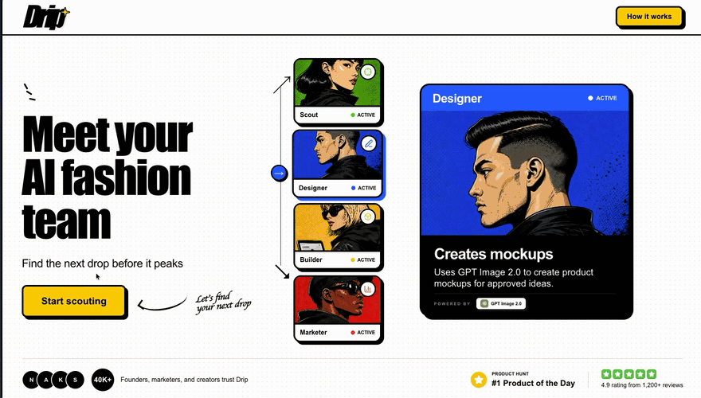
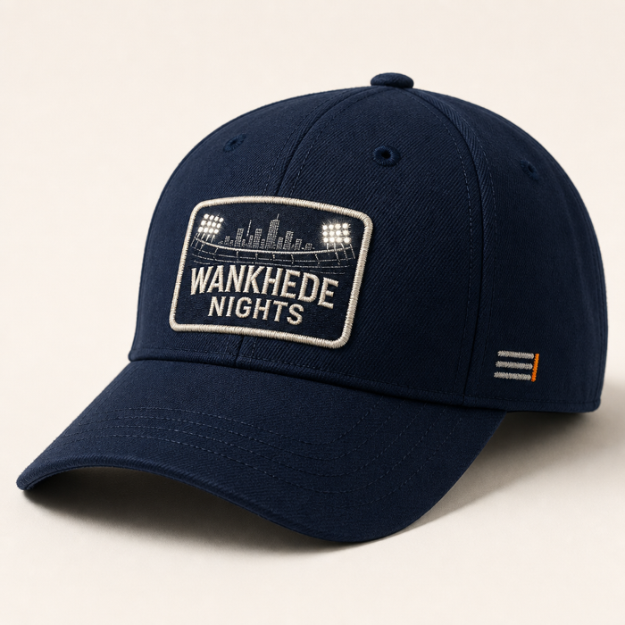
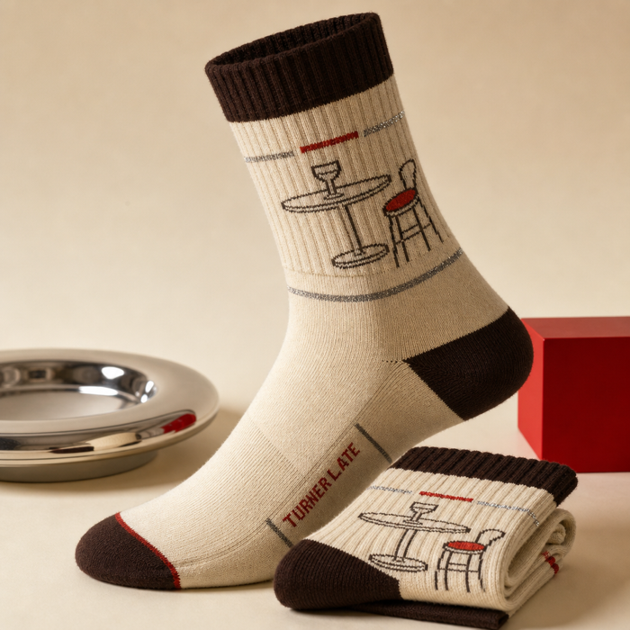
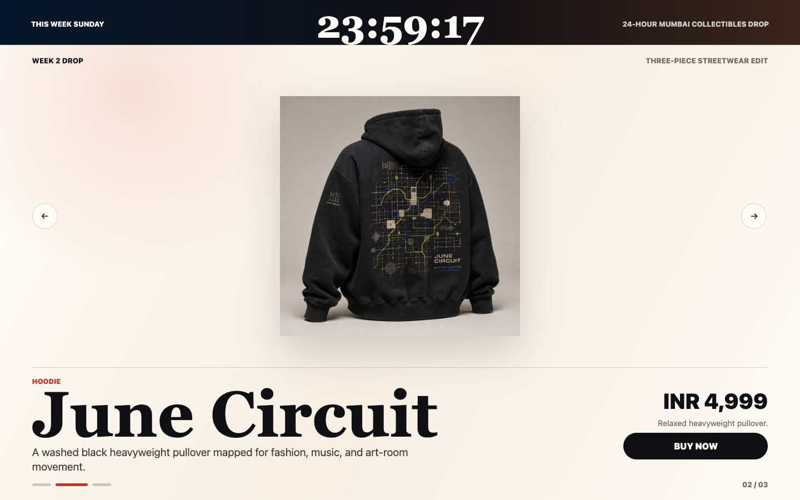
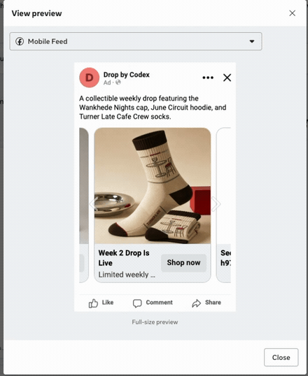

<p align="center">
  
</p>

<h1 align="center">Drip — meet your AI e-commerce team, powered by the OpenAI Codex SDK</h1>

<p align="center">
  <a href="https://developers.openai.com/codex"></a>
  <a href="https://vercel.com/docs/vercel-sandbox"></a>
  <a href="https://convex.dev"></a>
  
</p>

<p align="center">
  <a href="references/docs/specs/01_SCOUT.md"><b>Scout</b></a>
  &nbsp;·&nbsp;
  <a href="references/docs/specs/02_FASHION_DESIGNER.md"><b>Fashion Designer</b></a>
  &nbsp;·&nbsp;
  <a href="references/docs/specs/03_BUILDER.md"><b>Builder</b></a>
  &nbsp;·&nbsp;
  <a href="references/docs/specs/04_PERFORMANCE_MARKETER.md"><b>Performance Marketer</b></a>
</p>

<p align="center">
  Drip turns what's trending on the internet <em>right now</em> into a limited-edition merch drop:<br/>
  source-backed ideas → product mock images → a live one-page drop website → a paused Facebook ad —<br/>
  with you approving every handoff.
</p>

<p align="center">
  <a href="https://dripbycodex.vercel.app">🟡 <b>Live app</b></a>
  &nbsp;&nbsp;·&nbsp;&nbsp;
  <a href="https://drip-websites-h97phbjsc-neil-sanghrajkas-projects.vercel.app/">🛍️ <b>A drop site Builder shipped</b></a>
  &nbsp;&nbsp;·&nbsp;&nbsp;
  <a href="references/docs/README.md">📚 <b>Docs</b></a>
</p>

---

## Why this exists

One person + an AI team = a working e-commerce business. The fashion team is just the implementation — the point is that a single operator can spot a cultural moment, design products, ship a storefront, and validate demand with ads, all in about ten minutes. Tie up with a local supplier who prints on demand, and the drop is real.

**New here? Four ways to understand Drip:**

1. 🛒 **Experience** — the live product: [dripbycodex.vercel.app](https://dripbycodex.vercel.app)
2. 🎬 **Watch** — the [20-second product walkthrough](#quick-product-walkthrough) just below
3. 📕 **Read** — the product goals and campaign flow: [`references/docs/PRD.md`](references/docs/PRD.md)
4. 🖼️ **Browse** — slides on how the whole thing is built: [dripbycodex.vercel.app/slides](https://dripbycodex.vercel.app/slides)

## Quick product walkthrough

<p align="center">
  
</p>

1. **Start a drop** — sign in at [dripbycodex.vercel.app](https://dripbycodex.vercel.app), name this week's campaign, hit *Start scouting*.
2. **Scout researches** — spawns `x-researcher` and `exa-researcher` subagents to scan X and the web, and returns up to 5 source-backed, merchable ideas. You pick ~3.
3. **Fashion Designer creates** — fans out cap / sock / apparel design subagents, generates premium product mocks with GPT Image, and a reviewer curates the pool. You pick the products that become the drop.
4. **Builder ships** — writes a one-page limited-drop site, reviews it in a real browser with `agent-browser`, and deploys an immutable site to Vercel. You preview the live link.
5. **Performance Marketer drafts** — creates **one paused Facebook ad** pointing at the live site, using your selected images. No activation, no spend, ever.

Every stage streams its progress live into the cockpit, and every artifact (ideas, images, site, ad) is persisted to campaign history.

## What a campaign produces

Real outputs from a production campaign (the Week 2 **"June Circuit"** drop). Scout found the moments, Fashion Designer generated the mocks, Builder shipped the site, Performance Marketer drafted the paused ad.

<table>
  <tr>
    <td align="center"></td>
    <td align="center"></td>
    <td align="center"></td>
  </tr>
  <tr>
    <td align="center"><sub>Mock: cap</sub></td>
    <td align="center"><sub>Mock: hoodie</sub></td>
    <td align="center"><sub>Mock: socks</sub></td>
  </tr>
</table>

<table>
  <tr>
    <td align="center" valign="top"><a href="https://drip-websites-h97phbjsc-neil-sanghrajkas-projects.vercel.app/"></a></td>
    <td align="center" valign="top"></td>
  </tr>
  <tr>
    <td align="center"><sub>Live drop site, deployed → <a href="https://drip-websites-h97phbjsc-neil-sanghrajkas-projects.vercel.app/">open it</a></sub></td>
    <td align="center"><sub>Generated Facebook ad</sub></td>
  </tr>
</table>

## How it works

```
  trends on X / web                you pick ~3                you pick the products
        │                              │                              │
        ▼                              ▼                              ▼
   ┌─────────┐   candidate      ┌──────────────────┐   mock     ┌─────────┐   live site   ┌─────────────────────┐
   │  SCOUT  │ ───────────────► │ FASHION DESIGNER │ ─────────► │ BUILDER │ ────────────► │ PERFORMANCE MARKETER│
   └─────────┘     ideas        └──────────────────┘   images   └─────────┘               └─────────────────────┘
                                                                     │                              │
                                                                     ▼                              ▼
                                                              one-page drop site            one paused FB ad
                                                              deployed on Vercel            (no spend, ever)
```

**Each teammate is just a Codex skill plus a few subagents — and each subagent is itself just a small skill.** No bespoke agent framework: the whole team is markdown briefs and TOML files executed by the [OpenAI Codex SDK](references/codex-sdk/) inside a Vercel Sandbox. Change a file, change the teammate.

```
agent/codex-agent/
│
├── .agents/skills/                  a teammate = one skill (a markdown brief)
│   ├── scout/                         finds merchable moments on X + the web
│   ├── fashion-designer/              turns ideas into concepts + mock images
│   ├── builder/                       builds and ships the drop website
│   ├── performance-marketer/          drafts the paused Facebook ad
│   └── x-trends/ … exa-search/        shared tool skills the teammates use
│
└── .codex/agents/                   the subagents each teammate spawns
    ├── x-researcher.toml              Scout — researches X in parallel
    ├── cap-designer.toml              Designer — one product lane per agent
    ├── drop-site-builder.toml         Builder — writes the site code
    ├── drop-site-reviewer.toml        Builder — reviews it in a real browser
    ├── facebook-ad-copywriter.toml    Marketer — writes the ad copy
    └── … 7 more
```

For example, **Scout** = [`scout/SKILL.md`](agent/codex-agent/.agents/skills/scout/SKILL.md) (the research brief) + `x-researcher` and `exa-researcher` running in parallel on the `x-trends` and `exa-search` tool skills. Full breakdown per teammate: [`references/docs/specs/`](references/docs/specs/).

## Architecture

```
┌──────────────────────┐   live queries    ┌──────────────────────────┐
│   Drip cockpit       │◄─────────────────►│   Convex                 │
│   Next.js on Vercel  │                   │   auth · drops · runs    │
└──────────────────────┘                   │   artifacts · files      │
                                           └────────────┬─────────────┘
                                                        │ starts stage runs
                                                        ▼
                                           ┌──────────────────────────┐
                                           │  Vercel Sandbox (microVM)│
                                           │  runner + Codex SDK      │
                                           │  teammate skill + agents │
                                           └────────────┬─────────────┘
                                                        │ streams events + artifacts
                                                        │ back to Convex
                                                        ▼
                                           ┌──────────────────────────┐
                                           │  drop website → Vercel   │
                                           │  paused ad    → Meta     │
                                           └──────────────────────────┘
```

A Convex state machine drives each drop through the four stages. Each stage runs in a persistent Vercel Sandbox where the Codex SDK executes the teammate's skill, and everything the agents produce flows back into Convex storage.

Deep dives: [`references/docs/BACKEND.md`](references/docs/BACKEND.md) (data model, stage lifecycle, replay) · [`references/docs/SANDBOX.md`](references/docs/SANDBOX.md) (sandbox + Codex runtime) · [`references/docs/WHITEBOARD.md`](references/docs/WHITEBOARD.md) (the original whiteboard photos).

## Tech stack

| Frontend | Backend | Agent runtime | Agents | Image gen | Deploys |
| --- | --- | --- | --- | --- | --- |
| Next.js 16 · React 19 · Tailwind · shadcn/ui | [Convex](https://convex.dev) — auth, DB, file storage, live queries | [Vercel Sandbox](https://vercel.com/docs/vercel-sandbox) (Firecracker microVM) | [OpenAI Codex SDK](https://developers.openai.com/codex) — skills + subagents | GPT Image | Vercel (cockpit + generated drop sites) |

## Getting started

```bash
pnpm install
cp .env.example .env.local                 # fill in the placeholders
pnpm exec convex dev --configure new       # log in to Convex, create/link a project
pnpm dev                                   # cockpit on localhost
```

To self-deploy: `pnpm exec vercel login`, link with `pnpm exec vercel link --yes --project drip --scope <team>`, set `CONVEX_DEPLOY_KEY` in Vercel Production env, then push to `master` — the Convex deploy wrapper publishes the app. Full workflow: [`references/docs/DEVELOPMENT.md`](references/docs/DEVELOPMENT.md) (local) and [`references/docs/DEPLOYMENT.md`](references/docs/DEPLOYMENT.md) (production).

## Documentation map

**Want to understand the product?** Not technical — what Drip does and why.

| Read | For |
| --- | --- |
| [`references/docs/PRD.md`](references/docs/PRD.md) | The product: problem, campaign flow, decision points |
| [`references/docs/specs/01_SCOUT.md`](references/docs/specs/01_SCOUT.md) → [`04_PERFORMANCE_MARKETER.md`](references/docs/specs/04_PERFORMANCE_MARKETER.md) | One spec per teammate — what it does, its subagents, its output contract |
| [dripbycodex.vercel.app/slides](https://dripbycodex.vercel.app/slides) | The visual "how it works" deck |

**Want to understand how it's built?** The technical internals.

| Read | For |
| --- | --- |
| [`references/docs/BACKEND.md`](references/docs/BACKEND.md) | Convex data model, drop pipeline state machine, events, replay |
| [`references/docs/SANDBOX.md`](references/docs/SANDBOX.md) | The Vercel Sandbox + Codex SDK execution layer |
| [`references/docs/CONVEX.md`](references/docs/CONVEX.md) / [`references/docs/VERCEL.md`](references/docs/VERCEL.md) | Platform rules for the two backends |
| [`references/docs/META_ADS_CLI.md`](references/docs/META_ADS_CLI.md) | The Meta Ads CLI the Performance Marketer drives |
| [`references/docs/WHITEBOARD.md`](references/docs/WHITEBOARD.md) | The real whiteboard photos behind the architecture |

**Want to run it yourself?**

| Read | For |
| --- | --- |
| [`references/docs/DEVELOPMENT.md`](references/docs/DEVELOPMENT.md) | Local setup, worktrees, env scoping |
| [`references/docs/DEPLOYMENT.md`](references/docs/DEPLOYMENT.md) | Production deploys and verification |

## Repo layout

```
src/                    Next.js app — landing, dashboard, campaign cockpit
src/convex/             Convex schema + functions (the drop pipeline control plane)
agent/                  What runs inside the Vercel Sandbox: runner + codex-agent home (skills, subagents)
public/                 Static assets for the cockpit (team portraits, campaign art)
scripts/                Base sandbox snapshot setup + e2e smoke test
tests/                  Unit + smoke tests
references/             Docs, design assets, and read-only external checkouts
  docs/                 All documentation — start at references/docs/README.md
  docs/specs/           One spec per teammate, numbered in pipeline order
  whiteboard/           Architecture diagrams and the original whiteboard photos
  uimocks/              Product/UI mockups, screenshots, and demo GIFs
  slides/               "How it works" presentation deck
  codex-sdk/            Read-only OpenAI Codex SDK checkout
  sandbox-prototypes/   Early sandbox execution prototypes
```
