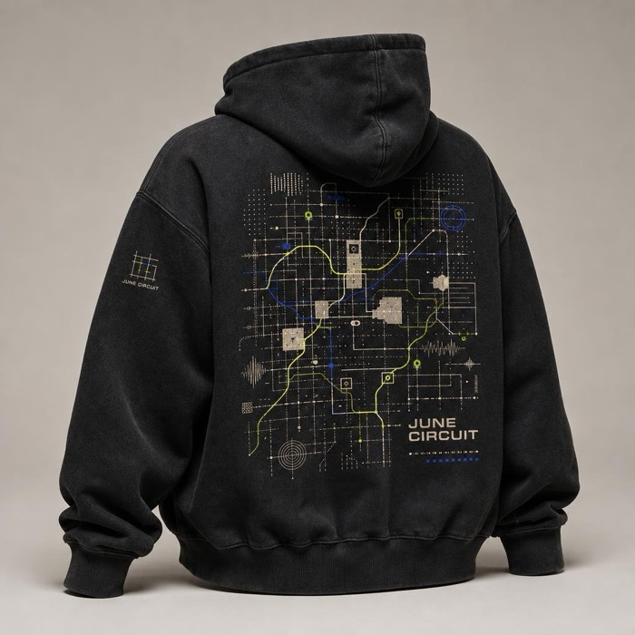
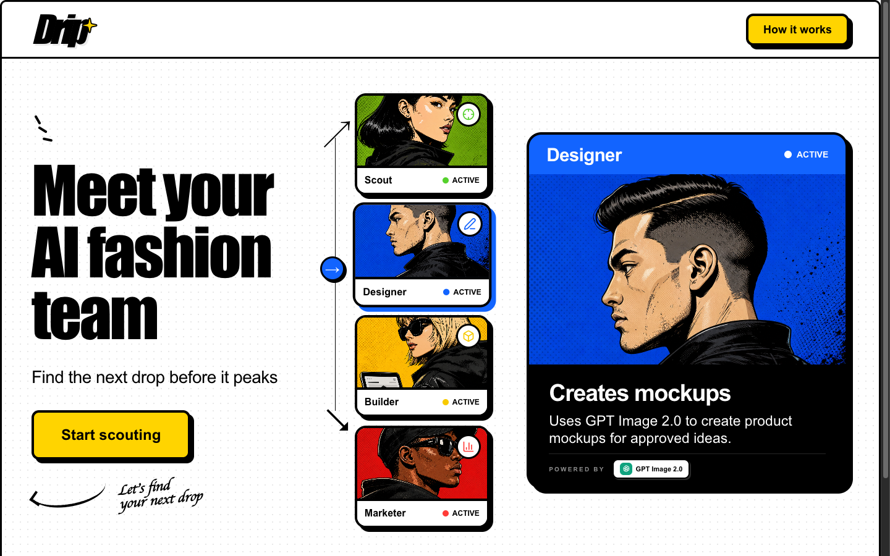

<p align="center">
  
</p>

<h1 align="center">Drip — meet your AI fashion team</h1>

<p align="center">
  <a href="docs/specs/01_SCOUT.md"><b>Scout</b></a>
  &nbsp;·&nbsp;
  <a href="docs/specs/02_FASHION_DESIGNER.md"><b>Fashion Designer</b></a>
  &nbsp;·&nbsp;
  <a href="docs/specs/03_BUILDER.md"><b>Builder</b></a>
  &nbsp;·&nbsp;
  <a href="docs/specs/04_PERFORMANCE_MARKETER.md"><b>Performance Marketer</b></a>
</p>

<p align="center">
  Drip turns what's trending on the internet <em>right now</em> into a limited-edition merch drop:<br/>
  source-backed ideas → product mock images → a live one-page drop website → a paused Facebook ad —<br/>
  with you approving every handoff.
</p>

<p align="center">
  <a href="https://dripbycodex.vercel.app">🟡 <b>Live app</b></a>
  &nbsp;&nbsp;·&nbsp;&nbsp;
  <a href="https://drip-websites-h97phbjsc-neil-sanghrajkas-projects.vercel.app/">🛍️ <b>A drop site Builder shipped</b></a>
  &nbsp;&nbsp;·&nbsp;&nbsp;
  <a href="docs/README.md">📚 <b>Docs</b></a>
</p>

---

## What a campaign produces

Real outputs from a production campaign (the Week 2 **"June Circuit"** drop). Scout found the moments, Fashion Designer generated the mocks, Builder shipped the site, Performance Marketer drafted the paused ad.

<table>
  <tr>
    <td align="center"></td>
    <td align="center"></td>
    <td align="center"></td>
    <td align="center"><a href="https://drip-websites-h97phbjsc-neil-sanghrajkas-projects.vercel.app/"></a></td>
  </tr>
  <tr>
    <td align="center"><sub>Mock: cap</sub></td>
    <td align="center"><sub>Mock: hoodie</sub></td>
    <td align="center"><sub>Mock: socks</sub></td>
    <td align="center"><sub>The live drop site Builder deployed → <a href="https://drip-websites-h97phbjsc-neil-sanghrajkas-projects.vercel.app/">open it</a></sub></td>
  </tr>
</table>

<details>
<summary><b>🎬 Quick product walkthrough</b> — what a full campaign looks like in the cockpit</summary>
<br/>

<p align="center">
  <a href="https://dripbycodex.vercel.app"></a>
</p>

1. **Start a drop** — sign in at [dripbycodex.vercel.app](https://dripbycodex.vercel.app), name this week's campaign, hit *Start scouting*.
2. **Scout researches** — spawns `x-researcher` and `exa-researcher` subagents to scan X and the web, and returns up to 5 source-backed, merchable ideas. You pick ~3.
3. **Fashion Designer creates** — fans out cap / sock / apparel design subagents, generates premium product mocks with GPT Image, and a reviewer curates the pool. You pick the products that become the drop.
4. **Builder ships** — writes a one-page limited-drop site, reviews it in a real browser with `agent-browser`, and deploys an immutable site to Vercel. You preview the live link.
5. **Performance Marketer drafts** — creates **one paused Facebook ad** pointing at the live site, using your selected images. No activation, no spend, ever.

Every stage streams its progress live into the cockpit, and every artifact (ideas, images, site, ad) is persisted to campaign history.

</details>

## How it works

```
  trends on X / web                you pick ~3                you pick the products
        │                              │                              │
        ▼                              ▼                              ▼
   ┌─────────┐   candidate      ┌──────────────────┐   mock     ┌─────────┐   live site   ┌─────────────────────┐
   │  SCOUT  │ ───────────────► │ FASHION DESIGNER │ ─────────► │ BUILDER │ ────────────► │ PERFORMANCE MARKETER│
   └─────────┘     ideas        └──────────────────┘   images   └─────────┘               └─────────────────────┘
                                                                     │                              │
                                                                     ▼                              ▼
                                                              one-page drop site            one paused FB ad
                                                              deployed on Vercel            (no spend, ever)
```

**Each teammate is just a Codex skill plus a few subagents.** There is no bespoke agent framework — the whole team is markdown skills and TOML subagent definitions executed by the [OpenAI Codex SDK](references/codex-sdk/) inside a Vercel Sandbox:

```
sandbox/codex-agent/
├── .agents/skills/
│   ├── scout/SKILL.md               ← the teammate = a skill…
│   ├── fashion-designer/SKILL.md
│   ├── builder/SKILL.md
│   ├── performance-marketer/SKILL.md
│   └── x-trends/ · exa-search/ · frontend-skill/ · agent-browser/ · meta-ads-cli/   ← shared tool skills
└── .codex/agents/                   ← …that spawns subagents
    ├── x-researcher.toml · exa-researcher.toml                          (Scout)
    ├── cap-designer.toml · sock-designer.toml · apparel-designer.toml
    │   · fashion-reviewer.toml                                          (Fashion Designer)
    ├── drop-site-builder.toml · drop-site-reviewer.toml
    │   · drop-site-deployer.toml                                        (Builder)
    └── facebook-ad-copywriter.toml · facebook-ad-operator.toml          (Performance Marketer)
```

For example, **Scout** = [`scout/SKILL.md`](sandbox/codex-agent/.agents/skills/scout/SKILL.md) (the research brief) + `x-researcher` and `exa-researcher` running in parallel on the `x-trends` and `exa-search` tool skills. Full breakdown per teammate: [`docs/specs/`](docs/specs/).

## Architecture

```
┌──────────────────────┐   live queries    ┌──────────────────────────┐
│   Drip cockpit       │◄─────────────────►│   Convex                 │
│   Next.js on Vercel  │                   │   auth · drops · runs    │
└──────────────────────┘                   │   artifacts · files      │
                                           └────────────┬─────────────┘
                                                        │ starts stage runs
                                                        ▼
                                           ┌──────────────────────────┐
                                           │  Vercel Sandbox (microVM)│
                                           │  runner + Codex SDK      │
                                           │  teammate skill + agents │
                                           └────────────┬─────────────┘
                                                        │ streams events + artifacts
                                                        │ back to Convex
                                                        ▼
                                           ┌──────────────────────────┐
                                           │  drop website → Vercel   │
                                           │  paused ad    → Meta     │
                                           └──────────────────────────┘
```

A Convex state machine drives each drop through the four stages. Each stage runs in a persistent Vercel Sandbox where the Codex SDK executes the teammate's skill, and everything the agents produce flows back into Convex storage.

Deep dives: [`docs/BACKEND.md`](docs/BACKEND.md) (data model, stage lifecycle, replay) · [`docs/SANDBOX.md`](docs/SANDBOX.md) (sandbox + Codex runtime) · [`docs/WHITEBOARD.md`](docs/WHITEBOARD.md) (the original whiteboard photos).

## Tech stack

| Frontend | Backend | Agent runtime | Agents | Image gen | Deploys |
| --- | --- | --- | --- | --- | --- |
| Next.js 16 · React 19 · Tailwind · shadcn/ui | [Convex](https://convex.dev) — auth, DB, file storage, live queries | [Vercel Sandbox](https://vercel.com/docs/vercel-sandbox) (Firecracker microVM) | [OpenAI Codex SDK](https://developers.openai.com/codex) — skills + subagents | GPT Image | Vercel (cockpit + generated drop sites) |

## Getting started

```bash
pnpm install
cp .env.example .env.local                 # fill in the placeholders
pnpm exec convex dev --configure new       # log in to Convex, create/link a project
pnpm dev                                   # cockpit on localhost
```

To self-deploy: `pnpm exec vercel login`, link with `pnpm exec vercel link --yes --project drip --scope <team>`, set `CONVEX_DEPLOY_KEY` in Vercel Production env, then push to `master` — the Convex deploy wrapper publishes the app. Full workflow: [`docs/DEVELOPMENT.md`](docs/DEVELOPMENT.md) (local) and [`docs/DEPLOYMENT.md`](docs/DEPLOYMENT.md) (production).

## Documentation map

Every part of the system has one canonical doc. Start here:

| Read | To understand |
| --- | --- |
| [`docs/PRD.md`](docs/PRD.md) | The product: problem, campaign flow, decision points, acceptance criteria |
| [`docs/BACKEND.md`](docs/BACKEND.md) | The full backend system map: Convex data model, drop pipeline state machine, events, replay |
| [`docs/specs/01_SCOUT.md`](docs/specs/01_SCOUT.md) | How Scout finds and ranks merchable cultural moments |
| [`docs/specs/02_FASHION_DESIGNER.md`](docs/specs/02_FASHION_DESIGNER.md) | How product concepts and mock images are generated and curated |
| [`docs/specs/03_BUILDER.md`](docs/specs/03_BUILDER.md) | How the one-page drop website is built, reviewed, and deployed |
| [`docs/specs/04_PERFORMANCE_MARKETER.md`](docs/specs/04_PERFORMANCE_MARKETER.md) | How the paused Facebook ad is created (and why it can never spend) |
| [`docs/SANDBOX.md`](docs/SANDBOX.md) | The Vercel Sandbox + Codex SDK execution layer: base image, runner lifecycle, payload |
| [`docs/CONVEX.md`](docs/CONVEX.md) | Convex project rules: layout, dev deployments, env ownership |
| [`docs/VERCEL.md`](docs/VERCEL.md) | Vercel project rules: auto-deploy policy, linking, sandbox image config |
| [`docs/DEVELOPMENT.md`](docs/DEVELOPMENT.md) | Local development: setup, worktrees, env scoping |
| [`docs/DEPLOYMENT.md`](docs/DEPLOYMENT.md) | Production deploys and verification |
| [`docs/WHITEBOARD.md`](docs/WHITEBOARD.md) | Index of the real whiteboard photos behind the architecture |
| [`docs/META_ADS_CLI.md`](docs/META_ADS_CLI.md) | The Meta Ads CLI the Performance Marketer drives |
| [`AGENTS.md`](AGENTS.md) | Operating rules for coding agents working on this repo |

## Repo layout

```
src/            Next.js app — landing, dashboard, campaign cockpit
src/convex/     Convex schema + functions (the drop pipeline control plane)
sandbox/        What runs inside the Vercel Sandbox: runner + codex-agent home (skills, subagents)
docs/           All documentation — start at docs/README.md
docs/specs/     One spec per teammate, numbered in pipeline order
references/     Read-only Codex SDK checkout + early sandbox prototypes
scripts/        Base sandbox snapshot setup + e2e smoke test
slides/         "How it works" presentation deck
public/         Static assets for the cockpit (team portraits, campaign art)
```

---

<p align="center">
  <sub>Built for the OpenAI hackathon — four AI teammates, one drop a week. <a href="https://dripbycodex.vercel.app">dripbycodex.vercel.app</a></sub>
</p>
