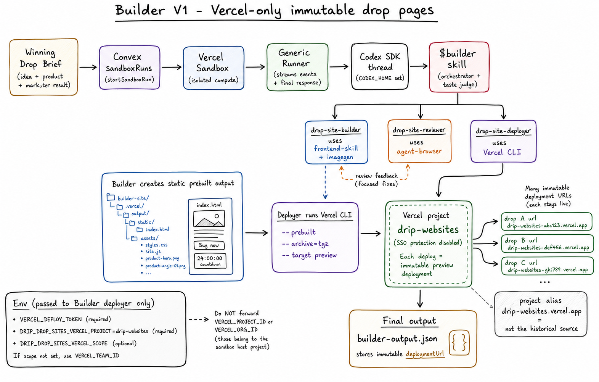

# Builder

Builder is Drip's fourth AI teammate. Its job is to take the approved Winning
Drop from Scout, Fashion Designer, and Performance Marketer, then create one
customer-facing drop website with a shareable live URL.

Builder stops at the drop page. It does not discover trends, design the full
product catalog, run ads, or add checkout logic.



## TL;DR

The product prompt should stay lean:

```text
Use $builder to create a live drop page for this winning cap product: [...]
```

The `$builder` skill owns the rest: product-page art direction, image-angle
generation, static-site creation, browser review, Vercel deployment, final JSON
writing, and JSON validation.

## Vercel-Only V1

For hackathon speed, Builder uses a dedicated Vercel project named
`drip-websites`. Each Builder run deploys one static one-page site as a new
immutable Vercel deployment and returns that deployment URL.

```text
drop A -> https://drip-websites-abc123.vercel.app
drop B -> https://drip-websites-def456.vercel.app
drop C -> https://drip-websites-ghi789.vercel.app
```

The generated deployment URLs are the historical live links. Builder must not
rely on the project alias URL, because the alias can point at whichever
deployment is current.

Deployment protection for `drip-websites` should be disabled so generated
preview URLs can render inside the Drip app and be shared without Vercel SSO.

## Architecture

The raw whiteboard reference for the teammate flow is
[`whiteboard/developer_flow.jpg`](whiteboard/developer_flow.jpg). The generated
architecture image above is the current Vercel-only plan.

```mermaid
flowchart LR
  Input["Winning Drop brief<br/>idea + product + marketer result"]
  Runner["Vercel Sandbox Runner"]
  Codex["Codex SDK Thread"]
  Builder["$builder skill<br/>orchestrator + taste judge"]
  Site["drop-site-builder<br/>uses $frontend-skill + $imagegen"]
  Review["drop-site-reviewer<br/>uses agent-browser"]
  Deploy["drop-site-deployer<br/>uses Vercel CLI"]
  Static["Static one-page site<br/>.vercel/output"]
  Project["Vercel project<br/>drip-websites"]
  Output["builder-output.json<br/>immutable deployment URL"]

  Input --> Runner --> Codex --> Builder
  Builder --> Site --> Static
  Static --> Review
  Review -. focused fixes .-> Builder
  Review --> Deploy
  Deploy --> Project --> Output
```



## How It Runs

1. Convex starts a Vercel Sandbox from `BASE_SANDBOX_IMAGE`.
2. The sandbox runner starts a Codex SDK thread in
   `/vercel/sandbox/agent-workspace`.
3. The runner sets `CODEX_HOME` so Codex can load sandbox skills and subagents.
4. Codex uses `$builder`.
5. `$builder` parses the Winning Drop, selected product, selected image, ad
   results, and positioning.
6. `$builder` asks `drop-site-builder` to create a one-page static site.
7. `drop-site-builder` uses `$frontend-skill` for visual direction and
   `$imagegen` for a few same-product angle images.
8. `$builder` asks the verifier subagent, `drop-site-reviewer`, to inspect a
   local preview with `agent-browser` in standard desktop viewports: 16:10
   (`1440x900`) and 16:9 (`1920x1080`). The verifier must capture screenshots
   and DOM overflow metrics, including right-edge clipping checks.
9. If review fails, `$builder` sends focused fixes back to `drop-site-builder`
   and runs one more review pass by default.
10. `$builder` asks `drop-site-deployer` to deploy the reviewed static output
    to the `drip-websites` Vercel project.
11. `drop-site-deployer` returns the immutable Vercel deployment URL.
12. `$builder` writes `builder-output.json` and validates it parses.

## Responsibility Map

| Layer | File | Responsibility |
| --- | --- | --- |
| Builder skill | `sandbox/codex-agent/.agents/skills/builder/SKILL.md` | End-to-end Builder workflow, final page judgment, subagent orchestration, output contract. |
| Frontend skill | `sandbox/codex-agent/.agents/skills/frontend-skill/SKILL.md` | Visual art-direction rules for striking one-page sites. |
| Imagegen skill | `sandbox/codex-agent/.codex/skills/.system/imagegen/SKILL.md` | Official Codex image-generation workflow for product angle assets. |
| Site builder subagent | `sandbox/codex-agent/.codex/agents/drop-site-builder.toml` | Static HTML/CSS/JS page creation and product angle generation. |
| Site reviewer subagent | `sandbox/codex-agent/.codex/agents/drop-site-reviewer.toml` | Browser QA with `agent-browser`, desktop 16:10/16:9 screenshots, overflow metrics, right-edge clipping checks, visual and functional checks. |
| Site deployer subagent | `sandbox/codex-agent/.codex/agents/drop-site-deployer.toml` | Vercel CLI deployment and live URL verification. |
| Runner | `sandbox/runner/codex.ts` | Passes Builder deploy env into Codex; remains generic. |
| Base snapshot setup | `scripts/setup_base_snapshot.ts` | Installs Vercel CLI and agent-browser CLI in the base image. |
| Sandbox guide | `docs/SANDBOX.md` | Runtime, env, and base snapshot map. |

## Page Contract

Builder creates one page only:

- Full-bleed, product-led page that fits in one viewport without normal
  scrolling.
- Top-of-page 24-hour urgency timer.
- Large centered auto-advancing product carousel.
- Selected product image plus two or three same-product angle images as slides.
- Short drop copy tied to the Winning Drop.
- Visible price.
- Dummy `Buy now` button.
- Sizing or fit guidance only when relevant to the product category.
- Bright, striking, elegant fashion art direction.

Do not create catalogs, dashboards, checkout flows, route trees, generic card
grids, multi-page storefronts, or long scroll landing pages.

## Static Site Shape

Builder should create prebuilt static output:

```text
/vercel/sandbox/agent-workspace/builder-site/
  .vercel/output/
    config.json
    static/
      index.html
      assets/
        styles.css
        site.js
        product-hero.png
        product-angle-01.png
```

The deployer should deploy from `builder-site` with `--prebuilt`. The page can
also be previewed locally by serving `.vercel/output/static`.

## Deployment Contract

Use the Vercel CLI from the sandbox base image:

```bash
vercel deploy /vercel/sandbox/agent-workspace/builder-site \
  --prebuilt \
  --archive=tgz \
  --project "$DRIP_DROP_SITES_VERCEL_PROJECT" \
  --scope "${DRIP_DROP_SITES_VERCEL_SCOPE:-$VERCEL_TEAM_ID}" \
  --token "$VERCEL_DEPLOY_TOKEN" \
  --target preview \
  --yes
```

Do not pass `--prod` for normal Builder runs. Do not promote the deployment.
Always force `--target preview`; the local smoke showed that relying on CLI
defaults can accidentally create a production deployment and alias the project
URL.

Do not forward `VERCEL_PROJECT_ID` or `VERCEL_ORG_ID` into the Builder deployer
environment. Those values belong to the Vercel Sandbox host project and can
confuse the Vercel CLI when deploying to `drip-websites` by project name.

Capture the immutable deployment URL printed by the CLI and verify it returns
HTTP 200. Deployment and HTTP verification commands should have hard timeouts so
the deployer fails loudly instead of hanging the Builder workflow. The deployer
gets one bounded deploy attempt and one bounded HTTP check, then returns either
success JSON or compact failure JSON with issues.

## Env

Required for Builder deploys:

```text
DRIP_DROP_SITES_VERCEL_PROJECT=drip-websites
VERCEL_DEPLOY_TOKEN=
```

Optional:

```text
DRIP_DROP_SITES_VERCEL_SCOPE=
```

If `DRIP_DROP_SITES_VERCEL_SCOPE` is omitted, the deployer should use
`VERCEL_TEAM_ID`.

## Output

Builder writes:

```text
/vercel/sandbox/agent-workspace/builder-output.json
```

Suggested schema:

```json
{
  "schemaVersion": "builder.drop-site.v1",
  "generatedAt": "ISO timestamp",
  "input": {
    "ideaRef": "idea_01",
    "productRef": "winner_cap_01",
    "sourceArtifacts": []
  },
  "site": {
    "title": "Drop name",
    "slug": "drop-name",
    "siteDir": "/vercel/sandbox/agent-workspace/builder-site",
    "assetDir": "/vercel/sandbox/agent-workspace/builder-site/.vercel/output/static/assets",
    "deploymentUrl": "https://...",
    "canonicalHistoricalUrl": "https://..."
  },
  "page": {
    "sections": ["urgency", "carousel", "purchase"],
    "countdownHours": 24,
    "ctaLabel": "Buy now",
    "ctaBehavior": "dummy"
  },
  "strategy": {
    "visualThesis": "...",
    "contentPlan": "...",
    "interactionThesis": "...",
    "subagentsUsed": [
      "drop-site-builder",
      "drop-site-reviewer",
      "drop-site-deployer"
    ]
  },
  "review": {
    "passed": true,
    "agentBrowserUsed": true,
    "browserChecks": {
      "desktop16x10": {
        "viewport": "1440x900",
        "horizontalOverflow": false,
        "rightEdgeClipping": false,
        "clippedRightEdgeElements": []
      },
      "desktop16x9": {
        "viewport": "1920x1080",
        "horizontalOverflow": false,
        "rightEdgeClipping": false,
        "clippedRightEdgeElements": []
      }
    },
    "issues": [],
    "fixesApplied": [],
    "screenshots": []
  },
  "deployment": {
    "provider": "vercel",
    "project": "drip-websites",
    "target": "preview",
    "url": "https://...",
    "verifiedAt": "ISO timestamp"
  }
}
```

The runner remains generic and does not enforce this Builder-specific artifact
contract. The `builder-drop-site` e2e scenario verifies the JSON exists,
parses, includes a live deployment URL, and references a browser-reviewed
one-page site.

## Smoke Test

The `builder-drop-site` black-box scenario sends a lean prompt through a real
`sandboxRuns` row:

```text
Use $builder to create a live drop page for this winning cap product: [...]
```

Expected proof:

- `builder-output.json` parses with schema `builder.drop-site.v1`.
- The static site exists under `builder-site/.vercel/output/static`.
- The page contains one HTML document, product imagery, a top 24-hour
  countdown, a product carousel, and a dummy `Buy now` button.
- The page includes one-viewport/no-scroll layout signals.
- Apparel pages include sizing; non-apparel pages avoid irrelevant sizing.
- `agent-browser` verifies desktop 16:10 and 16:9 rendering before deployment,
  including right-edge clipping and horizontal overflow metrics.
- The immutable Vercel deployment URL returns HTTP 200.
- The output uses the immutable deployment URL as the historical live link.
