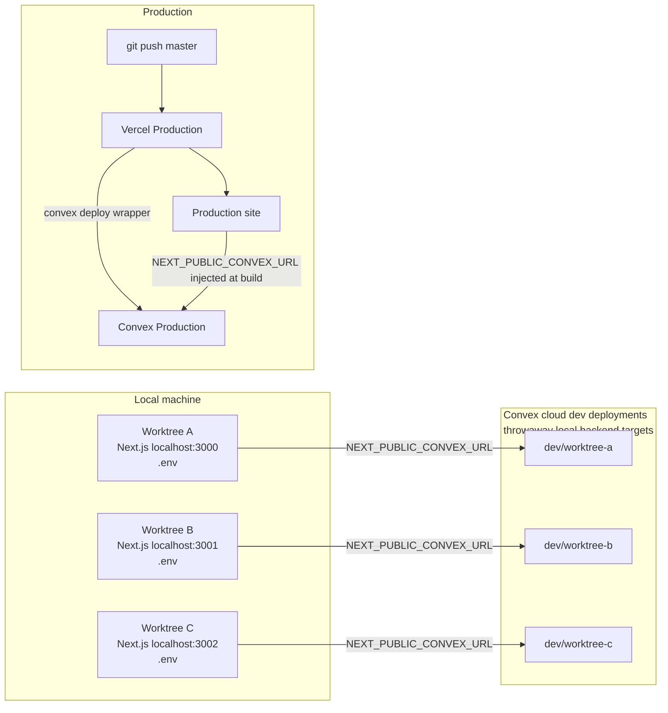

# Development

Last updated: 2026-06-03

## How to Update This Document

This is Drip's local development workflow map. Keep it focused on how to run and
test Drip locally, how parallel worktrees should use Convex, and where to look
for platform-specific rules.

When local development changes:

1. Update this document if local setup, local testing, worktree behavior, or
   local env ownership changes.
2. Update `docs/CONVEX.md` for Convex-specific backend rules.
3. Update `docs/VERCEL.md` for Vercel-specific platform rules.
4. Update `.env.example` in the same change if any local env var changes.
5. Keep real env values, deployment URLs, dashboard links, project IDs, and
   deploy keys out of committed files.

## Two Environment Model

Drip has only two environments:

```text
Local = localhost Next.js + throwaway Convex dev deployment
Prod  = Vercel Production + Convex Production
```

There is no local Vercel environment, no Vercel Preview environment, no Vercel
Development environment, and no shared staging environment.



Vercel may be linked locally for CLI access through `.vercel/project.json`, but
that file is private metadata. It is not a local runtime environment.

## Local Setup

Install dependencies:

```bash
pnpm install
```

Configure or reuse the local Convex dev deployment:

```bash
pnpm exec convex dev --configure existing
pnpm exec convex dev
```

Start the local Next.js app:

```bash
pnpm dev
```

If port `3000` is busy in another worktree, run Next.js on another local port:

```bash
pnpm exec next dev -p 3001
```

## Parallel Worktrees

Each worktree has its own ignored `.env`. If a worktree may change
`src/convex/`, it should use its own Convex dev deployment:

```bash
git worktree add ../drip-<lane-name> -b codex/<lane-name> master
cd ../drip-<lane-name>
pnpm install
pnpm exec convex deployment create dev/<lane-name> --type dev --select
pnpm exec convex dev
pnpm dev -- -p <port>
```

Frontend-only worktrees can temporarily share a Convex dev deployment, but the
default for serious parallel work is one Convex dev deployment per lane.

For sandbox work, run `pnpm run setup:base-snapshot` after changing
`sandbox/`. It creates a new base snapshot and syncs `BASE_SANDBOX_IMAGE` into
local `.env`, the selected Convex deployment, and prod Convex.

## Local Verification

For Convex-backed changes:

```bash
pnpm exec convex codegen
pnpm exec convex run smoke:ping '{"label":"local"}'
```

For app changes:

```bash
pnpm test
pnpm lint
pnpm typecheck
pnpm build
```

For black-box sandbox smoke tests through Convex:

```bash
pnpm test:smoke:sandbox -- --scenario fashion-designer-product
pnpm test:smoke:sandbox -- --scenario scout-cultural
pnpm e2e:sandbox -- --scenario fashion-designer-product
pnpm e2e:sandbox -- --scenario scout-cultural
```

For browser verification, run `pnpm dev`, open the local app, and verify
`/convex-smoke` shows the live Convex smoke status.

## References

- `docs/CONVEX.md`: Convex source layout, dev deployment rules, CLI commands,
  and Convex plugin usage.
- `docs/VERCEL.md`: Vercel project link, production env ownership, CLI
  commands, and Vercel plugin usage.
- `docs/DEPLOYMENT.md`: production deploy and verification workflow.
- `docs/SANDBOX.md`: local `pnpm run setup:base-snapshot` flow for refreshing
  the Codex SDK Vercel Sandbox base image.
