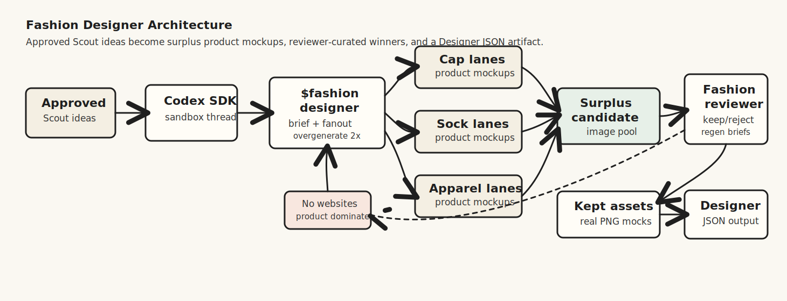
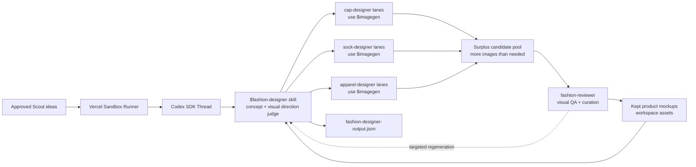

# Fashion Designer

Fashion Designer is Drip's second AI teammate. Its job is to take approved
Scout ideas and turn them into clothing concepts plus mock images that a user
can compare, revise, and select for ad testing.

Fashion Designer starts after Scout. It does not discover trends, run ads, post
to Convex, or build storefronts.

The output should feel like beautiful fashion product work: real-looking caps,
socks, tees, hoodies, bundles, or product-on-model shots. It should not look
like a website, ecommerce page, landing page, or ad dashboard.





## TL;DR

The product prompt should stay lean:

```text
Use $fashion-designer to create concepts and mock images for these approved Scout ideas: [...]
```

The `$fashion-designer` skill owns the rest: product direction, parallel
candidate fanout, surplus image generation, reviewer curation, artifact writing,
and JSON validation.

## How It Runs

1. Convex starts a Vercel Sandbox from `BASE_SANDBOX_IMAGE`.
2. The sandbox runner starts a Codex SDK thread in `/vercel/sandbox/agent-workspace`.
3. The runner sets `CODEX_HOME` to `/vercel/sandbox/agent-workspace/.codex` so Codex can load the sandbox skills and subagents.
4. Codex uses `$fashion-designer`.
5. `$fashion-designer` reads approved Scout ideas or a provided Scout artifact.
6. `$fashion-designer` plans a surplus candidate pool, usually about 2x the requested final mock count.
7. `$fashion-designer` spawns focused product subagents in parallel, split by product family and visual angle when useful.
8. Product subagents use `$imagegen` to generate beautiful product mockups and return compact candidate summaries.
9. `$fashion-designer` sends the candidate pool to `fashion-reviewer`.
10. `fashion-reviewer` keeps the best assets, rejects low-quality or off-brief images, and requests only focused regenerations.
11. `$fashion-designer` runs at most one targeted regeneration round by default.
12. `$fashion-designer` writes `fashion-designer-output.json` and stores kept images in `fashion-designer-assets/`.

## Responsibility Map

| Layer | File | Responsibility |
| --- | --- | --- |
| Fashion Designer skill | [`sandbox/codex-agent/.agents/skills/fashion-designer/SKILL.md`](../sandbox/codex-agent/.agents/skills/fashion-designer/SKILL.md) | End-to-end Designer workflow, product direction, subagent orchestration, final review set, output contract. |
| Imagegen skill | [`sandbox/codex-agent/.codex/skills/.system/imagegen/SKILL.md`](../sandbox/codex-agent/.codex/skills/.system/imagegen/SKILL.md) | Official Codex image-generation workflow and asset handling rules. |
| Cap subagent | [`sandbox/codex-agent/.codex/agents/cap-designer.toml`](../sandbox/codex-agent/.codex/agents/cap-designer.toml) | Cap concept and product mock image generation. |
| Sock subagent | [`sandbox/codex-agent/.codex/agents/sock-designer.toml`](../sandbox/codex-agent/.codex/agents/sock-designer.toml) | Sock concept and product mock image generation. |
| Apparel subagent | [`sandbox/codex-agent/.codex/agents/apparel-designer.toml`](../sandbox/codex-agent/.codex/agents/apparel-designer.toml) | Tees, hoodies, bundles, and product-on-model mock image generation. |
| Reviewer subagent | [`sandbox/codex-agent/.codex/agents/fashion-reviewer.toml`](../sandbox/codex-agent/.codex/agents/fashion-reviewer.toml) | Visual QA, rejection, curation, and focused regeneration requests. |
| Codex sandbox config | [`sandbox/codex-agent/.codex/config.toml`](../sandbox/codex-agent/.codex/config.toml) | Sets sandbox defaults and registers subagents; project skills are discovered from `.agents/skills` and system skills from `.codex/skills`. |
| Runner | [`sandbox/runner/codex.ts`](../sandbox/runner/codex.ts) | Runs Codex SDK, passes run env, and streams generic Codex events/results. |
| Base snapshot setup | [`scripts/setup_base_snapshot.ts`](../scripts/setup_base_snapshot.ts) | Copies and smoke-tests the sandbox runtime payload. |
| Sandbox guide | [`docs/SANDBOX.md`](SANDBOX.md) | Runtime, env, and base snapshot map. |

## Important Boundaries

- Scout finds trends. Fashion Designer only works from approved ideas, provided
  topics, or a Scout artifact.
- Fashion Designer owns visual judgment. Do not implement coded concept ranking,
  mock scoring, or product-type selection in runner, Convex, or helper scripts.
- Generate more image candidates than the final requested count, then let
  `fashion-reviewer` discard weak images and keep the best set.
- `$imagegen` is the only image-generation capability. Use the official
  built-in image generation path by default.
- If built-in image generation is unavailable in the sandbox, Fashion Designer
  may use the official `$imagegen` CLI fallback with `OPENAI_API_KEY`.
- Do not accept locally rendered placeholder PNGs as generated campaign assets.
- Do not generate websites, storefronts, ecommerce pages, ad dashboards, browser
  UI, or landing-page layouts. The product itself should dominate the image.
- Product subagents do not decide ad winners. They create and self-review mock
  images for Fashion Designer.
- `fashion-reviewer` does not discover trends or decide ad winners. It reviews
  image quality, rejects weak candidates, and asks for targeted regeneration
  only when the final set has a real gap.
- Generated images meant for the campaign must be copied into the agent
  workspace. Do not leave project-bound assets only under `$CODEX_HOME`.
- Fashion Designer stops before Performance Marketer. It outputs selected mocks
  for review, not ad campaign results.

## Speed Strategy

The fast path is parallel overgeneration:

1. Make a compact design brief.
2. Start multiple product lanes at once, using `cap-designer`, `sock-designer`,
   and `apparel-designer`.
3. Ask for a surplus pool, typically about 2x the requested final mocks.
4. Send the pool to `fashion-reviewer`.
5. Keep enough strong assets and stop. Regenerate only targeted failures.

This optimizes wall-clock time while preserving taste. More raw images are
generated, but the user waits for parallel lanes instead of a long serial
perfecting loop.

## Output

Fashion Designer writes:

```text
/vercel/sandbox/agent-workspace/fashion-designer-output.json
```

Generated images are saved under:

```text
/vercel/sandbox/agent-workspace/fashion-designer-assets/
```

The schema version is:

```text
fashion-designer.concepts.v1
```

Read the Fashion Designer skill for the exact JSON shape.

The runner is intentionally generic and does not enforce this Designer-specific
artifact contract. E2E tests and any future Designer-specific orchestration
layer should verify the JSON exists, parses, references existing image files,
records reviewer curation, and matches the expected schema.

## Updating The Base Image

Fashion Designer lives inside the sandbox agent payload. After changing files
under `sandbox/codex-agent/` or `sandbox/runner/`, recreate the base image
before black-box sandbox testing. The setup command syncs `BASE_SANDBOX_IMAGE`
into local `.env`, selected Convex, and prod Convex:

```bash
pnpm run setup:base-snapshot
```
