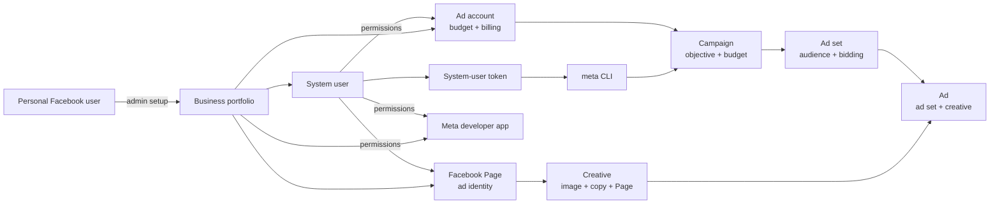

# Meta Ads CLI

Last updated: 2026-06-07

This guide captures the Meta Ads CLI proof for Drip's Performance Marketer.
The intent is to let a sandbox agent create real Meta ad assets, keep spend
under operator control, and return enough evidence for the Drip user to review
the paused drop-of-week ad draft.

This is not a simulated ad flow. The Performance Marketer should create real
Meta campaign objects, but it should default to paused objects until the user
explicitly approves delivery.

## Product Intent

Drip's Performance Marketer promotes the generated Builder drop page with the
selected product images.

| Product need | Meta Ads CLI behavior |
| --- | --- |
| Promote the generated drop page | Create a paused campaign, one paused ad set, one creative, and one paused ad that links to the Builder URL. |
| Keep the user in control | Create assets as `PAUSED` first and require explicit approval before activation. |
| Show visible evidence | Return campaign/ad status, budget, creative names, and an Ads Manager review artifact. |
| Keep the ad focused | Create one paused ad for the Builder page and do not start optimization loops in v1. |

For the hackathon demo, the minimum credible proof is:

1. A Facebook Page identity exists.
2. A Meta ad account exists with billing ready.
3. The sandbox agent can authenticate with the official `meta` CLI.
4. The CLI can create a paused campaign, paused ad set, creative, and paused ad
   for the Builder website URL.
5. The objects are visible in Ads Manager and verifiable with CLI `list`/`get`.

## Relationship Map



### What Each Piece Means

| Object | Why it matters |
| --- | --- |
| Personal Facebook user | Performs the one-time setup, accepts policies, creates or owns the business assets. |
| Business portfolio | Container for the Page, ad account, app, system user, and permissions. |
| Facebook Page | Required identity for Facebook ads. Even a basic Facebook-only ad needs a Page. |
| Ad account | Holds currency, timezone, payment method, budget limits, campaigns, ad sets, ads, and insights. |
| Meta developer app | Lets the system user generate a token with Marketing API permissions. |
| System user | Non-human business user used for server/CLI automation. |
| System-user token | Secret used by the CLI. It must never be committed or printed. |
| Campaign | Top-level ad object. Holds objective and, in our demo path, campaign-level daily budget. |
| Ad set | Audience, optimization goal, billing event, bidding, schedule, and placements. |
| Creative | Page identity plus image/video/copy/click destination. |
| Ad | Connects one ad set to one creative. |

## One-Time Meta Setup

These steps can use the Meta UI because they are account/bootstrap tasks. The
thing Drip must prove through automation is campaign operation after setup.

| Step | Result |
| --- | --- |
| Create business portfolio | Business owns the ad account, Page, app, and system user. |
| Create ad account | Use the target country/currency/timezone. Our India demo used INR and Asia/Kolkata. |
| Add billing/funding | Required before real delivery, and often needed before Meta accepts write flows reliably. |
| Accept required disclosures | Ads Manager may show first-time policy prompts, such as the non-discrimination policy. |
| Create Facebook Page | Required for Facebook ad identity. For the demo, use a simple Page such as `Drop by Codex`. |
| Create Meta developer app | Needed for the system-user token. |
| Publish/live the app if required | Some permissions and token flows are blocked while the app is only in development. |
| Create system user | Assign full access to the Page, ad account, and app. |
| Generate system-user token | Include `ads_management`, `ads_read`, `business_management`, `pages_manage_ads`, `pages_read_engagement`, and `pages_show_list`. |

Do not put real account IDs, app IDs, token values, payment details, or dashboard
URLs in docs, commits, screenshots, or final agent messages.

## Runtime Env

The official CLI expects these env names:

```bash
ACCESS_TOKEN=<meta-system-user-token>
AD_ACCOUNT_ID=act_<ad-account-id>
BUSINESS_ID=<business-portfolio-id>
PAGE_ID=<facebook-page-id>
```

Drip keeps private runtime env under namespaced app variables and maps them into
the official CLI names inside the sandbox runner:

| Drip env | CLI env | Notes |
| --- | --- | --- |
| `META_ADS_ACCESS_TOKEN` | `ACCESS_TOKEN` | System-user token. Secret. |
| `META_ADS_AD_ACCOUNT_ID` | `AD_ACCOUNT_ID` | Use the CLI account ID with the `act_` prefix. |
| `META_ADS_BUSINESS_ID` | `BUSINESS_ID` | Optional but useful for business-scoped list operations. |
| `META_ADS_PAGE_ID` | `PAGE_ID` | Optional Page identity for ad creatives when page-list discovery is unavailable. |

For current local testing, the ignored repo `.env` stores both forms:

- `META_ADS_ACCESS_TOKEN`, `META_ADS_AD_ACCOUNT_ID`,
  `META_ADS_BUSINESS_ID`, `META_ADS_PAGE_ID` for Drip's runtime contract.
- `ACCESS_TOKEN`, `AD_ACCOUNT_ID`, `BUSINESS_ID`, `PAGE_ID` as direct aliases
  for the official `meta` CLI.

Keep those values only in private runtime config. Do not copy real values into
`.env.example`, docs, screenshots, logs, commits, or final agent messages.

Important gotcha: Meta surfaces several numeric IDs for the same-looking asset.
For the CLI, `AD_ACCOUNT_ID` must be the usable ad account ID, including the
`act_` prefix. Passing a business asset ID can cause confusing API errors during
campaign creation.

For creative creation, prefer an explicit `PAGE_ID` when configured. Some
system-user tokens can create ads for a Page they are assigned to but still fail
generic page-list discovery.

When `PAGE_ID` is present, page-list discovery is informational only. An empty
`meta ads page list` result must not block the paused-ad recipe.

## Local CLI Smoke

In the Vercel Sandbox base image, `meta` should already be on PATH.

```bash
set -a
source .env
set +a

meta --version
meta auth status
meta ads adaccount list
meta ads page list
meta ads campaign list
```

Do not paste `meta auth status` output into public logs; it can reveal a token
prefix even when it masks most of the token.

For local host testing without installing the tool globally, run the official
package through `uvx`:

```bash
set -a
source .env
set +a

uvx --python 3.12 --from meta-ads meta --version
uvx --python 3.12 --from meta-ads meta auth status
uvx --python 3.12 --from meta-ads meta ads adaccount list
```

The current Drip sandbox setup preinstalls the `meta-ads` package through a
Python 3.12 `uv` tool because the package requires Python 3.12+.

## Paused Campaign Flow

This is the flow that worked for the Facebook-only proof.

For the Performance Marketer live smoke, run this flow from one private wrapper
script instead of a command-by-command agent loop. After the campaign and Page
are known, create one ad set, upload the selected product image or images,
create one creative, create one paused ad, and perform only the bounded status
checks needed for paused-object evidence. The wrapper should print one
sanitized JSON summary plus phase timings; raw Meta IDs and raw CLI/Graph JSON
stay in private variables/files.

### 1. Create The Campaign

Use a paused traffic campaign with campaign-level budget. Meta requires campaign
creation to explicitly declare special ad categories. For Drip's normal
apparel/drop traffic tests, no special category applies, so use
`special_ad_categories=[]`.

The current official `meta` CLI package verified in the sandbox (`meta-ads`
1.0.1) does not expose a campaign-create flag for this field. If
`meta ads campaign create` returns that `special_ad_categories` is required, use
the Graph API fallback for campaign creation, then continue with the CLI for the
ad set and Graph calls for image upload, creative creation, ad creation, and the
final pause update.

Graph fallback:

```bash
META_API_VERSION="${META_API_VERSION:-v25.0}"

curl -sS -X POST "https://graph.facebook.com/${META_API_VERSION}/${AD_ACCOUNT_ID}/campaigns" \
  -F "name=Drop by Codex 100 INR Paused Demo" \
  -F "objective=OUTCOME_TRAFFIC" \
  -F "daily_budget=10000" \
  -F "status=PAUSED" \
  -F "special_ad_categories=[]" \
  -F "access_token=${ACCESS_TOKEN}"
```

CLI campaign creation is acceptable only when the installed CLI can send
`special_ad_categories`.

```bash
meta ads campaign create \
  --name "Drop by Codex 100 INR Paused Demo" \
  --objective outcome_traffic \
  --daily-budget 10000 \
  --status paused
```

Budget values are minor units. For INR, `10000` means Rs 100. A Rs 50 daily
budget failed in our India test because Meta rejected it as too small. Rs 100
succeeded for the demo account.

### 2. Create The Ad Set

If the campaign uses campaign-level budget, omit ad set budget flags.

```bash
meta ads adset create <campaign-id> \
  --name "Drop by Codex Traffic Ad Set" \
  --optimization-goal link_clicks \
  --billing-event impressions \
  --bid-amount 100 \
  --targeting-countries IN \
  --status paused
```

The test account required `--bid-amount`; without it, Meta returned a bid-cap
requirement error. Keep this field configurable because different account bid
strategy settings can change what Meta requires.

### 3. Upload Images And Create A Creative

Create the creative under the same ad account and Page identity that the ad will
use. Upload selected local images first and use the returned image hash or
hashes; this is more reliable than relying on CLI local-file creative handling.
The Performance Marketer v1 path should try a carousel creative when multiple
selected image hashes exist, then fall back to one static image if Meta rejects
the carousel shape.

```bash
PAGE_ID=<page-id>
DESTINATION_URL=<builder-url>
META_API_VERSION="${META_API_VERSION:-v25.0}"

curl -sS -X POST "https://graph.facebook.com/${META_API_VERSION}/${AD_ACCOUNT_ID}/adimages" \
  -F "filename=@./selected-product.jpg" \
  -F "access_token=${ACCESS_TOKEN}"

OBJECT_STORY_SPEC='{
  "page_id": "<page-id>",
  "link_data": {
    "image_hash": "<image-hash>",
    "link": "<builder-url>",
    "message": "Drop-of-week copy.",
    "name": "Drop by Codex",
    "description": "Limited drop for this week.",
    "call_to_action": {
      "type": "SHOP_NOW",
      "value": { "link": "<builder-url>" }
    }
  }
}'

curl -sS -X POST "https://graph.facebook.com/${META_API_VERSION}/${AD_ACCOUNT_ID}/adcreatives" \
  -F "name=Drop by Codex Creative" \
  -F "object_story_spec=${OBJECT_STORY_SPEC}" \
  -F "access_token=${ACCESS_TOKEN}"
```

Creative ownership matters. A creative created under one ad account cannot be
attached to an ad set in another ad account.

### 4. Create The Ad

```bash
CREATIVE_JSON='{"creative_id":"<creative-id>"}'

curl -sS -X POST "https://graph.facebook.com/${META_API_VERSION}/${AD_ACCOUNT_ID}/ads" \
  -F "name=Drop by Codex Demo Ad" \
  -F "adset_id=<ad-set-id>" \
  -F "creative=${CREATIVE_JSON}" \
  -F "status=PAUSED" \
  -F "access_token=${ACCESS_TOKEN}"
```

For extra safety, explicitly update the ad back to paused after creation:

```bash
curl -sS -X POST "https://graph.facebook.com/${META_API_VERSION}/<ad-id>" \
  -F "status=PAUSED" \
  -F "access_token=${ACCESS_TOKEN}"
```

### 5. Verify

```bash
meta ads campaign list
meta ads campaign get <campaign-id>

meta ads adset list
meta ads adset get <ad-set-id>

meta ads creative list
meta ads creative get <creative-id>

meta ads ad list
meta ads ad get <ad-id>
```

Expected safe state after creation:

| Object | Configured status | Effective status |
| --- | --- | --- |
| Campaign | `PAUSED` | `PAUSED` |
| Ad set | `PAUSED` | `PAUSED` |
| Ad | `PAUSED` | Often `PENDING_REVIEW` or `IN_PROCESS` until Meta completes review |

The ad can be pending review while still configured paused. That means Meta is
processing the object, not that delivery is active.

## Single Drop Ad Demo

For the v1 demo, create one explicit creative/ad for the drop-of-week page. Use
the Builder URL as `DESTINATION_URL` and the selected product image set as the
creative input. Keep the selected images together as the one drop ad set.

Use the Graph image-upload plus creative/ad creation recipe above. The output
should record all selected image refs; the actual creative should use a
carousel when possible or one static image with a sanitized fallback note.

The CLI may support Dynamic Creative Optimization style inputs with repeated
`--images`, `--titles`, `--bodies`, and `--call-to-actions`. Do not use that for
the v1 Drip flow unless a future product spec reintroduces Meta-managed
creative testing.

## Preview And Review Links

The official `meta` CLI currently exposes create/list/get/update/delete flows
for ad objects, but it does not expose a dedicated public ad preview URL command.

Practical review options:

| Review artifact | Works for demo? | Notes |
| --- | --- | --- |
| Ads Manager campaign/ad URL | Yes | Best visible proof for an authenticated admin. Do not commit real dashboard URLs. |
| CLI `list`/`get` output | Yes | Best deterministic proof for sandbox logs and product history. |
| Meta preview iframe generated outside the CLI | Partial | Can show a logged-in preview, but it is not a public URL and is outside the official CLI proof path. |
| Public Facebook ad URL | No reliable paused-ad URL | Paused or pending ads do not behave like public posts. |

For Drip product UX, treat the campaign status plus a reviewable Ads Manager
artifact as the acceptance target. After active delivery, insights and Meta's UI
become the source for performance reporting.

## Findings From The E2E Proof

Date: 2026-06-07.

| Finding | Impact |
| --- | --- |
| The official CLI package is `meta-ads`; command is `meta`. | The sandbox should preinstall `meta` and agents should not bootstrap it per run. |
| The CLI authenticates from `ACCESS_TOKEN`, `AD_ACCOUNT_ID`, and `BUSINESS_ID`. | Drip maps private `META_ADS_*` env into those official names. |
| `AD_ACCOUNT_ID` must be the CLI-visible `act_...` account ID. | Using the wrong Meta asset ID can create generic API failures. |
| A Page is required for Facebook ad creatives. | Facebook-only is the easiest first demo; Instagram can wait. |
| Billing/funding and one-time Ads Manager disclosures can block account readiness. | Use UI only for setup; then prove ad operations with the CLI. |
| Rs 50 daily budget was too low for the India test account. | Use Rs 100 for the hackathon demo cap unless a future account reports a lower minimum. |
| Campaign creation requires `special_ad_categories=[]` for normal Drip apparel/drop tests. | Use the Graph fallback for campaign creation until the official CLI exposes that field. |
| Ad set creation required `--bid-amount` for the test account. | Keep bid amount configurable and retry with it when Meta asks for a bid cap. |
| Creative creation can fail with tiny or invalid local image fixtures. | Use real RGB JPEG/PNG assets, 1080x1080 or larger for smoke inputs, and upload them through `/adimages` before creative creation. |
| Creative ownership is scoped to the ad account. | Create creatives under the same ad account used by the ad set. |
| A newly created ad may show `PENDING_REVIEW` or `IN_PROCESS` while configured paused. | This is expected review processing; verify `configured_status` or explicit `status` before claiming safety. |
| The CLI does not provide a public ad preview URL command. | Use Ads Manager plus CLI status as the review artifact. |

## Common Blockers

| Symptom | Likely cause | Fix |
| --- | --- | --- |
| `No results` for ad accounts | Token lacks business/ad-account access. | Assign the system user to the ad account and regenerate/refresh token permissions. |
| Campaign create says `special_ad_categories` is required | The installed CLI cannot send Meta's required campaign category field. | Use Graph campaign-create fallback with `special_ad_categories=[]`, then continue with CLI. |
| Campaign create returns generic API error | Wrong ad account ID, account not ready, missing billing, first-time policy prompt, or missing required API field. | Confirm `meta ads adaccount list`, use `act_...`, clear setup prompts, verify billing, and validate `special_ad_categories=[]`. |
| Rs 50 budget rejected | Account minimum daily budget is higher. | Use the account's minimum or Rs 100 for India demo. |
| Ad set asks for bid cap | Account/campaign bid strategy requires `bid_amount`. | Retry ad set create with `--bid-amount`. |
| Creative create fails after campaign/ad set creation | Invalid image fixture, CLI local-file upload limitation, Page/ad-account mismatch, or Meta policy validation. | Generate real 1080x1080 RGB smoke images, upload through `/adimages`, create the creative from `image_hash`, and return sanitized `stage`, `errorCode`, `errorSubcode`, `errorType`, and `errorMessage` if it still fails. |
| Creative cannot attach to ad | Creative belongs to another ad account. | Recreate the creative under the same current `AD_ACCOUNT_ID`. |
| Ad is pending review | Meta review is processing the ad. | Keep status paused and poll until review completes if delivery is needed. |
| Need Instagram-only placement | Instagram account and placement configuration are not yet wired. | Start with Facebook-only; add Instagram asset linking later. |

## Sandbox Agent Rules

Sandbox agents using `meta-ads-cli` should follow these rules:

1. Run read-only smoke checks before mutation.
2. Never print tokens or raw account/app/business IDs in final answers.
3. Create campaign objects as `paused` by default.
4. Keep budgets at or below the user-approved cap.
5. Use Facebook-only Page identity for the first demo unless the task explicitly
   asks for Instagram and the Instagram asset is linked.
6. Return concise evidence: campaign name, budget, status, ad set status, ad
   status, and whether the ad is pending review.
7. Do not activate a campaign, ad set, or ad without an explicit user approval
   for live delivery.

## Productization Notes

The product should eventually store these fields on the Drop Campaign record:

| Field | Why |
| --- | --- |
| Campaign name and sanitized Meta object references | Lets the cockpit reopen/reconcile the Meta test. |
| Budget cap and currency | Makes spend controls visible to the user. |
| Objective, audience, and optimization goal | Explains what was being tested. |
| Creative names and image references | Ties the ad artifact back to selected Designer mocks. |
| Configured/effective statuses | Separates user-controlled pause state from Meta review state. |
| Review artifact | Link or reference for an admin to inspect in Ads Manager. |
| Destination URL | The Builder website link used by the ad. |
| Selected image references | Ties the ad back to the Fashion Designer selections. |

Open product questions:

| Question | Current answer |
| --- | --- |
| Should Drip auto-activate ads? | No. Create paused first; activation should be explicit. |
| Is Instagram needed for v1 demo? | No. Facebook-only is simpler and proves the CLI path. |
| Can we show a public ad link? | Not reliably for paused/pending ads. Show Ads Manager artifact plus CLI status. |
| What is the smallest budget? | Account-specific. Rs 50 failed; Rs 100 succeeded in the India proof. |
| Should we use dynamic creative optimization? | No for v1. The current product creates one paused ad for the Builder page. |
