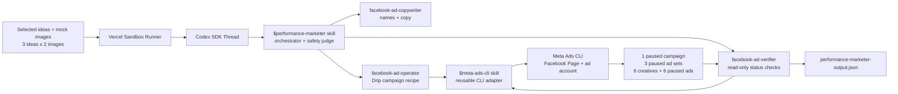

# Performance Marketer

Performance Marketer is Drip's third AI teammate. Its job is to take selected
Fashion Designer mock images and create real Facebook-only Meta ad campaign
objects for validation.

Performance Marketer stops after paused campaign creation. It does not activate
ads, read campaign performance, recommend a winner, generate product mockups, or
build storefronts.



## TL;DR

The product prompt should stay lean:

```text
Use $performance-marketer to create a paused Facebook ad campaign for these 3 ideas and 6 selected images: [...]
```

The `$performance-marketer` skill owns Drip's campaign plan, subagent
orchestration, paused-only safety judgment, output JSON writing, and JSON
validation. The `$meta-ads-cli` skill only knows the CLI command surface and
safety rules.

## How It Runs

1. Convex starts a Vercel Sandbox from `BASE_SANDBOX_IMAGE`.
2. The sandbox runner starts a Codex SDK thread in
   `/vercel/sandbox/agent-workspace`.
3. Codex uses `$performance-marketer`.
4. `$performance-marketer` parses selected idea/image inputs or a Fashion
   Designer artifact.
5. `facebook-ad-copywriter` creates Facebook ad names and copy.
6. `facebook-ad-operator` uses `$meta-ads-cli` to run preflight and create the
   paused campaign objects.
7. `facebook-ad-verifier` uses `$meta-ads-cli` read-only commands to verify
   configured paused state.
8. `$performance-marketer` writes `performance-marketer-output.json` with
   sanitized refs only.

## Responsibility Map

| Layer | File | Responsibility |
| --- | --- | --- |
| Performance Marketer skill | `sandbox/codex-agent/.agents/skills/performance-marketer/SKILL.md` | Drip-specific campaign orchestration, paused-only safety, output contract. |
| Meta Ads CLI skill | `sandbox/codex-agent/.agents/skills/meta-ads-cli/SKILL.md` | Reusable Meta CLI usage, env mapping, preflight, redaction, paused creation rules. |
| Copywriter subagent | `sandbox/codex-agent/.codex/agents/facebook-ad-copywriter.toml` | Campaign/ad set/ad names and Facebook copy. |
| Operator subagent | `sandbox/codex-agent/.codex/agents/facebook-ad-operator.toml` | Creates the exact Drip hackathon campaign recipe with the CLI. |
| Verifier subagent | `sandbox/codex-agent/.codex/agents/facebook-ad-verifier.toml` | Read-only status verification and sanitized evidence. |
| Runner | `sandbox/runner/codex.ts` | Passes Meta env into Codex; remains generic. |
| Sandbox guide | `docs/SANDBOX.md` | Runtime, env, and base snapshot map. |

## Important Boundaries

- `$meta-ads-cli` is the adapter. It does not know Drip's three-idea/six-image
  recipe.
- `facebook-ad-operator` knows the recipe: one paused campaign, three paused ad
  sets, six creatives, and six paused ads.
- Performance Marketer must not activate campaigns, ad sets, or ads.
- Performance Marketer must not read insights in this pass.
- Final responses and docs must not include raw Meta IDs, dashboard URLs, or
  private env values.
- `performance-marketer-output.json` records sanitized refs only.

## Output

Performance Marketer writes:

```text
/vercel/sandbox/agent-workspace/performance-marketer-output.json
```

The schema version is:

```text
performance-marketer.facebook-campaign.v1
```

The output includes idea/image mapping, campaign/ad set/ad names, sanitized
Meta refs, configured/effective statuses, verification evidence, and safety
booleans:

- `facebookOnly: true`
- `activationPerformed: false`
- `insightsReadbackPerformed: false`
- `rawMetaIdsPersisted: false`

## Smoke Test

The guarded black-box scenario sends a lean prompt through a real
`sandboxRuns` row and creates real paused Meta objects:

```bash
pnpm e2e:sandbox -- --scenario performance-marketer-facebook-paused --allow-meta-create
```

The scenario is excluded from `--scenario all` unless `--allow-meta-create` is
also provided.

Expected proof:

- `performance-marketer-output.json` parses with schema
  `performance-marketer.facebook-campaign.v1`.
- Meta env presence reached the Codex process.
- The output records one campaign, three ad sets, six creatives, and six ads.
- All delivery objects are configured paused.
- No activation or insights readback happened.
- No raw Meta-looking IDs are present in the final response or output JSON.

## Updating The Base Image

Performance Marketer lives inside the sandbox agent payload. After changing
files under `sandbox/codex-agent/` or `sandbox/runner/`, recreate the base image
before black-box sandbox testing:

```bash
pnpm run setup:base-snapshot
```
