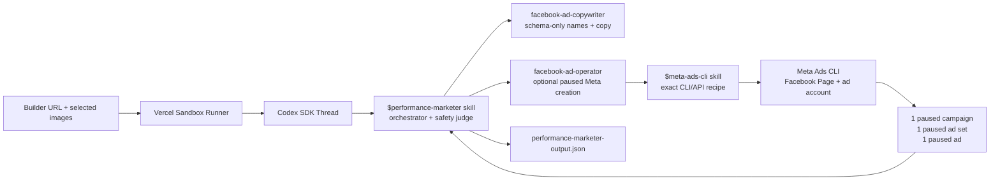

# Performance Marketer

Performance Marketer is Drip's fourth AI teammate. Its job is to take the
generated Builder website URL plus selected Fashion Designer product images and
create one paused Facebook-only ad artifact for the limited drop.

Performance Marketer stops after paused draft creation. It does not activate
ads, read performance, run optimization loops, generate product
mockups, or build storefronts.



## TL;DR

The product prompt should stay lean:

```text
Use $performance-marketer to create one paused Facebook drop-of-week ad for this Builder website and these selected product images: [...]
```

The `$performance-marketer` skill owns Drip's ad plan, subagent orchestration,
paused-only safety judgment, output JSON writing, and JSON validation. The
`$meta-ads-cli` skill owns the exact Meta command recipe and safety rules when
real paused Meta object creation is explicitly requested.

## How It Runs

1. Convex starts a Vercel Sandbox from `BASE_SANDBOX_IMAGE`.
2. The sandbox runner starts a Codex SDK thread in
   `/vercel/sandbox/agent-workspace`.
3. Codex uses `$performance-marketer`.
4. `$performance-marketer` parses the Builder website URL, Builder artifact,
   selected products, and selected image paths.
5. `facebook-ad-copywriter` creates Facebook ad names and copy.
6. `facebook-ad-operator` uses `$meta-ads-cli` only when the prompt explicitly
   asks for real paused Meta objects. Otherwise the artifact remains a safe
   paused draft plan. Smoke tests must use real square JPEG/PNG assets, not
   tiny byte fixtures, before asking Meta to create a creative.
7. `$performance-marketer` writes `performance-marketer-output.json` with
   sanitized refs only.

## Responsibility Map

| Layer | File | Responsibility |
| --- | --- | --- |
| Performance Marketer skill | `sandbox/codex-agent/.agents/skills/performance-marketer/SKILL.md` | Drip-specific ad orchestration, paused-only safety, output contract. |
| Meta Ads CLI skill | `sandbox/codex-agent/.agents/skills/meta-ads-cli/SKILL.md` | Exact Drip Meta command recipe, env mapping, preflight, redaction, and paused creation rules. |
| Copywriter subagent | `sandbox/codex-agent/.codex/agents/facebook-ad-copywriter.toml` | Schema-only campaign/ad set/ad names and Facebook copy. |
| Operator subagent | `sandbox/codex-agent/.codex/agents/facebook-ad-operator.toml` | Runs the exact `$meta-ads-cli` paused Facebook recipe when allowed and returns sanitized evidence. |
| Runner | `sandbox/runner/codex.ts` | Passes Meta env into Codex; remains generic. |
| Sandbox guide | `docs/SANDBOX.md` | Runtime, env, and base snapshot map. |

## Important Boundaries

- `$meta-ads-cli` owns the exact command recipe: one paused campaign, one
  paused ad set, one creative/ad.
- The ad destination must be the Builder website URL.
- The creative must use the selected product image set from Fashion Designer or
  the Builder handoff.
- Performance Marketer must create exactly one paused ad artifact in v1.
- Performance Marketer must not tell the user what to build.
- Performance Marketer must not activate campaigns, ad sets, or ads.
- Performance Marketer must not read insights in this pass.
- Final responses and docs must not include raw Meta IDs, dashboard URLs, or
  private env values.
- `performance-marketer-output.json` records sanitized refs only.

## Output

Performance Marketer writes:

```text
/vercel/sandbox/agent-workspace/performance-marketer-output.json
```

The schema version is:

```text
performance-marketer.facebook-campaign.v1
```

The output includes:

| Field | Requirement |
| --- | --- |
| `input.destinationUrl` | Builder website URL. |
| `input.selectedImageRefs` | Product image refs used in the ad. |
| `safety.facebookOnly` | `true` |
| `safety.abTestingPerformed` | `false`, retained as a safety field for compatibility. |
| `safety.activationPerformed` | `false` |
| `safety.insightsReadbackPerformed` | `false` |
| `safety.rawMetaIdsPersisted` | `false` |
| `campaign` | One paused Facebook traffic campaign. |
| `adSets` | One paused ad set for the drop-of-week audience. |
| `ads` | One ad using the Builder URL and selected product image set. |
| `verification` | Sanitized paused-draft evidence and zero issues. |

## Smoke Test

The guarded black-box scenario sends a lean prompt through a real
`sandboxRuns` row and may create real paused Meta objects only when explicitly
allowed:

```bash
pnpm e2e:sandbox -- --scenario performance-marketer-facebook-paused --allow-meta-create
```

The scenario is excluded from `--scenario all` unless `--allow-meta-create` is
also provided.

Expected proof:

- `performance-marketer-output.json` parses with schema
  `performance-marketer.facebook-campaign.v1`.
- Meta env presence reached the Codex process.
- The output records one campaign, one ad set, one creative, and one ad.
- The ad destination is the Builder URL.
- The selected product image refs are carried into the single ad, and any smoke
  image inputs are real square assets suitable for Meta upload.
- All delivery objects are configured paused.
- No optimization loop, activation, or insights readback happened.
- The output records `rawMetaIdsPersisted: false`.

## Updating The Base Image

Performance Marketer lives inside the sandbox agent payload. After changing
files under `sandbox/codex-agent/` or `sandbox/runner/`, recreate the base image
before black-box sandbox testing:

```bash
pnpm run setup:base-snapshot
```
