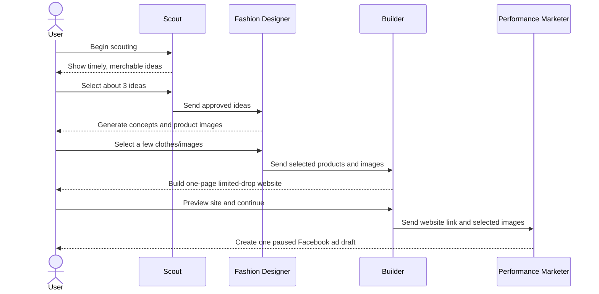
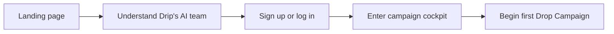
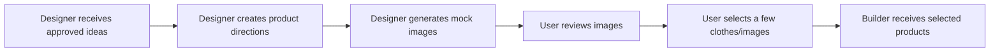
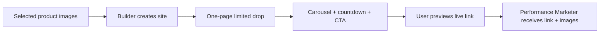
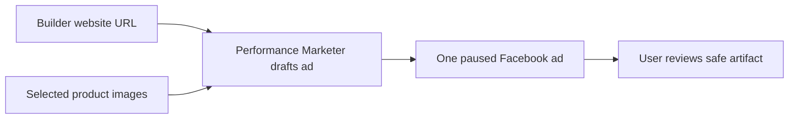

# Drip PRD

Last updated: 2026-06-08

> **Product in one line:** Drip is an AI-powered drop studio that turns
> internet moments into limited-edition merch drops, a one-page drop website,
> and a paused Facebook ad draft for launch.

> **Core product promise:** Help the user decide what merch should become this
> week's limited drop, generate the product visuals, build the drop page, and
> prepare a safe paused ad that points to the page.

---

## How to Update This Document

This is Drip's lightweight product requirements document and product changelog.
Keep it focused on the user journey, product behavior, decisions, and
acceptance criteria. Detailed implementation notes belong in the teammate and
platform docs.

When product requirements change:

1. Update the relevant product journey or acceptance criteria.
2. Add a dated amendment.
3. Keep API schemas, env details, and deep technical edge cases out unless they
   are necessary to understand the product behavior.

---

## Product Summary

Drip helps a solo creator, founder, or small fashion-commerce operator move from
"something is trending" to "this is the limited drop we can promote this week."

The product behaves like a small AI team. The user stays in control of the key
decisions, while each teammate creates a concrete artifact for the next step.

| Teammate | Plain-English Job | Main Output |
| --- | --- | --- |
| **Scout** | Finds timely, merchable cultural moments. | Candidate drop ideas |
| **Fashion Designer** | Turns approved ideas into clothing concepts and product images. | Product concepts and mock images |
| **Builder** | Turns selected product images into a one-page limited-drop website. | Live drop page with carousel and CTA |
| **Performance Marketer** | Creates one paused Facebook ad draft for the generated website. | Paused ad artifact using the page link and product images |

Drip is not just an image generator or a storefront generator. The valuable
output is a complete launch-ready package:

| Decision | What Drip Should Make Clear |
| --- | --- |
| **Why now** | Why this cultural moment is timely and who cares. |
| **What to make** | Which product ideas and images the user selected. |
| **Where to send buyers** | The generated single-page limited-drop website. |
| **How to promote it** | A paused Facebook ad draft using the site link and selected images. |
| **What is safe** | No ad activation, no experiments, and no real spend by default. |

---

## Problem Statement

Internet culture moves faster than small merchants can operate. A sports win,
album release, meme, celebrity moment, product launch, local event, or
city-specific trend can create a short window where a limited merch drop feels
urgent and desirable.

Today, the workflow is fragmented:

| The Creator Has To... | Why It Is Hard |
| --- | --- |
| Notice what is trending | Trends are noisy and decay quickly. |
| Decide whether it is merchable | Not every cultural spike should become a product. |
| Translate taste into product design | Generic meme merch feels cheap. |
| Produce credible visuals | Inventory does not exist yet. |
| Build a launch page | The site must feel timely, premium, and product-led. |
| Draft paid promotion | Ads need the final page link and strong product images. |

By the time the creator does all of this manually, the moment may already be
stale. Drip turns the work into one guided campaign where AI teammates do the
heavy lifting, show their outputs, and ask the user to approve the key handoffs.

---

## Campaign Flow

The flow is manual at each major handoff. Drip should not auto-transition past
the user's approval points.

**Design intent:** the campaign should feel like one continuous workspace. The
user should be able to watch each teammate work, review outputs in place, and
move from research to launch assets without switching tools.

---

## Scope Snapshot

| Area | Product Requirement |
| --- | --- |
| **Product surface** | Desktop web app centered on a single Drop Campaign cockpit. |
| **Primary user** | Individual operator building a limited-edition merch or fashion-drop business. |
| **Landing page** | Introduce Drip and the four teammates in the correct flow order. |
| **Authentication** | Simple username/password signup, login, and logout. |
| **Drop creation** | Let the user begin scouting from the current campaign setup. |
| **Scout research** | Scout proposes timely ideas with trend context, audience, and urgency. |
| **Idea approval** | User selects the ideas worth designing, usually about three. |
| **Design and images** | Fashion Designer creates clothing concepts and high-quality mock images. |
| **Product selection** | User selects the clothes/images that should become the drop. |
| **Website generation** | Builder creates a one-page limited-drop site with a carousel and dummy buy CTA. |
| **Ad draft** | Performance Marketer creates one paused Facebook ad artifact using the site link and selected images. |
| **History** | User can revisit current and past campaign artifacts. |

---

## Core Concepts

| Concept | Meaning |
| --- | --- |
| **User** | The person operating Drip and making final campaign decisions. |
| **Drop Campaign** | One weekly or moment-based merch launch workflow. |
| **Current Drop** | The active campaign the user is operating now. |
| **Drop History** | Previous campaigns, decisions, outputs, ad artifacts, and launched pages. |
| **AI Team** | Scout, Fashion Designer, Builder, and Performance Marketer. |
| **Candidate Idea** | A merch direction tied to a trend or user-provided topic. |
| **Product Concept** | A concrete clothing direction with product type, fit, color, graphic placement, and rationale. |
| **Mock Image** | A realistic product or fashion image generated by Fashion Designer. |
| **Selected Product Set** | The clothes/images the user chooses after Fashion Designer finishes. |
| **Drop Page** | The standalone one-page website Builder creates from selected products. |
| **Paused Ad Draft** | The Performance Marketer artifact that uses the drop page link and selected images, with delivery off. |

---

## Product Principles

| Principle | What It Means |
| --- | --- |
| **Keep the user approving the big calls** | The user approves ideas, product images, website handoff, and ad creation. |
| **Make the moment legible** | Explain why each idea matters now, who cares, and how long the window may last. |
| **Prefer taste over novelty** | The merch should feel like fashion or collectible streetwear, not low-effort meme merch. |
| **Build before promoting** | Performance Marketer should point to the generated website, not to an abstract idea. |
| **No hidden spend** | Ads are paused/draft artifacts unless the user explicitly chooses real activation later. |
| **One ad in v1** | The current product creates one paused ad for the generated drop page. |
| **Launch one focused drop** | Optimize for a compact product set and a single limited-drop page, not a sprawling catalog. |

---

## AI Team Responsibilities

| Teammate | Inputs | Outputs | Acceptance Criteria |
| --- | --- | --- | --- |
| **Scout** | Campaign setup, topics, current cultural signals, product categories, taste guidance | Candidate ideas with audience, urgency, merch angle, and rationale | User can understand and select about three ideas without reading raw research logs. |
| **Fashion Designer** | Approved ideas, product categories, audience, taste constraints | Clothing concepts plus realistic product images | User can compare images and select the few clothes/images that should become the drop. |
| **Builder** | Selected products/images, drop name, drop date, taste constraints | One-page limited-drop website with carousel, countdown, price/copy, dummy buy CTA, and live preview URL | User can preview a polished product-led site before creating an ad. |
| **Performance Marketer** | Builder website URL, selected product images, drop copy, targeting defaults | One paused Facebook ad artifact with sanitized evidence | Ad uses the generated website link and selected images; no activation, insights readback, or spend. |

### Default Campaign Counts

| Stage | Default Count |
| --- | --- |
| Scout candidate ideas | Up to **5** |
| Ideas selected by user | About **3** |
| Fashion Designer concepts/images | Multiple concepts per approved idea |
| Product images selected for website | A few strong clothes/images |
| Generated drop websites | **1** one-page limited-drop site |
| Facebook ad artifacts | **1** paused ad for the drop |

---

## User Decision Points

| Stage | User Decision | Product Requirement |
| --- | --- | --- |
| **Drop setup** | Begin scouting for the current drop | Make the campaign name/date visible. |
| **Scout** | Select which candidate ideas move to design | Preserve selected ideas as the Designer input. |
| **Fashion Designer** | Select which clothes/images become the drop | Selected images should be visible in Builder and Marketer context. |
| **Builder** | Review the generated drop website | Show the page link and product carousel before marketing. |
| **Performance Marketer** | Create or review the paused ad artifact | Show that the ad is paused and uses the Builder link plus selected images. |

---

## User Journeys

### Journey 1: First-Time User

| Moment | Acceptance Criteria |
| --- | --- |
| **Landing** | User understands Drip as an AI merch drop studio. |
| **Team intro** | User sees Scout, Fashion Designer, Builder, and Performance Marketer in that order. |
| **Workspace entry** | User lands in the main Drip workspace, not a long onboarding wizard. |

### Journey 2: Scout Research and Approval

| Moment | Acceptance Criteria |
| --- | --- |
| **Research output** | Each idea includes title, why-now, audience, merch angle, and urgency. |
| **Selection** | User can select and deselect ideas with clear visual feedback. |
| **Persistence** | The approved idea set becomes the Fashion Designer input. |

### Journey 3: Fashion Designer Concepts and Selection

| Moment | Acceptance Criteria |
| --- | --- |
| **Concepting** | Designer produces product type, fit, color, placement, and style rationale. |
| **Image quality** | Images should feel premium and product-led, not placeholder-like. |
| **Selection** | User can select the product images that should appear in the drop site. |

### Journey 4: Builder Creates the Limited Drop Website

| Moment | Acceptance Criteria |
| --- | --- |
| **Builder handoff** | Builder receives the selected Fashion Designer products/images. |
| **Generated site** | Site is a unique one-page limited-drop page, not a dashboard or generic catalog. |
| **Carousel** | Selected product images appear as the main website visual system. |
| **CTA** | Buy button is dummy/inert in v1; no checkout or payment collection. |
| **Live link** | User can open a shareable preview URL separate from the Drip cockpit. |

### Journey 5: Performance Marketer Creates Paused Ad

| Moment | Acceptance Criteria |
| --- | --- |
| **Ad input** | The ad uses the Builder website URL and selected product images. |
| **Ad shape** | One paused Facebook ad draft for the drop of the week. |
| **Safety** | No activation, no insights readback, no experiments, and no spend. |
| **Review** | User can see status, destination link, selected image set, and sanitized evidence. |

---

## Experience Direction

### Operator Cockpit

Drip should feel like a desktop-first, single-page campaign cockpit. The user
should see the current drop, teammate progress, key decisions, generated assets,
the website link, and the paused ad artifact in one energetic workspace.

| Requirement | Direction |
| --- | --- |
| **Visual continuity** | Keep the bold teammate-card visual system from the current mocks. |
| **Information density** | Dense enough for a serious operator, not a long marketing page. |
| **Decision making** | Core decisions should be selectable and approvable inline. |
| **Live progress** | Outputs should refresh from backend state as teammates finish. |
| **Tone** | Fashion-forward, high-signal, playful, and legible. |

### Generated Drop Website

The Drip cockpit and generated drop website should feel intentionally distinct.

| Surface | Purpose | Feel |
| --- | --- | --- |
| **Drip cockpit** | Internal operator interface for decisions, status, and review. | Bold, structured, teammate-led. |
| **Drop website** | Customer-facing page for selected products. | Editorial, immersive, product-led, urgent, unique to the drop. |

---

## Supporting Experience: Campaign History

Campaign history supports the core journey without becoming the main product
loop. The user should be able to switch between the current drop and older drops
cleanly, review what happened, and reopen the generated drop page.

| Stage | Acceptance Criteria |
| --- | --- |
| **History list** | User can view active and historical drops by date or campaign. |
| **Campaign record** | Each campaign preserves Scout ideas, Designer selections, Builder output, and Performance Marketer artifact. |
| **Explainability** | History makes it easy to understand why the selected products became the drop. |

---

## Key Open Questions

| Topic | Open Question |
| --- | --- |
| **Meta setup** | What exact account/Page setup is required before real paused Meta object creation is available? |
| **Commerce CTA** | Should future generated sites use checkout, waitlist, preorder, or interest capture? |
| **Revision loop** | Which teammate outputs are editable, regeneratable, or only reviewable? |
| **History depth** | How much campaign history should be visible before the cockpit feels crowded? |
| **Activation path** | What user confirmation is required before future versions can activate ads or spend? |

---

## Future Ideas

These are examples of directions Drip could explore later, not committed v1
scope.

| Idea | What It Could Add |
| --- | --- |
| **Recurring Auto Drops** | Drip prepares new campaign recommendations automatically. |
| **Ad Activation** | User explicitly approves activation and spend for a prepared ad. |
| **Commerce Integration** | Drop websites support checkout or commerce handoff. |
| **Supplier Packets** | Drip prepares production-ready handoff packets. |
| **Brand Memory** | Teammates remember taste, prior decisions, and launch preferences. |

---

## Amendments

### 2026-06-03: Initial High-Level PRD

Created the first lightweight product requirements document for Drip. Defined
the product as an autonomous AI drop studio for internet-moment merch.

### 2026-06-03: Four-Teammate Workflow Correction

Updated the PRD to use the four-teammate workflow: Scout, Designer, Performance
Marketer, and Builder. Made Designer responsible for concepts and mock images.
This amendment has been superseded by the Builder-before-Marketer flow below:
v1 no longer uses Meta/Instagram validation before the website step.

### 2026-06-08: Builder Before Performance Marketer

Changed the v1 journey to Scout -> Fashion Designer -> Builder -> Performance
Marketer. Builder now creates the one-page limited-drop website from selected
product images before the ad step. Performance Marketer now creates one paused
Facebook ad artifact using the generated website link and selected images, with
one paused ad, no activation, and no spend.
