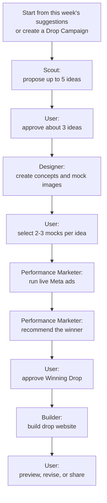
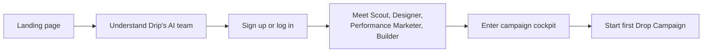
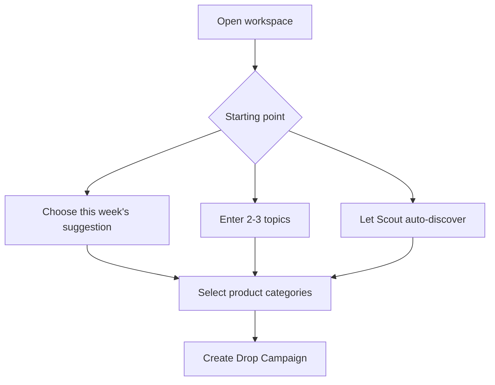
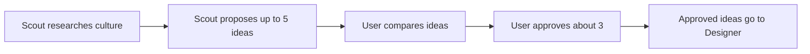
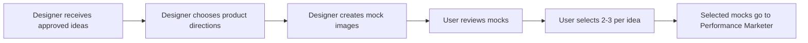
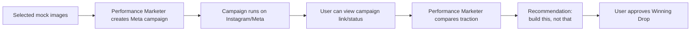
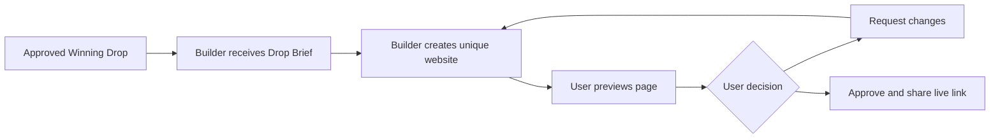
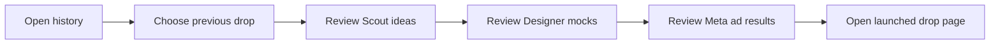

# Drip PRD

Last updated: 2026-06-03

> **Product in one line:** Drip is an AI-powered drop studio that turns internet
> moments into live-tested, limited-edition merch campaigns.

> **Core product promise:** Tell the user **what to build**, **what not to
> build**, and **why**, then help them launch the winning drop page.

---

## How to Update This Document

This is Drip's lightweight product requirements document and product changelog.
Keep it high level: capture what changed, why it matters, core user journeys,
AI teammate responsibilities, and user acceptance criteria. Detailed specs for
individual flows should live in separate documents and be linked from here.

When product requirements change:

1. Update the relevant section if the current product direction has changed.
2. Add an entry under Amendments with the date, summary, and any linked
   follow-up specs.
3. Keep implementation details, API schemas, and deep edge-case handling out of
   this document unless they are necessary to understand the product.

---

## Product Summary

Drip helps a solo creator, founder, or small fashion-commerce operator move from
"something is trending" to "this is the drop worth launching" without manually
coordinating research, fashion design, performance marketing, and web design.

The inspiration is a **limited-edition drop business**: every week, a small set
of timely items can become collectible because they capture the cultural moment.
Drip turns that idea into an autonomous AI team for internet-moment merch.

| Teammate | Plain-English Job | Main Output |
| --- | --- | --- |
| **Scout** | Finds what is trending and proposes merchable ideas. | Candidate drop ideas |
| **Designer** | Turns approved ideas into clothing concepts and mock images. | Product concepts and mockups |
| **Performance Marketer** | Runs live Meta/Instagram A/B tests and identifies the winner. | Ad campaign results and recommendation |
| **Builder** | Creates the customer-facing website for the winning drop. | Live drop page |

The product is **not** just an image generator or a storefront generator. The
valuable output is a confident business recommendation:

| Decision | What Drip Should Say |
| --- | --- |
| **Build this** | The strongest product, audience, price, and launch angle. |
| **Do not build that** | Which ideas looked interesting but failed to get traction. |
| **Why now** | Why the cultural moment is timely. |
| **Why this won** | The Meta ad, audience, creative, and buyer-intent signals behind the pick. |
| **How to launch** | The final brief and generated drop page for the winner. |

---

## Problem Statement

Internet culture moves faster than small merchants can operate. A sports win,
album release, meme, celebrity moment, product launch, local event, or
city-specific trend can create a short window where a limited merch drop feels
urgent and desirable.

Today, the workflow is fragmented:

| The Creator Has To... | Why It Is Hard |
| --- | --- |
| Notice what is trending | Trends are noisy and decay quickly. |
| Decide whether it is merchable | Not every cultural spike should become a product. |
| Translate taste into product design | Generic meme merch feels cheap. |
| Produce credible visuals | Inventory does not exist yet. |
| Run ad tests | The creator needs traction data before deciding what to make. |
| Interpret the winner | Clicks, saves, comments, and signups need a clear recommendation. |
| Build a storefront | The page needs to feel timely, premium, and launch-ready. |

By the time the creator does all of this manually, the moment may already be
stale. Drip turns the process into one guided campaign where AI teammates do the
work, show their outputs, and ask the user to approve the key decisions.

---

## Campaign Flow

**Design intent:** the campaign should feel like one continuous workspace. The
user should be able to see the team working, review outputs in place, and move
from research to launch without switching between disconnected tools.

---

## Scope Snapshot

| Area | Product Requirement |
| --- | --- |
| **Product surface** | A desktop web app centered on a single Drop Campaign cockpit. |
| **Primary user** | An individual operator building a limited-edition merch or fashion-drop business. |
| **Landing page** | Explain Drip, introduce the AI team, and let users sign up or log in. |
| **Authentication** | Simple username/password signup, login, and logout. |
| **Current-week suggestions** | Show prepared or running suggestions for what is interesting this week. |
| **Drop creation** | Let the user start from topics, product categories, or auto-discovery. |
| **Scout research** | Scout proposes up to five ideas with trend context, audience, and urgency. |
| **Idea approval** | User approves the ideas worth designing, usually about three. |
| **Design and mocks** | Designer creates clothing concepts and mock images for approved ideas. |
| **Mock selection** | User selects two to three mock images per approved idea. |
| **Meta ad testing** | Performance Marketer runs live Meta/Instagram tests for selected mocks. |
| **Recommendation** | Performance Marketer explains which product got traction and should be built. |
| **Launch** | Builder creates a unique customer-facing drop website for the winner. |
| **History** | User can switch between current and past drops by campaign date. |

---

## Core Concepts

| Concept | Meaning |
| --- | --- |
| **User** | The person operating Drip and making final campaign decisions. |
| **Drop Campaign** | One weekly or moment-based merch launch workflow. |
| **Current Drop** | The active campaign the user is operating now. |
| **Drop History** | Previous campaigns, decisions, outputs, ad results, and launched pages. |
| **AI Team** | Scout, Designer, Performance Marketer, and Builder. |
| **Candidate Idea** | A merch direction tied to a trend or user-provided topic. |
| **Product Concept** | A concrete clothing direction with product type, fit, color, print placement, and rationale. |
| **Mock Image** | A realistic product, model, bundle, or ad creative generated by Designer. |
| **Meta Ad Test** | A live Instagram/Meta campaign that tests selected mock images. |
| **Winning Drop** | The selected product or bundle Drip recommends launching. |
| **Drop Brief** | The final package of product, audience, creative, ad results, and launch guidance. |
| **Drop Page** | The standalone customer-facing website created for the winning drop. |

---

## Product Principles

| Principle | What It Means |
| --- | --- |
| **Validate before making** | Run demand tests before deciding what to manufacture or launch. |
| **Make the moment legible** | Explain why each idea matters now, who cares, and how long the window may last. |
| **Feel like a team, not a form** | Scout, Designer, Performance Marketer, and Builder should feel like specialists with visible handoffs. |
| **Keep the user approving the big calls** | The user approves ideas, mock selections, winner selection, and the final page. |
| **Give a simple final answer** | The product should say: build this, do not build that, and here is why. |
| **Prefer taste over novelty** | The merch should feel like fashion or collectible streetwear, not low-effort meme merch. |
| **Preserve evidence** | Recommendations should tie back to trend reasoning, selected mocks, ad campaign status, and winner data. |
| **Launch one strong drop** | Optimize for a focused limited-edition product or bundle, not a sprawling catalog. |
| **Make the site feel unique** | Every winning drop gets its own page, visual style, product story, and countdown. |

---

## AI Team Responsibilities

### Team Map

| Teammate | Inputs | Outputs | Acceptance Criteria |
| --- | --- | --- | --- |
| **Scout** | User topics, current-week prompts, cultural signals, taste guidance | Up to five candidate ideas with audience, urgency, merch angle, and rationale | Ideas are understandable, timely, and merchable. |
| **Designer** | Approved ideas, product categories, audience, taste constraints | Clothing concepts plus mock images across tees, caps, hoodies, socks, bundles, model shots, and ad creatives | User can compare, reject, revise, and select mocks before ad testing. |
| **Performance Marketer** | Selected mock images, audience, price, copy, campaign goal | Live Meta/Instagram campaign, campaign link/status, traction data, and winner recommendation | The user can see what is being tested and which product won. |
| **Builder** | Winning Drop, Drop Brief, selected mock images, ad results, positioning | Unique drop website with countdown, images, product copy, CTA, and shareable live link | User can preview, request changes, and approve the final page. |

### Default Campaign Counts

| Stage | Default Count |
| --- | --- |
| Scout candidate ideas | Up to **5** |
| Ideas approved by user | About **3** |
| Designer mock images per approved idea | About **5** |
| Mock images selected for ads | **2-3** per approved idea |
| Meta ad campaigns | One campaign set for the selected ideas and mocks |
| Final winner | **1** product or bundle |

---

## User Decision Points

| Stage | User Decision | Product Requirement |
| --- | --- | --- |
| **Drop setup** | Start from prepared suggestions, provide topics, or auto-discover | Make the starting mode clear. |
| **Scout research** | Approve which candidate ideas move to design | Preserve rejected or deferred ideas in history. |
| **Designer mocks** | Select which mock images go to Meta ads | The user can compare mocks and select two to three per idea. |
| **Performance Marketer** | Review live campaign status and winner recommendation | Show campaign link/status and explain which product got the most traction. |
| **Winner selection** | Approve the Winning Drop | Convert the winner into a clear Drop Brief for Builder. |
| **Builder** | Preview, revise, or approve the drop website | Keep the generated page separate from the internal campaign cockpit. |

---

## User Journeys

### Journey 1: First-Time User

| Moment | Acceptance Criteria |
| --- | --- |
| **Landing** | User understands Drip as an autonomous merch drop studio. |
| **Auth** | User can sign up, log in, and log out with simple credentials. |
| **Team intro** | User can identify what each AI teammate does. |
| **Workspace entry** | User lands in the main Drip workspace, not a long onboarding wizard. |

### Journey 2: Create and Shape a Drop Campaign

| Moment | Acceptance Criteria |
| --- | --- |
| **Empty state** | User can create a new campaign from a clean workspace. |
| **Prepared suggestions** | User can start from this week's Scout suggestions. |
| **User topics** | User can provide a few topics they already care about. |
| **Auto-discovery** | User can ask Scout to find trends without a starting topic. |
| **Campaign setup** | User can select categories such as tees, caps, hoodies, socks, or bundles. |

### Journey 3: Scout Research and User Approval

| Stage | Acceptance Criteria |
| --- | --- |
| **Research output** | Each idea includes title, audience, why-now, merch angle, and urgency. |
| **Comparison** | User can compare ideas without reading raw research logs. |
| **Approval** | User chooses which ideas should become design work. |
| **Persistence** | Approved and rejected ideas remain visible in campaign history. |

### Journey 4: Designer Concepts, Mock Images, and User Selection

| Stage | Acceptance Criteria |
| --- | --- |
| **Concepting** | Designer decides product type, fit, colors, print placement, typography, and style direction. |
| **Mock generation** | Designer creates about five mock images per approved idea. |
| **Merch variety** | Mocks can include tees, caps, hoodies, socks, bundles, product shots, model shots, or ad creatives. |
| **Selection** | User selects two to three mocks per idea for live Meta testing. |
| **Revision** | User can reject or request changes before mocks advance. |

### Journey 5: Performance Marketer Runs Live Meta Ads

| Stage | Acceptance Criteria |
| --- | --- |
| **Campaign creation** | Performance Marketer creates live Meta/Instagram A/B tests for selected mocks. |
| **Visibility** | User can see campaign status and a reviewable campaign link or artifact. |
| **Signals** | Performance Marketer reports traction signals such as CTR, CPC, likes, saves, comments, waitlist signups, and buyer intent. |
| **Recommendation** | Performance Marketer explains which merch should be built and which should not. |
| **Winner** | User approves one product or bundle as the Winning Drop. |

### Journey 6: Builder and Drop Website

| Stage | Acceptance Criteria |
| --- | --- |
| **Builder handoff** | Builder receives the winning idea, selected mock images, ad results, and campaign description. |
| **Generated site** | The page is unique to the drop, not a generic template. |
| **Page content** | Page includes product images, product copy, price or waitlist CTA, model imagery, size/fit guidance, and a large countdown. |
| **Style** | Page can use a distinct font, layout, and visual direction that fits the drop. |
| **Preview** | User can preview and request changes before sharing. |
| **Live link** | Approved page has a shareable link separate from the Drip dashboard. |

## Experience Direction

### Operator Cockpit

Drip should feel like a **desktop-first, single-page campaign cockpit**. The
user should see the current drop, AI teammate progress, key decisions, generated
assets, live ad status, and launch readiness in one calm workspace.

| Requirement | Direction |
| --- | --- |
| **Information density** | Dense enough for a serious operator, not a broad admin dashboard. |
| **Navigation** | A clean current-drop/history toggle should keep past drops close without clutter. |
| **AI presence** | Teammate cards should show role, current status, and latest output. |
| **Decision making** | Core decisions should be selectable, approvable, rejectable, or editable inline. |
| **Motion** | Status changes should feel alive without becoming noisy. |
| **Tone** | Clean, quiet-luxury, fashion-forward, restrained, and legible. |

### Generated Drop Website

The Drip cockpit and the generated drop website should feel intentionally
distinct.

| Surface | Purpose | Feel |
| --- | --- | --- |
| **Drip cockpit** | Internal operator interface for decisions, status, and review. | Calm, structured, high-signal. |
| **Drop website** | Customer-facing site for the winning product. | Editorial, immersive, product-led, urgent, unique to the drop. |

---

## Supporting Experience: Campaign History

Campaign history supports the core journey without becoming the main product
loop. The user should be able to switch between the current drop and older drops
cleanly, review what happened, and reopen the live drop page.

| Stage | Acceptance Criteria |
| --- | --- |
| **History list** | User can view active and historical drops by date or campaign. |
| **Campaign record** | Each campaign preserves research, approved ideas, mock selections, ad status/results, Builder output, and final decisions. |
| **Explainability** | History makes it easy to understand why a product was recommended or rejected. |

---

## Key Open Questions

| Topic | Open Question |
| --- | --- |
| **Meta ad setup** | What minimum account setup is required before Performance Marketer can run live tests? |
| **Budget** | What default spend should a live one-day test use? |
| **Winner threshold** | What counts as enough traction to recommend "build this"? |
| **User control** | Which teammate outputs are editable, and which are only reviewable? |
| **Drop page CTA** | Should the first generated site use checkout, waitlist, or interest capture? |
| **History depth** | How much campaign history should be visible before the cockpit feels crowded? |

---

## Future Ideas

These are examples of directions Drip could explore later, not committed scope.

| Idea | What It Could Add |
| --- | --- |
| **Recurring Auto Drops** | Drip prepares new campaign recommendations automatically. |
| **Commerce Integration** | Drop websites support real checkout or commerce handoff. |
| **Supplier Packets** | Drip prepares production-ready handoff packets. |
| **Brand Memory** | Teammates remember taste, prior decisions, and launch preferences. |

---

## Amendments

### 2026-06-03: Initial High-Level PRD

Created the first lightweight product requirements document for Drip. Defined
the product as an autonomous AI drop studio for internet-moment merch,
established the top-level Drop Campaign journey, and set the UX direction as a
desktop-first single-page campaign cockpit with a distinct generated drop page.

### 2026-06-03: Readability Pass

Reworked the PRD into a more readable product document with stronger formatting,
section dividers, tables, cleaner user journey diagrams, and condensed future
idea examples. Removed the initial version boundary and initial out-of-scope
sections to keep the document focused on product direction and user journeys.

### 2026-06-03: Four-Teammate Workflow Correction

Updated the PRD to use the corrected four-teammate workflow: Scout, Designer,
Performance Marketer, and Builder. Made Designer responsible for concepts and
mock images, made live Meta/Instagram testing the validation step, split Scout
approval and Designer mock selection into separate journeys, and kept Builder
as the final website launch step.
