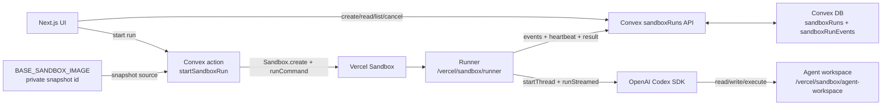
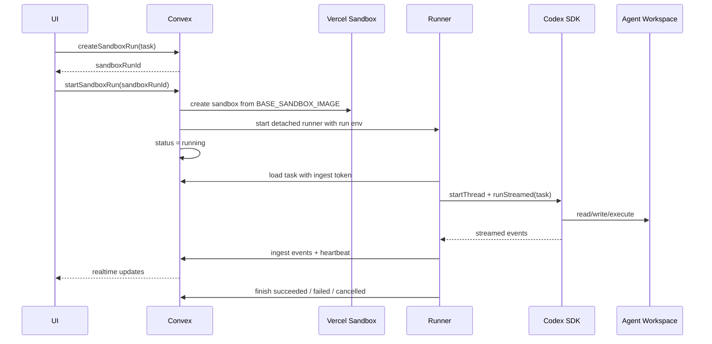
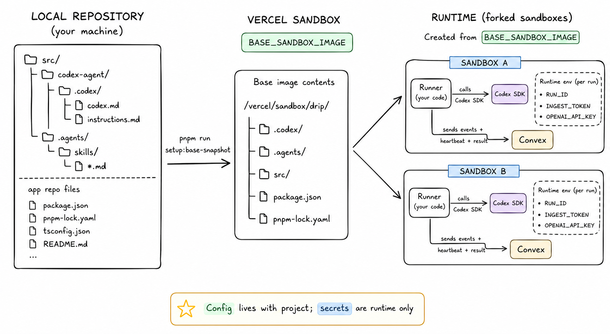
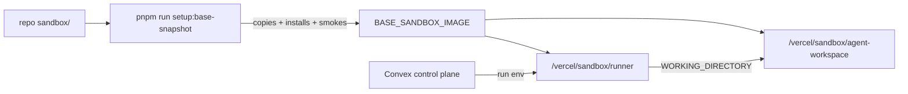

# Sandbox

Last updated: 2026-06-07

This is the high-level map for Drip's Vercel Sandbox and Codex SDK execution
layer. The base snapshot is a separate sandbox runtime payload, not a clone of
the Drip app repo.

## System Map



## Run Sequence



## Runtime Payload

Only `sandbox/` is copied into the Vercel Sandbox base snapshot.

```text
repo/
  sandbox/
    runner/
      index.ts
      config.ts
      codex.ts
      convex.ts
      types.ts
      package.json
      pnpm-lock.yaml

    codex-agent/
      .codex/
        config.toml
        agents/
          sandbox-verifier.toml
          x-researcher.toml
          exa-researcher.toml
          cap-designer.toml
          sock-designer.toml
          apparel-designer.toml
          fashion-reviewer.toml
          drop-site-builder.toml
          drop-site-reviewer.toml
          drop-site-deployer.toml
          facebook-ad-copywriter.toml
          facebook-ad-operator.toml
        skills/
          .system/
            imagegen/
              SKILL.md
      .agents/
        skills/
          agent-browser/
            SKILL.md
          builder/
            SKILL.md
          performance-marketer/
            SKILL.md
          frontend-skill/
            SKILL.md
          scout/
            SKILL.md
          meta-ads-cli/
            SKILL.md
          fashion-designer/
            SKILL.md
          x-trends/
            SKILL.md
          exa-search/
            SKILL.md
```

The snapshot maps that repo payload to:

```text
/vercel/sandbox/
  runner/
    index.ts
    package.json
    pnpm-lock.yaml
    node_modules/

  agent-workspace/
    .codex/
    .agents/
```

`src/` remains Drip product and Convex control-plane code. It is not copied into
the base snapshot.

The setup command also preinstalls Node and Python tool dependencies into the
base image. Node tools include the Vercel CLI for Builder deploys and
`agent-browser` plus its browser dependency for Builder review. Python tools
include `openai` and `pillow` for the official `$imagegen` fallback, plus `uv`
and the verified Meta Ads CLI package (`meta-ads`) for ad-account and campaign
automation. `meta-ads` requires Python 3.12+, so the setup installs it as a
uv-managed tool rather than relying on the sandbox system Python. That keeps
agent runs focused on the task rather than per-run dependency bootstrap. If
Meta's official Ads CLI docs change the package/auth model, update the setup
script, `$meta-ads-cli` skill, and smoke checks together.





## Control-Plane Contracts

| Caller | Function | Contract |
| --- | --- | --- |
| UI | `sandboxRuns.createSandboxRun({ workspaceId, task })` | Insert `queued`; return `{ sandboxRunId }`. |
| UI | `sandboxRunActions.startSandboxRun({ sandboxRunId })` | Generate runner token, create Vercel Sandbox from `BASE_SANDBOX_IMAGE`, and start the runner. |
| UI | `sandboxRuns.getSandboxRun({ sandboxRunId })` | Return sanitized run state without `ingestTokenHash`. |
| UI | `sandboxRuns.listSandboxRunEvents({ sandboxRunId, afterSeq? })` | Return ordered events, paged at 100. |
| UI | `sandboxRuns.cancelSandboxRun({ sandboxRunId })` | Mark cancellation; queued runs become terminal immediately. |
| Runner | `sandboxRuns.getSandboxRunForRunner({ sandboxRunId, ingestToken })` | Verify token and return task plus cancellation state. |
| Runner | `sandboxRuns.ingestSandboxRunEvent({ sandboxRunId, ingestToken, seq, type, payload })` | Append the next event, accept idempotent retries, reject sequence gaps. |
| Runner | `sandboxRuns.heartbeatSandboxRun({ sandboxRunId, ingestToken })` | Update liveness and return whether cancellation was requested. |
| Runner | `sandboxRuns.finishSandboxRun({ sandboxRunId, ingestToken, status, result?, error? })` | Store a terminal runner status and output. |

Valid statuses are `queued`, `provisioning`, `running`, `succeeded`, `failed`,
`cancelled`, and `lost`. `lost` is reserved for a future watchdog.

## Runner Interface

Codex SDK is the only runner path.

The default snapshot-mode command is:

```bash
cd /vercel/sandbox/runner
node --import tsx index.ts
```

The runner receives run-specific env, loads the task from Convex, starts Codex
SDK, and points Codex at the configured agent workspace:

```text
WORKING_DIRECTORY=/vercel/sandbox/agent-workspace
CODEX_HOME=/vercel/sandbox/agent-workspace/.codex
```

The runner starts Codex SDK with approval policy `never`, web search disabled,
network access controlled by `DRIP_CODEX_NETWORK_ACCESS_ENABLED`, and
`sandboxMode: "danger-full-access"` inside the outer Vercel Sandbox isolation
boundary. The runner is generic: it streams Codex events and final response, but
does not interpret skill-specific artifacts such as Scout's `scout-output.json`
Fashion Designer's `fashion-designer-output.json`, or Performance Marketer's
`performance-marketer-output.json`.

## Builder Drop-Site Deployment

Builder uses the same generic runner and sandbox workspace as Scout and Fashion
Designer. For v1, Builder deploys each generated one-page site as an immutable
preview deployment in the dedicated Vercel project
`drip-websites`.

The historical live link is the immutable deployment URL returned by Vercel,
not the project alias URL. The project alias may point at whichever deployment
is current, but each generated deployment URL can remain live at the same time
as previous drops.

The Builder deployer creates a prebuilt static output under:

```text
/vercel/sandbox/agent-workspace/builder-site/.vercel/output/
```

Then deploy with Vercel CLI:

```bash
vercel deploy /vercel/sandbox/agent-workspace/builder-site \
  --prebuilt \
  --archive=tgz \
  --project "$DRIP_DROP_SITES_VERCEL_PROJECT" \
  --scope "${DRIP_DROP_SITES_VERCEL_SCOPE:-$VERCEL_TEAM_ID}" \
  --token "$VERCEL_DEPLOY_TOKEN" \
  --target preview \
  --yes
```

Do not pass `--prod` for normal Builder runs, and do not promote the deployment
unless a later product requirement explicitly asks for a canonical alias. Force
`--target preview`; a local smoke showed that relying on CLI defaults can
create a production deployment and alias the project URL.

Do not forward `VERCEL_PROJECT_ID` or `VERCEL_ORG_ID` into the Codex child
process for Builder deployment. Those values identify the sandbox host project,
not the generated-sites project, and can make the Vercel CLI reject or
mis-target the deploy command.

The dedicated `drip-websites` project should have Vercel SSO deployment
protection disabled so immutable preview URLs can be embedded and shared.

Builder-specific base image additions:

- `vercel` CLI is installed through `sandbox/runner/package.json`, keeping
  `/vercel/sandbox/runner/node_modules/.bin` on Codex's `PATH`.
- `agent-browser` CLI and its browser dependency are installed in the base
  image.
- `frontend-skill` is copied into `sandbox/codex-agent/.agents/skills/`.
- Builder, site-builder, site-reviewer, and site-deployer skill/subagent files
  live in `sandbox/codex-agent/`.

## Performance Marketer Meta Ads

Performance Marketer uses the same generic runner and sandbox workspace as
Scout, Fashion Designer, and Builder. It creates real Facebook-only Meta ad
objects, but v1 stops before activation or insights readback.
Campaign creation uses a Graph API fallback when the installed CLI cannot send
Meta's required `special_ad_categories=[]` field; ad sets, creatives, ads, and
pause updates continue through the CLI.

The responsibility split is:

- `$meta-ads-cli` is a reusable adapter skill for CLI commands, env mapping,
  preflight, redaction, paused-object safety, and the exact Drip creation
  recipe.
- `$performance-marketer` owns Drip's campaign recipe and output artifact.
- `facebook-ad-copywriter` fills the copy schema only.
- `facebook-ad-operator` runs the exact `$meta-ads-cli` creation recipe and
  returns sanitized created-object evidence. It does not spawn other agents.

Performance Marketer writes:

```text
/vercel/sandbox/agent-workspace/performance-marketer-output.json
```

The guarded live smoke creates real paused Meta objects and is excluded from
`--scenario all` unless live Meta creation is explicitly allowed:

```bash
pnpm e2e:sandbox -- --scenario performance-marketer-facebook-paused --allow-meta-create
```

Never activate campaigns, ad sets, or ads from the v1 Performance Marketer
workflow, and never print raw Meta IDs, dashboard URLs, or private env values in
docs, logs, or final responses.

## Env Contract

Never commit or print real values for these names.

| Name | Owner | Purpose |
| --- | --- | --- |
| `BASE_SANDBOX_IMAGE` | Private local/Convex runtime config | Active Vercel Sandbox snapshot ID. Updated in `.env`, selected Convex, and prod Convex by the base snapshot setup command. |
| `VERCEL_TOKEN` | Convex action and setup command | Durable Vercel Sandbox auth for product runs. |
| `VERCEL_OIDC_TOKEN` | Setup command | Optional local setup auth when a fresh Vercel OIDC token is available; not the product Convex action credential. |
| `VERCEL_TEAM_ID` | Vercel Sandbox SDK | Required alongside sandbox auth. |
| `VERCEL_PROJECT_ID` | Vercel Sandbox SDK | Required alongside sandbox auth. |
| `VERCEL_DEPLOY_TOKEN` | Convex action/runtime | Dedicated Vercel deploy token forwarded to Builder for immutable drop-site preview deployments. For hackathon runs it may be populated from the same private token as `VERCEL_TOKEN`, but keep the env name separate. |
| `DRIP_DROP_SITES_VERCEL_PROJECT` | Convex action/runtime | Vercel project name for Builder drop-site deployments. Default value is `drip-websites`. |
| `DRIP_DROP_SITES_VERCEL_SCOPE` | Convex action/runtime | Optional Vercel scope for Builder drop-site deployments. If omitted, Builder should use `VERCEL_TEAM_ID`. |
| `DRIP_SANDBOX_RUNTIME` | Setup command | Base sandbox runtime override; default `node24`. |
| `DRIP_SANDBOX_VCPUS` | Vercel Sandbox SDK | CPU setting; default 2. |
| `DRIP_SANDBOX_TIMEOUT_MS` | Vercel Sandbox SDK | Sandbox lifetime timeout. |
| `DRIP_SANDBOX_INSTALL_TIMEOUT_MS` | Setup command | Runner dependency install timeout while preparing the base snapshot. |
| `DRIP_SANDBOX_RUNNER_CWD` | Convex action and setup command | Runner directory; default `/vercel/sandbox/runner`. |
| `DRIP_SANDBOX_RUNNER_ENTRYPOINT` | Convex action and setup command | Runner entrypoint relative to runner cwd; default `index.ts`. |
| `DRIP_SANDBOX_AGENT_WORKDIR` | Convex action and setup command | Codex working directory; default `/vercel/sandbox/agent-workspace`. |
| `CONVEX_CLOUD_URL` | Convex runtime built-in | Source of truth for the sandbox runner callback URL. The action passes it into the runner as `CONVEX_URL`; do not configure an operator override for this path. |
| `OPENAI_API_KEY` or `CODEX_API_KEY` | Convex action/runtime | OpenAI auth source. The action passes `OPENAI_API_KEY` into the runner command. |
| `OPENAI_API_KEY` | Codex child process | Also forwarded to Codex so the official `$imagegen` CLI fallback can reuse the runner OpenAI key when built-in image generation is unavailable. |
| `CODEX_MODEL` | Convex action/runtime | Runtime override; default is `gpt-5.5`. |
| `CODEX_REASONING_EFFORT` | Convex action/runtime | Runtime override; default is `low`. |
| `DRIP_CODEX_NETWORK_ACCESS_ENABLED` | Convex action/runtime | Enables Codex SDK network access for API-backed skills such as Scout; default `false`. |
| `EXA_API_KEY` | Convex action/runtime | Exa Search API key passed only into the Codex process when present. |
| `X_BEARER_TOKEN` or `TWITTER_BEARER_TOKEN` | Convex action/runtime | X API app-only bearer token passed only into the Codex process when present. |
| `META_ADS_ACCESS_TOKEN` | Convex action/runtime | Meta system-user token passed into the Codex process as the official Meta Ads CLI `ACCESS_TOKEN` when present. |
| `META_ADS_AD_ACCOUNT_ID` | Convex action/runtime | Default Meta ad account passed into the Codex process as `AD_ACCOUNT_ID` when present. Use the CLI-expected value, including the `act_` prefix when applicable. |
| `META_ADS_BUSINESS_ID` | Convex action/runtime | Optional Meta business portfolio passed into the Codex process as `BUSINESS_ID` when present. |
| `DRIP_SANDBOX_RUNNER_TIMEOUT_MS` | Convex action | Detached runner command timeout. |
| `DRIP_HEARTBEAT_MS` | Runner | Heartbeat interval. |

Prototype-only env belongs to `docs/prototypes/sandbox-codex-sdk/*` and
`src/convex/sandboxPrototype.ts`; it is not part of the product run contract.

## Base Snapshot Operation

```bash
pnpm run setup:base-snapshot
```

The setup command creates a fresh sandbox, copies only `sandbox/runner` and
`sandbox/codex-agent`, installs runner dependencies, verifies runner imports and
agent config/skill files, verifies Drip app files are absent, snapshots the
sandbox, starts a fork from that snapshot, repeats the smoke checks, updates
`.env`, selected Convex, and prod Convex to the new `BASE_SANDBOX_IMAGE`, then
deletes the previous snapshot.

## Black-Box E2E Smoke Tests

Use the Convex-side smoke harness when you need to prove the product path works
from the same boundary the app uses: create a `sandboxRuns` row, call the
Convex action, stream runner events, inspect the Vercel Sandbox artifact, then
clean up.

Scenario prompts should stay lean and employee-facing. They should invoke the
skill and describe the role-specific task, but should not mention internal
subagents, API names, model settings, or artifact paths unless those are part
of the user-facing contract.

```bash
pnpm e2e:sandbox -- --scenario fashion-designer-product
pnpm e2e:sandbox -- --scenario scout-cultural
pnpm e2e:sandbox -- --scenario builder-drop-site
pnpm e2e:sandbox -- --scenario performance-marketer-facebook-paused --allow-meta-create
pnpm e2e:sandbox -- --scenario all
```

Use `--start-attempts <count>` when Vercel Sandbox creation is temporarily
throttled. The harness retries only transient platform start failures such as
429/5xx responses; skill output assertions stay strict.

Performance Marketer's smoke creates real paused Meta ad objects. It is guarded:
running the scenario directly requires `--allow-meta-create`, and `--scenario
all` skips it unless that flag is also present.

The harness writes ignored evidence under `.sandbox-e2e/`:

| File | Purpose |
| --- | --- |
| `run.json` | Final `sandboxRuns` row returned by Convex. |
| `events.json` | Streamed runner events used for black-box assertions. |
| `output.json` | Skill artifact copied back from the Vercel Sandbox. |
| `summary.json` | Timing, Convex DB state snapshots, event counts, final response, and copied asset metadata. |
| `contact-sheet.html` | Fashion Designer-only visual review sheet for copied image assets. |

For every scenario, the harness asserts the Convex control-plane state changed
as expected:

1. The prompt is stored in a newly created `sandboxRuns` row with `queued`
   status.
2. `sandboxRunActions.startSandboxRun` records `sandboxId`, `commandId`, and a
   running or terminal status.
3. The runner writes ordered `sandboxRunEvents`.
4. The terminal `sandboxRuns` row contains `codexThreadId` and `finalResponse`.
5. The sandbox artifact is read from the Vercel Sandbox filesystem, not from a
   local mock.
6. The artifact `generatedAt` timestamp falls inside the current run window, so
   stale files from prior runs are rejected.

Fashion Designer smoke tests verify a multi-idea batch: two approved ideas,
caps and socks, two kept final mocks per idea, surplus candidates, grouped
`ideas[]` output, per-idea reviewer keep/reject records, the expected JSON
schema, and real PNG/JPEG/WebP files under `fashion-designer-assets/`. Each
copied image is signature-checked, dimension-checked, hashed, and included in
the contact sheet.

Do not assert exact model phrasing, exact image-generation command lines, exact
subagent names, or exact prompt/query internals. The skill owns its judgment and
implementation strategy; the harness verifies the public employee contract.

Scout smoke tests verify that the run wrote `scout-output.json` with
source-backed candidates. They are intentionally strict: if X credentials, Exa
credentials, provider balance, or Codex network access are missing in the
Convex action/runner runtime, the smoke should fail rather than accepting
invented cultural moments. The runner emits non-secret env-presence booleans in
`runner.started` so failures can be attributed to configuration propagation
without exposing credential values.

Performance Marketer smoke tests verify that the run wrote
`performance-marketer-output.json` with schema
`performance-marketer.facebook-campaign.v1`, Meta env presence, one campaign,
three ad sets, six creatives, six paused ads, no activation, no insights
readback, and no raw Meta-looking IDs in the final response or output JSON.
The live path has no second Meta agent. Created-object evidence from the
operator is enough for the hackathon artifact.

By default the harness deletes the Vercel Sandbox after inspection. Use
`--keep-sandbox` for manual debugging, or set
`DRIP_E2E_KEEP_SANDBOX_ON_FAILURE=1` to preserve only failing sandboxes. Use
`--cleanup-artifacts` when a CI lane should leave no local evidence after a
successful run.

## Security Boundaries

| Boundary | Rule |
| --- | --- |
| Drip repo source | Not part of the base image. Only `sandbox/` is copied. |
| Runner token | Plaintext exists only in the runner command env; Convex stores only the hash. |
| Public reads | `sandboxRuns.getSandboxRun` removes `ingestTokenHash`. |
| Event stream | Events are currently loose and SDK-shaped; broader exposure needs a future redaction/visibility policy. |
| Snapshot ID | `BASE_SANDBOX_IMAGE` is private runtime config in `.env` and Convex env, never source code or docs. |
| Prototype ingest | `src/convex/http.ts` is not used for product sandbox runs. |

## Source Map

| Path | What to inspect |
| --- | --- |
| `sandbox/runner/*` | Runner process, Codex SDK loop, Convex ingest client, and runner-local dependency manifest. |
| `sandbox/codex-agent/.codex/config.toml` | Sandbox-only Codex defaults and agent registration; project skills are discovered from `.agents/skills`. |
| `sandbox/codex-agent/.codex/agents/sandbox-verifier.toml` | Custom subagent definition for sandbox verification. |
| `sandbox/codex-agent/.codex/agents/x-researcher.toml` | Custom subagent definition for X trend signal collection. |
| `sandbox/codex-agent/.codex/agents/exa-researcher.toml` | Custom subagent definition for Exa cultural context collection. |
| `sandbox/codex-agent/.codex/agents/cap-designer.toml` | Custom subagent definition for cap concept and mock image generation. |
| `sandbox/codex-agent/.codex/agents/sock-designer.toml` | Custom subagent definition for sock concept and mock image generation. |
| `sandbox/codex-agent/.codex/agents/apparel-designer.toml` | Custom subagent definition for apparel concept and mock image generation. |
| `sandbox/codex-agent/.codex/agents/fashion-reviewer.toml` | Custom subagent definition for Fashion Designer image curation, rejection, and regeneration requests. |
| `sandbox/codex-agent/.codex/agents/drop-site-builder.toml` | Custom subagent definition for Builder static site creation and product image angle generation. |
| `sandbox/codex-agent/.codex/agents/drop-site-reviewer.toml` | Custom subagent definition for Builder browser review with `agent-browser`. |
| `sandbox/codex-agent/.codex/agents/drop-site-deployer.toml` | Custom subagent definition for Builder Vercel preview deployment and HTTP verification. |
| `sandbox/codex-agent/.codex/agents/facebook-ad-copywriter.toml` | Custom subagent definition for Performance Marketer ad naming and copy. |
| `sandbox/codex-agent/.codex/agents/facebook-ad-operator.toml` | Custom subagent definition for Performance Marketer paused Facebook ad object creation. |
| `sandbox/codex-agent/.codex/skills/.system/imagegen/SKILL.md` | Official Codex image generation skill copied into the sandbox `CODEX_HOME` layout. |
| `sandbox/codex-agent/.agents/skills/agent-browser/SKILL.md` | Browser automation skill stub copied into the agent workspace. |
| `sandbox/codex-agent/.agents/skills/builder/SKILL.md` | Builder orchestration skill and structured output contract. |
| `sandbox/codex-agent/.agents/skills/frontend-skill/SKILL.md` | Frontend art-direction skill used by Builder site creation. |
| `sandbox/codex-agent/.agents/skills/scout/SKILL.md` | Scout orchestration skill and structured output contract. |
| `sandbox/codex-agent/.agents/skills/meta-ads-cli/SKILL.md` | Meta Ads CLI usage, runtime env, and safety rules for sandbox agents. |
| `sandbox/codex-agent/.agents/skills/fashion-designer/SKILL.md` | Fashion Designer orchestration skill and structured output contract. |
| `sandbox/codex-agent/.agents/skills/performance-marketer/SKILL.md` | Performance Marketer orchestration skill and structured output contract. |
| `sandbox/codex-agent/.agents/skills/x-trends/SKILL.md` | Instruction-only X public-data research skill. |
| `sandbox/codex-agent/.agents/skills/exa-search/SKILL.md` | Instruction-only generic Exa Search API skill. |
| `scripts/setup_base_snapshot.ts` | Base snapshot creation, copy rules, install, smoke, Convex env sync, and previous snapshot cleanup. |
| `src/convex/schema.ts` | `sandboxRuns` and `sandboxRunEvents` table shape. |
| `src/convex/sandboxRuns.ts` | Control-plane queries/mutations and runner token checks. |
| `src/convex/sandboxRunActions.ts` | Vercel Sandbox provisioning and runner command startup. |
| `docs/prototypes/sandbox-codex-sdk/` | Prototype-only tutorial code and env surface. |
