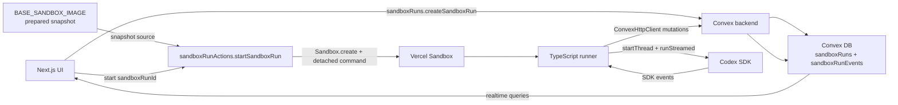
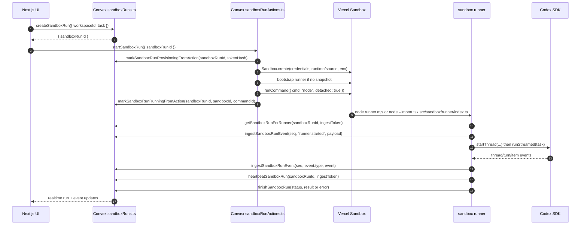
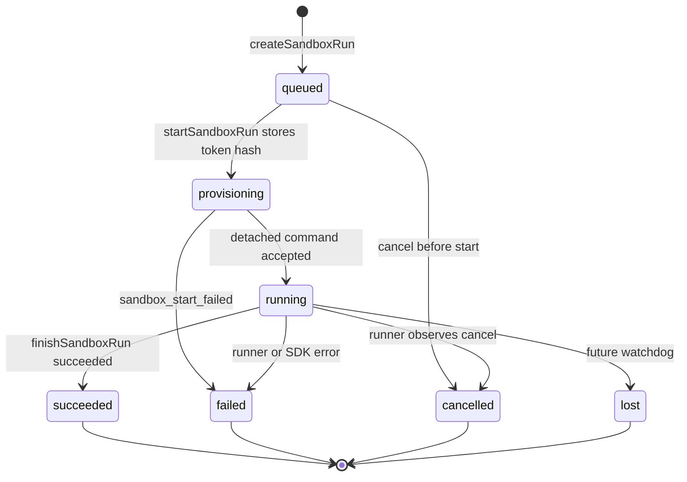
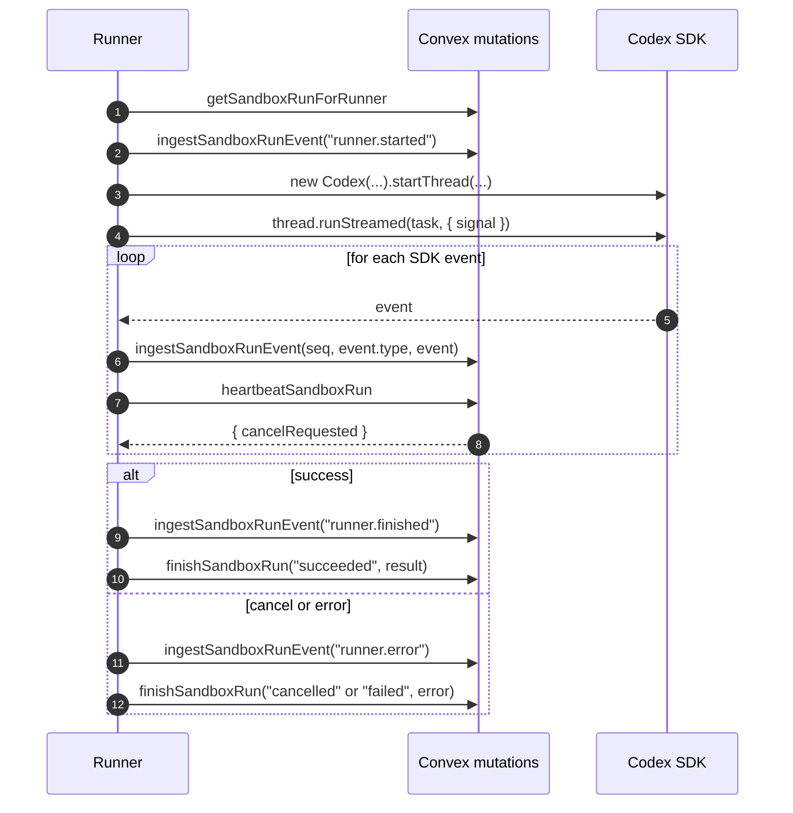

# Sandbox

Last updated: 2026-06-03

This document is the single Sandbox map for Drip. It combines two layers:

- The Phase B runtime control plane: generic `sandboxRun` rows, event streams,
  runner mutations, Vercel Sandbox execution, and Codex SDK streaming.
- The Phase C base image flow: local creation of the prepared Vercel Sandbox
  snapshot and the private `BASE_SANDBOX_IMAGE` env variable.

The two layers are one system: Phase C prepares the reusable base image, and
Phase B starts isolated sandbox runs from that image and streams state back
through Convex.

## 90-Second Map



The key runtime simplification: there is no custom HTTP ingest endpoint for
product sandbox runs. The sandbox runner is TypeScript, so it uses
`ConvexHttpClient` and normal Convex mutations. Those mutations are gated by a
short-lived token scoped to one sandbox run.

The Phase A prototype still has a custom route in `src/convex/http.ts` for
`/sandbox-prototype/ingest`. Product sandbox runs use the `sandboxRuns.*`
mutations instead.

## How The Layers Fit

| Layer | Primary artifact | Owner | Purpose |
| --- | --- | --- | --- |
| Base image | `BASE_SANDBOX_IMAGE` | Local setup script | Holds the prepared Vercel Sandbox snapshot ID privately. |
| Setup flow | `scripts/setup_base_snapshot` | Developer/local ops | Creates a fresh sandbox, copies repo/agent files, installs dependencies, snapshots it, and updates `BASE_SANDBOX_IMAGE`. |
| Control plane | `src/convex/sandboxRuns.ts` | Convex | Stores run state, events, cancellation, liveness, token checks, and terminal result. |
| Provisioning action | `src/convex/sandboxRunActions.ts` | Convex Node action | Creates a sandbox from the base image or bootstrap fallback, then starts the detached runner command. |
| Runner | `src/sandbox/runner/*` | Vercel Sandbox process | Loads the task, runs Codex SDK, sends ordered events, heartbeats, and finishes the run. |

## Runtime Control Plane

### Whiteboard Trail

| Reference | How to read it |
| --- | --- |
| [`docs/whiteboard/data_flow.jpg`](whiteboard/data_flow.jpg) | The main loop: UI to Convex to sandbox, then Convex back to UI. |
| [`docs/whiteboard/convex_runs.jpg`](whiteboard/convex_runs.jpg) | The `createSandboxRun`, `startSandboxRun`, and `getSandboxRun` lifecycle sketch. |
| [`docs/whiteboard/sandbox_flow.jpg`](whiteboard/sandbox_flow.jpg) | Dashboard/modal sandbox loop, rewritten here as generic run primitives. |
| [`docs/whiteboard/sandbox_loop.jpg`](whiteboard/sandbox_loop.jpg) | Alternate close-up of sandbox, backend, Convex, and UI. |
| [`docs/whiteboard/repo_structure.jpg`](whiteboard/repo_structure.jpg) | Original source layout sketch; current code keeps Convex in `src/convex/` and runner code in `src/sandbox/`. |

### Source Of Truth

| Layer | Owns | Files |
| --- | --- | --- |
| UI | Target contract: start/cancel/read sandbox runs and render realtime state. | Product UI, not implemented here. |
| Convex | Auth boundary, sandbox run rows, event rows, cancellation, token checks, sandbox-start action. | `src/convex/schema.ts`, `src/convex/sandboxRuns.ts`, `src/convex/sandboxRunActions.ts` |
| Vercel Sandbox | Isolated filesystem, shell command, npm install/bootstrap, Codex runtime process. | Created by `sandboxRunActions.startSandboxRun`. |
| Runner | Deterministic glue: load task, start Codex SDK, forward events, heartbeat, finish. | `src/sandbox/runner/*` |
| Codex SDK | Agentic turn execution and SDK event stream. | Imported inside the runner. |

### Run Sequence



### State Machine



| Status | Meaning |
| --- | --- |
| `queued` | Convex has the request and returned quickly to the caller. |
| `provisioning` | The action generated a token, stored its hash, and is creating the sandbox. |
| `running` | Vercel accepted the detached runner command. |
| `succeeded` | The runner completed the Codex SDK turn and stored a result. |
| `failed` | Sandbox startup, runner execution, or SDK execution failed. |
| `cancelled` | The run was cancelled before start or the runner observed cancellation. |
| `lost` | Reserved for a future watchdog when a runner disappears. |

### Data Model

| Table | Purpose | Important fields |
| --- | --- | --- |
| `sandboxRuns` | Current state for one generic Codex task. | `workspaceId`, `task`, `status`, `sandboxId`, `commandId`, `codexThreadId`, `ingestTokenHash`, `cancelRequestedAt`, `lastHeartbeatAt`, `result`, `error`, timestamps. |
| `sandboxRunEvents` | Ordered event stream for a run. | `sandboxRunId`, `seq`, `type`, `payload`, `createdAt`. |

Public run reads remove `ingestTokenHash`. The plaintext token is only passed
to the sandbox runner at command start and is never stored directly.

### API Contract

| Caller | Function | Contract |
| --- | --- | --- |
| UI | `sandboxRuns.createSandboxRun({ workspaceId, task })` | Insert `queued`; return `{ sandboxRunId }`. |
| UI | `sandboxRunActions.startSandboxRun({ sandboxRunId })` | Provision sandbox and start the detached runner. |
| UI | `sandboxRuns.getSandboxRun({ sandboxRunId })` | Read sanitized run state. |
| UI | `sandboxRuns.listSandboxRunEvents({ sandboxRunId, afterSeq? })` | Read ordered events, paged at 100. |
| UI | `sandboxRuns.cancelSandboxRun({ sandboxRunId })` | Set `cancelRequestedAt`; queued runs become `cancelled`. |
| Runner | `sandboxRuns.getSandboxRunForRunner({ sandboxRunId, ingestToken })` | Return task and cancellation flag after token verification. |
| Runner | `sandboxRuns.ingestSandboxRunEvent({ sandboxRunId, ingestToken, seq, type, payload })` | Append next event, accept idempotent retries, reject gaps. |
| Runner | `sandboxRuns.heartbeatSandboxRun({ sandboxRunId, ingestToken })` | Update liveness and return `cancelRequested`. |
| Runner | `sandboxRuns.finishSandboxRun({ sandboxRunId, ingestToken, status, result?, error? })` | Store terminal status and output. |

### Runner Modes

| Mode | Command | When used |
| --- | --- | --- |
| Snapshot/base image | `node --import tsx src/sandbox/runner/index.ts` | Preferred once Phase C provides a prepared snapshot containing repo files and dependencies. Skips bootstrap unless `DRIP_SANDBOX_BOOTSTRAP=1`. |
| Bootstrap fallback | `node runner.mjs` | Current demo path when no snapshot exists. The action writes an embedded package manifest and runner file, then runs `npm install --ignore-scripts --omit=dev`. |

The fallback keeps this substrate demoable before snapshot lifecycle work lands.
The snapshot mode is the steady-state shape.

At command start the action passes `CONVEX_URL`, `SANDBOX_RUN_ID`,
`INGEST_TOKEN`, `OPENAI_API_KEY`, `CODEX_MODEL`, and
`CODEX_REASONING_EFFORT`. The runner defaults `WORKING_DIRECTORY` to its
current directory and `DRIP_HEARTBEAT_MS` to 5000 ms when those values are not
provided.

### Runner Loop



### Event Shape

Keep events loose and SDK-shaped for now.

| Type | Source | UI hint |
| --- | --- | --- |
| `runner.started` | Runner | Show setup began. |
| `runner.heartbeat` | Runner | Update liveness/cancel state. |
| `runner.finished` | Runner | Show final result metadata. |
| `runner.error` | Runner | Show normalized failure. |
| `thread.started` | Codex SDK | Store `codexThreadId`. |
| `turn.started` | Codex SDK | Show agent turn began. |
| `item.started` | Codex SDK | Show streamed item began. |
| `item.updated` | Codex SDK | Optional live detail. |
| `item.completed` | Codex SDK | Capture final agent message text. |
| `turn.completed` | Codex SDK | Capture usage and completion. |
| `turn.failed` | Codex SDK | Finish failed. |
| `error` | Codex SDK | Finish failed. |

`sandboxRunEvents.seq` is monotonic per sandbox run. The mutation accepts the
next expected sequence, treats already-written sequence numbers as retries, and
reports the expected sequence for gaps.

### Env Contract

Never commit or print real values for these names.

| Name | Used by | Purpose |
| --- | --- | --- |
| `BASE_SANDBOX_IMAGE` | Convex action/runtime config | Canonical active Vercel Sandbox base snapshot ID. Updated privately by `scripts/setup_base_snapshot`. |
| `DRIP_RUNNER_CONVEX_URL` | Convex action | Convex URL passed into the sandbox runner. Usually equals the public Convex client URL. |
| `OPENAI_API_KEY` or `CODEX_API_KEY` | Convex action and runner | Auth for Codex SDK/OpenAI. |
| `VERCEL_OIDC_TOKEN` | Convex action | Short-lived Vercel Sandbox auth token when available. |
| `VERCEL_TOKEN` | Convex action | Access-token fallback for non-OIDC contexts. |
| `VERCEL_TEAM_ID` | Convex action | Required with explicit Vercel Sandbox credentials. |
| `VERCEL_PROJECT_ID` | Convex action | Required with explicit Vercel Sandbox credentials. |
| `DRIP_SANDBOX_RUNTIME` | Convex action | Runtime override, default `node24`. |
| `DRIP_SANDBOX_VCPUS` | Convex action | Sandbox CPU setting, passed as `resources.vcpus`. |
| `CODEX_MODEL` | Runner | Optional model override. |
| `CODEX_REASONING_EFFORT` | Runner | Optional reasoning effort override. |
| `DRIP_HEARTBEAT_MS` | Runner | Optional heartbeat interval. |

For Convex actions, explicit Vercel Sandbox credentials are required. A
short-lived `VERCEL_OIDC_TOKEN` is useful for local/dev e2e checks; a scoped
`VERCEL_TOKEN` plus team/project IDs is the sturdier non-Vercel runtime shape.

### Security Boundary

| Boundary | Rule |
| --- | --- |
| UI auth | UI APIs are the product boundary for create, cancel, and read. |
| Runner token | The runner gets only `SANDBOX_RUN_ID` and `INGEST_TOKEN`; Convex stores only the token hash. |
| Runner writes | Runner mutations can only load the run, append events, heartbeat, and finish that run. |
| App data | Domain writes are deferred to future scoped tools/skills, not generic runner access. |
| Secrets | Do not expose tokens, API keys, deployment URLs, project IDs, sandbox names, command IDs, or real env values in docs/logs/screenshots. |
| Cancellation | UI sets `cancelRequestedAt`; runner observes it through heartbeat and aborts the SDK signal. |
| Codex inner sandbox | The runner starts Codex with `approvalPolicy: "never"`, web search disabled, SDK network access disabled, and `sandboxMode: "danger-full-access"` inside the outer Vercel Sandbox. |

### Current Limitations

| Limitation | Current behavior |
| --- | --- |
| UI | This doc defines the target UI contract; the shipped page is still the app starter page. |
| Lost sandbox runs | `lost` is in the schema, but no watchdog marks it yet. |
| Cancellation | Running sandbox runs become terminal only after the runner observes cancellation and calls `finishSandboxRun`. |
| Duplicate events | Duplicate `seq` values are accepted if an event already exists; payload equality is not compared. |
| Event payloads | `sandboxRunEvents.payload` is `v.any()` and has no redaction/visibility model yet. |
| Runtime auth | Copied local OIDC tokens expire; durable Convex-hosted execution should use scoped Vercel access-token credentials. |

### Verification Checklist

| Layer | What to prove |
| --- | --- |
| Convex API blackbox | Create/read/cancel, token rejection, idempotent seq retry, seq gap rejection, heartbeat cancellation, finish states, `codexThreadId` extraction. |
| Local runner blackbox | `src/sandbox/runner/index.ts` can run Codex SDK against Convex mutations and finish with a sentinel response. |
| Full sandbox e2e | `sandboxRuns.createSandboxRun` plus `sandboxRunActions.startSandboxRun` starts Vercel Sandbox, bootstraps/executes the runner, streams events, and stores the final result. |
| Static gates | `pnpm lint`, `pnpm typecheck`, and `pnpm build`. |

## Base Image And Snapshot Operations

### Base Image Strategy

Drip uses one prebuilt Vercel Sandbox snapshot as the Codex SDK base image.
That base image is updated locally with one script:

```bash
scripts/setup_base_snapshot
```

The script always creates a fresh base snapshot and updates the same private env
variable:

```bash
BASE_SANDBOX_IMAGE=<vercel-sandbox-snapshot-id>
```

Runtime code should read `BASE_SANDBOX_IMAGE` when it needs to create a new
Vercel Sandbox for Codex. Do not hardcode snapshot IDs in source code or docs.

### Repo Layout

Keep the setup in this repo:

```text
agent/
  AGENTS.md
  .agents/
    skills/

scripts/
  setup_base_snapshot
```

`agent/` only contains the Codex agent files that get copied into the base
snapshot. It should not know whether it is running in Vercel Sandbox,
production, or anywhere else.

`scripts/setup_base_snapshot` owns the setup layer: creating the Vercel Sandbox,
copying repo code, copying `agent/`, installing dependencies, creating the
snapshot, and updating `BASE_SANDBOX_IMAGE`.

If files in `agent/` change, ask whether to recreate the base sandbox image
before committing. That keeps agent runtime changes and snapshot refreshes from
quietly drifting apart.

### What The Script Does

`scripts/setup_base_snapshot` should:

1. Create a new Vercel Sandbox.
2. Copy this repo's source code into the sandbox.
3. Copy the `agent/` folder into the sandbox.
4. Install runtime dependencies, including `@openai/codex-sdk`.
5. Set up non-secret env placeholders and any fixed local config.
6. Run a quick smoke check.
7. Create a Vercel Sandbox snapshot.
8. Update the private `BASE_SANDBOX_IMAGE` env variable to the new snapshot ID.

### Runtime Flow From Base Image

When production needs Codex:

1. Read `BASE_SANDBOX_IMAGE`.
2. Start a new Vercel Sandbox from that snapshot.
3. Pass run-specific secrets and inputs only at runtime.
4. Run the Codex SDK runner.
5. Write status and outputs back to Convex.
6. Stop the sandbox.

### Base Image Rules

- Do not commit real snapshot IDs, env values, Vercel IDs, Convex IDs, or
  OpenAI credentials.
- Do not build a second repo for this.
- Base image refresh is local, not CI-managed.
- If the base config changes, run `scripts/setup_base_snapshot` again and keep
  updating the same `BASE_SANDBOX_IMAGE` variable.
- The base image should contain reusable code and dependency state only. Pass
  run-specific secrets, inputs, and tokens at runtime.

## Deferred

| Item | Why it waits |
| --- | --- |
| `sandboxSessions` | Needed when multiple commands or interactive sessions share one sandbox. |
| Multiple active commands | MVP is one detached command per run. |
| Custom HTTP ingest | Not needed while the TypeScript runner can call Convex mutations. |
| Watchdog/recovery | `lost` exists, but scheduled recovery policy is not implemented yet. |
| Artifact storage | Current substrate persists events/results, not durable files. |
| Redaction/visibility policy | Needed before broader log/artifact exposure. |
| Snapshot versioning | Phase C defines the local base image refresh shape; durable version selection can come later. |
| Domain writes | Drop-campaign-specific mutations should layer on top of this generic run substrate. |
