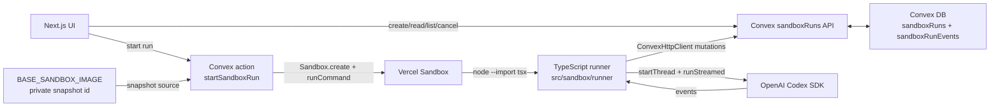

# Sandbox

Last updated: 2026-06-03

This is the high-level map for Drip's Codex SDK execution layer. It names the
contracts and source files; operational details for refreshing the prepared
Vercel Sandbox image live in `scripts/setup_base_snapshot`.

## System Map



There are two layers:

| Layer | Purpose | Stable source |
| --- | --- | --- |
| Control plane | Stores run state, event streams, cancellation, liveness, and terminal results. | `src/convex/sandboxRuns.ts` |
| Sandbox provisioner | Creates a Vercel Sandbox, starts the detached runner command, and records sandbox/command metadata privately in Convex. | `src/convex/sandboxRunActions.ts` |
| Runner | Loads the run task, streams Codex SDK events, sends heartbeats, observes cancellation, and finishes the run. | `src/sandbox/runner/*` |
| Base snapshot operation | Builds and verifies the reusable Vercel Sandbox snapshot used by runtime provisioning. | `scripts/setup_base_snapshot` |

Product sandbox runs use Convex mutations for runner ingest. The custom HTTP
route in `src/convex/http.ts` belongs to the Phase A prototype only.

## Control-Plane Contracts

| Caller | Function | Contract |
| --- | --- | --- |
| UI | `sandboxRuns.createSandboxRun({ workspaceId, task })` | Insert `queued`; return `{ sandboxRunId }`. |
| UI | `sandboxRunActions.startSandboxRun({ sandboxRunId })` | Generate the runner token, provision Vercel Sandbox, start the detached runner. |
| UI | `sandboxRuns.getSandboxRun({ sandboxRunId })` | Return sanitized run state without `ingestTokenHash`. |
| UI | `sandboxRuns.listSandboxRunEvents({ sandboxRunId, afterSeq? })` | Return ordered events, paged at 100. |
| UI | `sandboxRuns.cancelSandboxRun({ sandboxRunId })` | Mark cancellation; queued runs become terminal immediately. |
| Runner | `sandboxRuns.getSandboxRunForRunner({ sandboxRunId, ingestToken })` | Verify token and return task plus cancellation state. |
| Runner | `sandboxRuns.ingestSandboxRunEvent({ sandboxRunId, ingestToken, seq, type, payload })` | Append the next event, accept idempotent retries, reject sequence gaps. |
| Runner | `sandboxRuns.heartbeatSandboxRun({ sandboxRunId, ingestToken })` | Update liveness and return whether cancellation was requested. |
| Runner | `sandboxRuns.finishSandboxRun({ sandboxRunId, ingestToken, status, result?, error? })` | Store a terminal runner status and output. |

Valid statuses are `queued`, `provisioning`, `running`, `succeeded`, `failed`,
`cancelled`, and `lost`. `lost` is reserved for a future watchdog.

## Runner Interface

The snapshot-mode command is:

```bash
node --import tsx src/sandbox/runner/index.ts
```

`src/sandbox/runner/config.ts` reads the command-time env contract:

| Name | Required | Purpose |
| --- | --- | --- |
| `CONVEX_URL` | Yes | Convex URL used by `ConvexHttpClient`. |
| `SANDBOX_RUN_ID` or `RUN_ID` | Yes | Run identifier scoped to this command. |
| `INGEST_TOKEN` | Yes | Plaintext runner token; Convex stores only its hash. |
| `OPENAI_API_KEY` | Yes | Codex SDK/OpenAI auth passed only at runtime. |
| `CODEX_MODEL` | No | Defaults to `gpt-5.5`. |
| `CODEX_REASONING_EFFORT` | No | Defaults to `low`; accepts `minimal`, `low`, `medium`, `high`, `xhigh`. |
| `DRIP_HEARTBEAT_MS` | No | Defaults to 5000 ms. |
| `WORKING_DIRECTORY` | No | Defaults to the sandbox process cwd. |

The runner starts Codex SDK with approval policy `never`, web search disabled,
SDK network access disabled, and `sandboxMode: "danger-full-access"` inside
the outer Vercel Sandbox isolation boundary.

## Env Contract

Never commit or print real values for these names.

| Name | Owner | Purpose |
| --- | --- | --- |
| `BASE_SANDBOX_IMAGE` | Private local/Convex runtime config | Active Vercel Sandbox snapshot ID. Updated by `scripts/setup_base_snapshot`. |
| `DRIP_RUNNER_CONVEX_URL` | Convex action | Convex URL passed into the runner; usually matches the public Convex client URL. |
| `OPENAI_API_KEY` or `CODEX_API_KEY` | Convex action/runtime | OpenAI auth source. The action passes `OPENAI_API_KEY` into the runner command. |
| `VERCEL_TOKEN` or `VERCEL_OIDC_TOKEN` | Vercel Sandbox SDK | Sandbox auth. Access-token auth is passed explicitly; OIDC is read from env. |
| `VERCEL_TEAM_ID` | Vercel Sandbox SDK | Required alongside sandbox auth. |
| `VERCEL_PROJECT_ID` | Vercel Sandbox SDK | Required alongside sandbox auth. |
| `DRIP_SANDBOX_RUNTIME` | Vercel Sandbox SDK | Runtime override; default `node24`. |
| `DRIP_SANDBOX_VCPUS` | Vercel Sandbox SDK | CPU setting; default 2. |
| `DRIP_SANDBOX_TIMEOUT_MS` | Vercel Sandbox SDK | Sandbox lifetime timeout. |
| `DRIP_SANDBOX_RUNNER_TIMEOUT_MS` | Convex action | Detached runner command timeout. |
| `DRIP_SANDBOX_BOOTSTRAP` | Convex action | Set `1` to force embedded fallback bootstrap even when a base snapshot exists. |
| `DRIP_SANDBOX_INSTALL_TIMEOUT_MS` | Convex action and setup script | Dependency install timeout for fallback/setup installs. |
| `DRIP_HEARTBEAT_MS` | Runner | Heartbeat interval. |

Prototype-only env belongs to `docs/prototypes/sandbox-codex-sdk/*` and
`src/convex/sandboxPrototype.ts`; it is not part of the product run contract.

## Base Image Contract

`scripts/setup_base_snapshot` is the stable local interface for refreshing the
base image. The operation:

- Loads private env from process and ignored local env files.
- Requires `VERCEL_TOKEN` or `VERCEL_OIDC_TOKEN`, plus `VERCEL_TEAM_ID` and
  `VERCEL_PROJECT_ID`.
- Creates a fresh Vercel Sandbox with `@vercel/sandbox`.
- Copies exactly the files reported by
  `git ls-files --cached --others --exclude-standard`.
- Installs dependencies with the repo package manager (`pnpm`), including
  `@openai/codex-sdk` and `tsx`.
- Runs a base smoke that proves runner files and Codex SDK import inside the
  prepared sandbox.
- Creates a non-expiring snapshot.
- Starts a second sandbox from that snapshot and proves file write/read works.
- Updates only ignored private env config with `BASE_SANDBOX_IMAGE` after all
  smoke checks pass.

The base image contains reusable code and dependency state only. Run-specific
secrets, inputs, ingest tokens, and model settings are passed at command start.

## Security Boundaries

| Boundary | Rule |
| --- | --- |
| Runner token | Plaintext exists only in the runner command env; Convex stores only the hash. |
| Public reads | `sandboxRuns.getSandboxRun` removes `ingestTokenHash`. |
| Event stream | Events are currently loose and SDK-shaped; broader exposure needs a future redaction/visibility policy. |
| Snapshot ID | `BASE_SANDBOX_IMAGE` is private runtime config, never source code or docs. |
| Prototype ingest | `src/convex/http.ts` is not used for product sandbox runs. |

## File Map

| Path | What to inspect |
| --- | --- |
| `scripts/setup_base_snapshot` | Stable executable setup entrypoint. |
| `scripts/setup_base_snapshot.ts` | Base snapshot operation, smoke checks, env update, and cleanup behavior. |
| `src/convex/schema.ts` | `sandboxRuns` and `sandboxRunEvents` table shape. |
| `src/convex/sandboxRuns.ts` | Control-plane queries/mutations and runner token checks. |
| `src/convex/sandboxRunActions.ts` | Vercel Sandbox provisioning and runner command startup. |
| `src/sandbox/runner/config.ts` | Runner env parsing and defaults. |
| `src/sandbox/runner/codex.ts` | Codex SDK loop, event forwarding, cancellation, and finish handling. |
| `src/sandbox/runner/convex.ts` | Runner-side Convex client and function references. |
| `src/sandbox/runner/embedded.ts` | Bootstrap fallback used when no base snapshot is configured or bootstrap is forced. |
| `docs/prototypes/sandbox-codex-sdk/` | Prototype-only tutorial code and env surface. |

## Deferred

| Item | Why it waits |
| --- | --- |
| Watchdog/recovery | `lost` exists, but no scheduled policy marks disappeared runners yet. |
| Artifact storage | Current substrate persists events/results, not durable files. |
| Redaction/visibility policy | Needed before broader event or artifact exposure. |
| Snapshot versioning | The current contract has one active private base snapshot. |
| Domain writes | Product-specific mutations should layer on top of the generic run substrate. |
