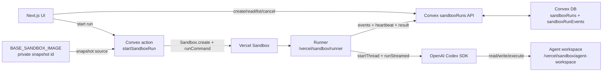
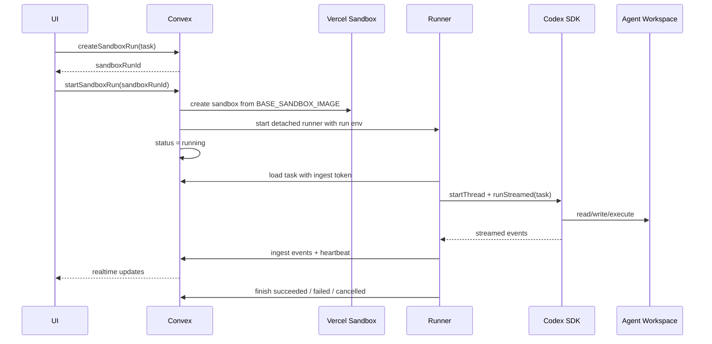
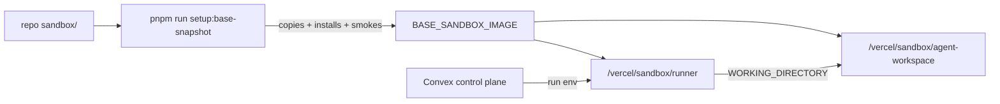

# Sandbox

Last updated: 2026-06-04

This is the high-level map for Drip's Vercel Sandbox and Codex SDK execution
layer. The base snapshot is a separate sandbox runtime payload, not a clone of
the Drip app repo.

## System Map



## Run Sequence



## Runtime Payload

Only `sandbox/` is copied into the Vercel Sandbox base snapshot.

```text
repo/
  sandbox/
    runner/
      index.ts
      config.ts
      codex.ts
      convex.ts
      types.ts
      package.json
      pnpm-lock.yaml

    codex-agent/
      .codex/
        config.toml
        agents/
          sandbox-verifier.toml
          x-researcher.toml
          exa-researcher.toml
      .agents/
        skills/
          agent-browser/
            SKILL.md
          scout/
            SKILL.md
          x-trends/
            SKILL.md
          exa-search/
            SKILL.md
```

The snapshot maps that repo payload to:

```text
/vercel/sandbox/
  runner/
    index.ts
    package.json
    pnpm-lock.yaml
    node_modules/

  agent-workspace/
    .codex/
    .agents/
```

`src/` remains Drip product and Convex control-plane code. It is not copied into
the base snapshot.




## Control-Plane Contracts

| Caller | Function | Contract |
| --- | --- | --- |
| UI | `sandboxRuns.createSandboxRun({ workspaceId, task })` | Insert `queued`; return `{ sandboxRunId }`. |
| UI | `sandboxRunActions.startSandboxRun({ sandboxRunId })` | Generate runner token, create Vercel Sandbox from `BASE_SANDBOX_IMAGE`, and start the runner. |
| UI | `sandboxRuns.getSandboxRun({ sandboxRunId })` | Return sanitized run state without `ingestTokenHash`. |
| UI | `sandboxRuns.listSandboxRunEvents({ sandboxRunId, afterSeq? })` | Return ordered events, paged at 100. |
| UI | `sandboxRuns.cancelSandboxRun({ sandboxRunId })` | Mark cancellation; queued runs become terminal immediately. |
| Runner | `sandboxRuns.getSandboxRunForRunner({ sandboxRunId, ingestToken })` | Verify token and return task plus cancellation state. |
| Runner | `sandboxRuns.ingestSandboxRunEvent({ sandboxRunId, ingestToken, seq, type, payload })` | Append the next event, accept idempotent retries, reject sequence gaps. |
| Runner | `sandboxRuns.heartbeatSandboxRun({ sandboxRunId, ingestToken })` | Update liveness and return whether cancellation was requested. |
| Runner | `sandboxRuns.finishSandboxRun({ sandboxRunId, ingestToken, status, result?, error? })` | Store a terminal runner status and output. |

Valid statuses are `queued`, `provisioning`, `running`, `succeeded`, `failed`,
`cancelled`, and `lost`. `lost` is reserved for a future watchdog.

## Runner Interface

Codex SDK is the only runner path.

The default snapshot-mode command is:

```bash
cd /vercel/sandbox/runner
node --import tsx index.ts
```

The runner receives run-specific env, loads the task from Convex, starts Codex
SDK, and points Codex at the configured agent workspace:

```text
WORKING_DIRECTORY=/vercel/sandbox/agent-workspace
CODEX_HOME=/vercel/sandbox/agent-workspace/.codex
```

The runner starts Codex SDK with approval policy `never`, web search disabled,
network access controlled by `DRIP_CODEX_NETWORK_ACCESS_ENABLED`, and
`sandboxMode: "danger-full-access"` inside the outer Vercel Sandbox isolation
boundary. The runner is generic: it streams Codex events and final response, but
does not interpret skill-specific artifacts such as Scout's `scout-output.json`.

## Env Contract

Never commit or print real values for these names.

| Name | Owner | Purpose |
| --- | --- | --- |
| `BASE_SANDBOX_IMAGE` | Private local/Convex runtime config | Active Vercel Sandbox snapshot ID. Updated by the base snapshot setup command. |
| `VERCEL_TOKEN` | Convex action and setup command | Durable Vercel Sandbox auth for product runs. |
| `VERCEL_OIDC_TOKEN` | Setup command | Optional local setup auth when a fresh Vercel OIDC token is available; not the product Convex action credential. |
| `VERCEL_TEAM_ID` | Vercel Sandbox SDK | Required alongside sandbox auth. |
| `VERCEL_PROJECT_ID` | Vercel Sandbox SDK | Required alongside sandbox auth. |
| `DRIP_SANDBOX_RUNTIME` | Setup command | Base sandbox runtime override; default `node24`. |
| `DRIP_SANDBOX_VCPUS` | Vercel Sandbox SDK | CPU setting; default 2. |
| `DRIP_SANDBOX_TIMEOUT_MS` | Vercel Sandbox SDK | Sandbox lifetime timeout. |
| `DRIP_SANDBOX_INSTALL_TIMEOUT_MS` | Setup command | Runner dependency install timeout while preparing the base snapshot. |
| `DRIP_SANDBOX_RUNNER_CWD` | Convex action and setup command | Runner directory; default `/vercel/sandbox/runner`. |
| `DRIP_SANDBOX_RUNNER_ENTRYPOINT` | Convex action and setup command | Runner entrypoint relative to runner cwd; default `index.ts`. |
| `DRIP_SANDBOX_AGENT_WORKDIR` | Convex action and setup command | Codex working directory; default `/vercel/sandbox/agent-workspace`. |
| `DRIP_RUNNER_CONVEX_URL` | Convex action | Optional Convex URL override passed into the runner; product actions fall back to Convex's built-in cloud URL when available. |
| `OPENAI_API_KEY` or `CODEX_API_KEY` | Convex action/runtime | OpenAI auth source. The action passes `OPENAI_API_KEY` into the runner command. |
| `CODEX_MODEL` | Convex action/runtime | Runtime override; default is `gpt-5.5`. |
| `CODEX_REASONING_EFFORT` | Convex action/runtime | Runtime override; default is `low`. |
| `DRIP_CODEX_NETWORK_ACCESS_ENABLED` | Convex action/runtime | Enables Codex SDK network access for API-backed skills such as Scout; default `false`. |
| `EXA_API_KEY` | Convex action/runtime | Exa Search API key passed only into the Codex process when present. |
| `X_BEARER_TOKEN` or `TWITTER_BEARER_TOKEN` | Convex action/runtime | X API app-only bearer token passed only into the Codex process when present. |
| `DRIP_SANDBOX_RUNNER_TIMEOUT_MS` | Convex action | Detached runner command timeout. |
| `DRIP_HEARTBEAT_MS` | Runner | Heartbeat interval. |

Prototype-only env belongs to `docs/prototypes/sandbox-codex-sdk/*` and
`src/convex/sandboxPrototype.ts`; it is not part of the product run contract.

## Base Snapshot Operation

```bash
pnpm run setup:base-snapshot
```

The setup command creates a fresh sandbox, copies only `sandbox/runner` and
`sandbox/codex-agent`, installs runner dependencies, verifies runner imports and
agent config/skill files, verifies Drip app files are absent, snapshots the
sandbox, starts a fork from that snapshot, repeats the smoke checks, and updates
private runtime config only after the fork smoke passes.

## Security Boundaries

| Boundary | Rule |
| --- | --- |
| Drip repo source | Not part of the base image. Only `sandbox/` is copied. |
| Runner token | Plaintext exists only in the runner command env; Convex stores only the hash. |
| Public reads | `sandboxRuns.getSandboxRun` removes `ingestTokenHash`. |
| Event stream | Events are currently loose and SDK-shaped; broader exposure needs a future redaction/visibility policy. |
| Snapshot ID | `BASE_SANDBOX_IMAGE` is private runtime config, never source code or docs. |
| Prototype ingest | `src/convex/http.ts` is not used for product sandbox runs. |

## Source Map

| Path | What to inspect |
| --- | --- |
| `sandbox/runner/*` | Runner process, Codex SDK loop, Convex ingest client, and runner-local dependency manifest. |
| `sandbox/codex-agent/.codex/config.toml` | Sandbox-only Codex defaults, agent registration, and skill registration. |
| `sandbox/codex-agent/.codex/agents/sandbox-verifier.toml` | Custom subagent definition for sandbox verification. |
| `sandbox/codex-agent/.codex/agents/x-researcher.toml` | Custom subagent definition for X trend signal collection. |
| `sandbox/codex-agent/.codex/agents/exa-researcher.toml` | Custom subagent definition for Exa cultural context collection. |
| `sandbox/codex-agent/.agents/skills/agent-browser/SKILL.md` | Browser automation skill stub copied into the agent workspace. |
| `sandbox/codex-agent/.agents/skills/scout/SKILL.md` | Scout orchestration skill and structured output contract. |
| `sandbox/codex-agent/.agents/skills/x-trends/SKILL.md` | Instruction-only X public-data research skill. |
| `sandbox/codex-agent/.agents/skills/exa-search/SKILL.md` | Instruction-only generic Exa Search API skill. |
| `scripts/setup_base_snapshot.ts` | Base snapshot creation, copy rules, install, smoke, and private env update. |
| `src/convex/schema.ts` | `sandboxRuns` and `sandboxRunEvents` table shape. |
| `src/convex/sandboxRuns.ts` | Control-plane queries/mutations and runner token checks. |
| `src/convex/sandboxRunActions.ts` | Vercel Sandbox provisioning and runner command startup. |
| `docs/prototypes/sandbox-codex-sdk/` | Prototype-only tutorial code and env surface. |
