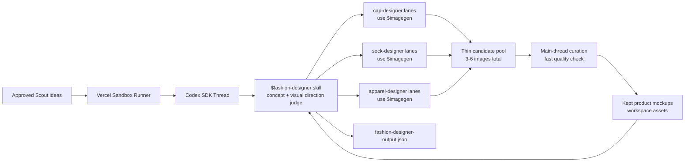

# Fashion Designer

Fashion Designer is Drip's second AI teammate. Its job is to take approved
Scout ideas and turn them into clothing concepts plus mock images that a user
can compare, revise, and select for the limited-drop website.

Fashion Designer starts after Scout. It does not discover trends, run ads, post
to Convex, or build storefronts.

The output should feel like beautiful fashion product work: real-looking caps,
socks, tees, hoodies, bundles, or product-on-model shots. It should not look
like a website, ecommerce page, landing page, or ad dashboard.




## TL;DR

The product prompt should stay lean:

```text
Use $fashion-designer to create concepts and mock images for these approved Scout ideas: [...]
```

The `$fashion-designer` skill owns the rest: per-idea product direction,
three thin product-lane agents, lightweight main-thread curation, artifact
writing, and JSON validation.

## How It Runs

1. Convex starts a Vercel Sandbox from `BASE_SANDBOX_IMAGE`.
2. The sandbox runner starts a Codex SDK thread in `/vercel/sandbox/agent-workspace`.
3. The runner sets `CODEX_HOME` to `/vercel/sandbox/agent-workspace/.codex` so Codex can load the sandbox skills and subagents.
4. Codex uses `$fashion-designer`.
5. `$fashion-designer` reads approved Scout ideas or a provided Scout artifact.
6. `$fashion-designer` treats the input as a batch:
   `approvedIdeas[] -> perIdeaBriefs[] -> 3 thin workOrders[] -> grouped output`.
7. For each approved idea, `$fashion-designer` creates one design brief,
   extracts a few concrete Scout cues from the approved moment, and chooses one
   best product category from the requested options.
8. `$fashion-designer` creates one work order per approved idea with
   `targetFinalMocks: 1` and `candidateTarget: 1` by default.
9. `$fashion-designer` spawns focused product subagents by work order, not just
   by product family. It may use `cap-designer`, `sock-designer`, or
   `apparel-designer` multiple times.
10. Product subagents use `$imagegen` to generate beautiful product mockups and
    return compact candidate summaries with `ideaRef` on every asset.
11. `$fashion-designer` does lightweight curation itself. It only spawns
    `fashion-reviewer` when quality is obviously bad, there are extra
    candidates, or the user explicitly asks for review.
12. `$fashion-designer` writes `fashion-designer-output.json` and stores kept
    images in `fashion-designer-assets/`.

## Responsibility Map

| Layer | File | Responsibility |
| --- | --- | --- |
| Fashion Designer skill | [`sandbox/codex-agent/.agents/skills/fashion-designer/SKILL.md`](../sandbox/codex-agent/.agents/skills/fashion-designer/SKILL.md) | End-to-end Designer workflow, product direction, subagent orchestration, final review set, output contract. |
| Imagegen skill | [`sandbox/codex-agent/.codex/skills/.system/imagegen/SKILL.md`](../sandbox/codex-agent/.codex/skills/.system/imagegen/SKILL.md) | Official Codex image-generation workflow and asset handling rules. |
| Cap subagent | [`sandbox/codex-agent/.codex/agents/cap-designer.toml`](../sandbox/codex-agent/.codex/agents/cap-designer.toml) | Cap concept and product mock image generation. |
| Sock subagent | [`sandbox/codex-agent/.codex/agents/sock-designer.toml`](../sandbox/codex-agent/.codex/agents/sock-designer.toml) | Sock concept and product mock image generation. |
| Apparel subagent | [`sandbox/codex-agent/.codex/agents/apparel-designer.toml`](../sandbox/codex-agent/.codex/agents/apparel-designer.toml) | Tees, hoodies, bundles, and product-on-model mock image generation. |
| Reviewer subagent | [`sandbox/codex-agent/.codex/agents/fashion-reviewer.toml`](../sandbox/codex-agent/.codex/agents/fashion-reviewer.toml) | Visual QA, rejection, curation, and focused regeneration requests. |
| Codex sandbox config | [`sandbox/codex-agent/.codex/config.toml`](../sandbox/codex-agent/.codex/config.toml) | Sets sandbox defaults and registers subagents; project skills are discovered from `.agents/skills` and system skills from `.codex/skills`. |
| Runner | [`sandbox/runner/codex.ts`](../sandbox/runner/codex.ts) | Runs Codex SDK, passes run env, and streams generic Codex events/results. |
| Base snapshot setup | [`scripts/setup_base_snapshot.ts`](../scripts/setup_base_snapshot.ts) | Copies and smoke-tests the sandbox runtime payload. |
| Sandbox guide | [`docs/SANDBOX.md`](SANDBOX.md) | Runtime, env, and base snapshot map. |

## Important Boundaries

- Scout finds trends. Fashion Designer only works from approved ideas, provided
  topics, or a Scout artifact.
- Fashion Designer owns visual judgment. Do not implement coded concept ranking,
  mock scoring, or product-type selection in runner, Convex, or helper scripts.
- Each concept should visibly relate to its approved Scout idea through one or
  two subtle cues in color, texture, motif, material, styling prop, or short
  phrase. It should not become a literal event poster or generic unrelated merch.
- Generate more image candidates than the final requested count, then let
  `fashion-reviewer` discard weak images and keep the best set per idea.
- Fashion Designer processes a hard maximum of three approved ideas per run. If
  more are provided, it keeps the first three by user/Scout order and records
  omitted idea refs in the JSON.
- `mocksPerIdea` is the final target per approved idea. For the UI, output
  should preserve grouping so it can render `Idea -> mocks`.
- `$imagegen` is the only image-generation capability. Use the official
  built-in image generation path by default.
- If built-in image generation is unavailable in the sandbox, Fashion Designer
  may use the official `$imagegen` CLI fallback with `OPENAI_API_KEY`.
- Do not accept locally rendered placeholder PNGs as generated campaign assets.
- Do not generate websites, storefronts, ecommerce pages, ad dashboards, browser
  UI, or landing-page layouts. The product itself should dominate the image.
- Product subagents do not decide ad winners. They create and self-review mock
  images for Fashion Designer.
- `fashion-reviewer` does not discover trends or decide ad winners. It reviews
  image quality, rejects weak candidates, and asks for targeted regeneration
  only when the final set has a real gap.
- Generated images meant for the campaign must be copied into the agent
  workspace. Do not leave project-bound assets only under `$CODEX_HOME`.
- Fashion Designer stops before Performance Marketer. It outputs selected mocks
  for review, not ad campaign results.

## Speed Strategy

The fast path is three thin product lanes:

1. Make one compact design brief per approved idea.
2. Pick exactly one best product category per idea from the requested category
   options.
3. Start exactly three product-lane work orders for three approved ideas, with
   no second wave by default.
4. Ask each lane for `targetFinalMocks: 1` and `candidateTarget: 1`, or at most
   two candidates if the lane is visually risky.
5. Copy returned JSON into the main candidate pool and close completed product
   lane agents immediately.
6. Do lightweight curation in the main Fashion Designer thread. Do not spawn
   `fashion-reviewer` unless quality is obviously bad, there are extra
   candidates to cull, or the user explicitly asks for review.
7. If two lanes finish and the third is slow, wait a short grace period, then
   finish with available images and mark the missing idea as needing
   regeneration.

This optimizes wall-clock time by improving prompt discipline instead of image
quantity. The default run should create 3-6 images total. More variants are a
separate user action, not part of the first Designer pass.

For the official `$imagegen` CLI fallback, product subagents should batch
distinct candidate prompts with `generate-batch` and modest concurrency
(`3-5`). The default high-quality path stays `gpt-image-2`, `quality=medium`,
and `1024x1024` for final candidate pools. When a product photo does not need
transparency, JPEG or WebP is allowed; JPEG at roughly 85 compression is the
fastest opaque-output default. Higher quality, PNG, or transparency-capable
formats are reserved for cases where the brief actually needs them.

## Output

Fashion Designer writes:

```text
/vercel/sandbox/agent-workspace/fashion-designer-output.json
```

Generated images are saved under:

```text
/vercel/sandbox/agent-workspace/fashion-designer-assets/
```

The schema version is:

```text
fashion-designer.concepts.v1
```

Read the Fashion Designer skill for the exact JSON shape.

The output keeps a flat `concepts[]` for simple downstream consumers and adds
`ideas[]` for UI grouping:

```json
{
  "schemaVersion": "fashion-designer.concepts.v1",
  "input": {
    "approvedIdeaIds": ["idea_01", "idea_03", "idea_05"],
    "maxApprovedIdeas": 3,
    "omittedIdeaIds": [],
    "mocksPerIdea": 5
  },
  "ideas": [
    {
      "ideaRef": "idea_01",
      "brief": {},
      "candidateCount": 10,
      "keptCount": 5,
      "concepts": []
    }
  ],
  "concepts": []
}
```

The runner is intentionally generic and does not enforce this Designer-specific
artifact contract. E2E tests and any future Designer-specific orchestration
layer should verify the JSON exists, parses, references existing image files,
records the lightweight review trail, matches the expected schema, and can
render a contact sheet of copied sandbox assets for visual review.

The Convex-side black-box smoke harness is:

```bash
pnpm test:smoke:sandbox -- --scenario fashion-designer-product
```

It sends a lean Fashion Designer prompt through a real `sandboxRuns` record,
starts the Convex action, waits for the run to finish, reads
`fashion-designer-output.json` back from the Vercel Sandbox, copies
PNG/JPEG/WebP assets into `.sandbox-e2e/`, validates image signatures,
dimensions, freshness, and schema, and writes a local `contact-sheet.html`.
The Fashion Designer smoke uses two approved ideas with caps and socks as
category options. Expected proof: one thin lane per idea by default, 2-4 final
usable images total, referenced assets that exist, and a compact review trail.
The smoke should not force exact subagent names, model wording, or internal
command lines; it should prove the employee produced the expected artifact and
images through the real sandbox path.

## Updating The Base Image

Fashion Designer lives inside the sandbox agent payload. After changing files
under `sandbox/codex-agent/` or `sandbox/runner/`, recreate the base image
before black-box sandbox testing. The setup command syncs `BASE_SANDBOX_IMAGE`
into local `.env`, selected Convex, and prod Convex:

```bash
pnpm run setup:base-snapshot
```
