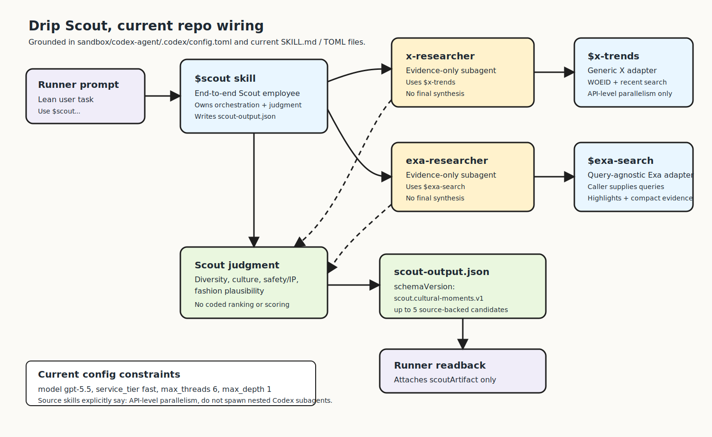
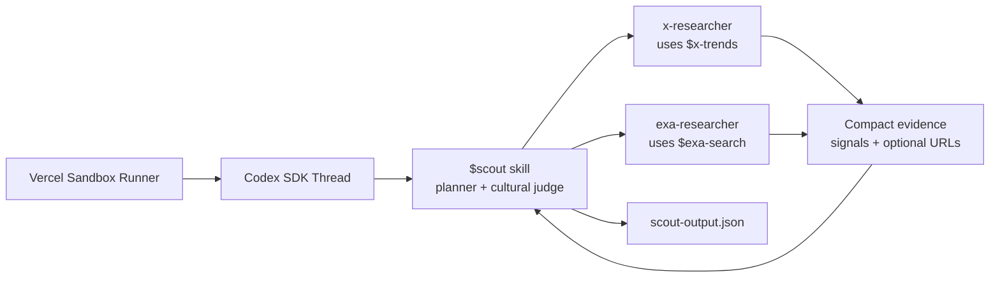

# Scout

Scout is Drip's first AI teammate. Its job is to find live cultural moments and
turn them into five evidence-informed candidate ideas by default that could inspire
original fashion merchandise.

Scout stops at discovery. It does not design products, run ads, post to Convex,
or build storefronts.





## TL;DR

The product prompt should stay lean. The app should pass a city, defaulting to
Mumbai when the user does not change it:

```text
Use $scout for Drip.
Input JSON: { "city": "Mumbai" }
```

The `$scout` skill owns the rest: city/country inference, source selection,
subagent fanout, final judgment, JSON writing, and JSON validation. Product
style such as streetwear belongs to Fashion Designer after Scout has selected
the cultural moments.

## How It Runs

1. Convex starts a Vercel Sandbox from `BASE_SANDBOX_IMAGE`.
2. The sandbox runner starts a Codex SDK thread in `/vercel/sandbox/agent-workspace`.
3. The runner sets `CODEX_HOME` to `/vercel/sandbox/agent-workspace/.codex` so Codex can load the sandbox skills and subagents.
4. Codex uses `$scout`.
5. `$scout` spawns `x-researcher` and `exa-researcher` in parallel.
6. `x-researcher` returns up to ten independent X culture/attention moments.
7. `exa-researcher` returns up to ten independent source-backed web moments.
8. Researchers return compact evidence only.
9. `$scout` begins synthesis around 2:30, applies the moment promotion test,
   and uses model judgment to choose the final candidates before the 3-minute
   deadline.
10. `$scout` writes `scout-output.json`.

## Responsibility Map

| Layer | File | Responsibility |
| --- | --- | --- |
| Scout skill | [`agent/codex-agent/.agents/skills/scout/SKILL.md`](../../../agent/codex-agent/.agents/skills/scout/SKILL.md) | End-to-end Scout workflow, subagent orchestration, final judgment, output contract. |
| X skill | [`agent/codex-agent/.agents/skills/x-trends/SKILL.md`](../../../agent/codex-agent/.agents/skills/x-trends/SKILL.md) | Generic X public-data API guidance and compact signal shape. |
| Exa skill | [`agent/codex-agent/.agents/skills/exa-search/SKILL.md`](../../../agent/codex-agent/.agents/skills/exa-search/SKILL.md) | Generic, query-agnostic Exa Search API guidance and compact evidence shape. |
| X subagent | [`agent/codex-agent/.codex/agents/x-researcher.toml`](../../../agent/codex-agent/.codex/agents/x-researcher.toml) | Evidence-only X trend and recent-post researcher. |
| Exa subagent | [`agent/codex-agent/.codex/agents/exa-researcher.toml`](../../../agent/codex-agent/.codex/agents/exa-researcher.toml) | Evidence-only source-backed web researcher. |
| Codex sandbox config | [`agent/codex-agent/.codex/config.toml`](../../../agent/codex-agent/.codex/config.toml) | Sets sandbox defaults and registers subagents; project skills are discovered from `.agents/skills`. |
| Runner | [`agent/runner/codex.ts`](../../../agent/runner/codex.ts) | Runs Codex SDK, passes research env, and streams generic Codex events/results. |
| Base snapshot setup | [`scripts/setup_base_snapshot.ts`](../../../scripts/setup_base_snapshot.ts) | Copies and smoke-tests the sandbox runtime payload. |
| Sandbox guide | [`references/docs/SANDBOX.md`](../SANDBOX.md) | Runtime, env, and base snapshot map. |

## Important Boundaries

- Scout owns judgment. Do not implement coded candidate ranking, scoring, or
  merchability decisions in runner, Convex, or helper scripts.
- X and Exa skills are reusable source adapters. They do not know Drip's final
  taste criteria.
- Source subagents do not synthesize final candidates. They return compact
  evidence for Scout.
- Scout discovery input should be city-first. Do not pass hard-coded demo topics,
  product categories, or downstream clothing style as discovery input unless the
  user explicitly provided those topics.
- With `max_depth = 1`, Scout spawns the Codex subagents. X/Exa skills may
  recommend API-level parallel calls, but they should not spawn nested Codex
  subagents.
- Scout has a hard 3-minute wall-clock budget. It should start final synthesis
  around 2:30 and return the best available first-pass evidence by the deadline.
- X and Exa are equal parallel first-pass discovery lanes. X finds public
  culture, attention, meme, fandom, creator, and recency signals. Exa finds big
  web-backed city events, launches, festivals, concerts, food/nightlife,
  screenings, exhibitions, local rituals, public happenings, and lifestyle
  shifts.
- Each source lane should return no more than ten moments. Exa should run 3-5
  fast queries total, return up to ten compact source-backed moments, and
  never double-check X/Twitter trends, run follow-up waves, target backfill, or
  judge final candidates.
- X should label each discovery as `specific_moment`, `topic_cluster`,
  `global_token`, or `weak_query_lane`, with why-now, audience, local
  specificity, sample metrics, and uncertainty.
- Final candidates should normally combine both lanes when both return, but
  Scout must not miss its 3-minute deadline. X-only candidates are allowed only
  as a fallback when Exa is late, empty, or too thin, and must pass a higher
  specificity bar with uncertainty in `signals` and `strategy.notes`.
- For X-only candidates, WOEID trend-list presence, query terms, team-history
  references, or national discussion with Mumbai wording are not enough. Scout
  needs visible Mumbai behavior, venue, neighborhood, community, gathering,
  ritual, or creator/fan action.
- Five is the default target and upper bound. Scout should return five
  candidates from the expanded source pool whenever the available evidence can
  support five without fabrication, unsafe IP, or missing the deadline. If the
  fifth choice is weaker than the first four, prefer the next strongest
  Exa-backed or both-backed moment with a concrete trigger and local anchor over
  a short list.
- Final candidates may include optional detail fields for the campaign UI:
  `description`, `whyNow`, `audience`, `localAnchor`, and
  `evidenceHighlights`. These are additive v1 fields and old artifacts remain
  compatible.
- Safety/IP guardrails stay on: avoid copied logos, team marks, album art,
  lyrics, celebrity likenesses, protected characters, protected IP, and private
  controversy. Scout should use original phrases and non-infringing visual cues.

## Output

Scout writes:

```text
/vercel/sandbox/agent-workspace/scout-output.json
```

The schema version is:

```text
scout.cultural-moments.v1
```

Read the Scout skill for the exact JSON shape.

The runner is intentionally generic and does not enforce this Scout-specific
artifact contract. E2E tests and any future Scout-specific orchestration layer
should verify the file exists, parses, and matches the expected schema.

## Updating The Base Image

Scout lives inside the sandbox agent payload. After changing files under
`agent/codex-agent/` or `agent/runner/`, recreate the base image before
black-box sandbox testing. The setup command syncs `BASE_SANDBOX_IMAGE` into
local `.env`, selected Convex, and prod Convex:

```bash
pnpm run setup:base-snapshot
```
